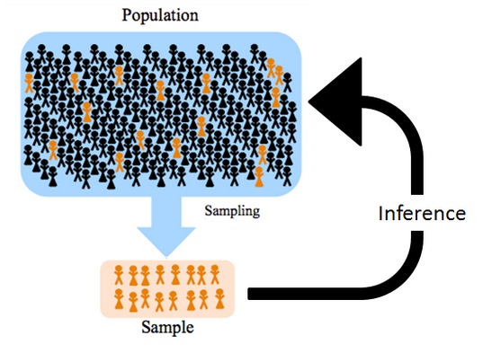

# Выборка {#sample} 

<!-- Допустим, нас есть какое-то предположение о связи неких психологических конструктов относительно того, как работает психика у людей. Например, о том, что кофеин как-то влияет на такой конструкт, как внимание -- это наша **теоретическая гипотеза**. Чтобы ее проверить, нам нужно провести исследование и уточнить гипотезу на языке этого исследования, сделать ее более конкретной. Например, мы решили провести эксперимент, в котором экспериментальная группа пила 3 кружки кофе в первой половине дня, а контрольная группа пила декофеинизированный кофе. Далее мы делали несколько замеров решения какого-нибудь когнитивного теста на внимание во второй половине дня и смотрели, сколько ошибок допускают экспериментальной и контрольной выборок. десь мы уточнили. И когда мы делаем выводы, мы говорим не о нашей небольшой группе людей, которых мы исследовали – а о всей популяции людей, она называется **генеральной совокупностью**. Почему так можно? -->

Мы рассмотрели два примера -- о влиянии кофеина на внимание и коммуникационного рабочего инструмента на продуктивность. В этих примерах мы предположили, что провели исследование -- то есть набрали какое-то количество человек и сделали вывод, как в целом это работает не только у этих человек, а вообще у людей. Почему так происходит? Почему мы можем распространить эти выводы на всех людей, которые теоретически могут пить кофе и воспользоваться этим коммуникационным инструментом? И зачем нам вообще это нужно?


```{r echo= FALSE, fig.align = 'center', out.width="80%"}

```
<p align="center">*Изображение с https://towardsdatascience.com/*</p>

## Выборочные оценки

Как мы можем сделать вывод о всех людях в целом? Что мы будем делать, если хотим узнать средний рост людей на всей планете? Будем ли мы измерять каждого человека из почти 8 миллиардов на планете и брать среднее арифметическое?


```{r echo= FALSE, fig.align = 'center', out.width="100%"}
knitr::include_graphics("docs/images/height_distribution.png")
```
<p align="center"> https://ourworldindata.org/human-height </p>

**Генеральная совокупность** -- множество (или совокупность) всех изучаемых объектов в рамках определенного исследовательского вопроса.

**Выборка** или **выборочная совокупность** -- часть генеральной совокупности, отобранная для изучения определенного исследовательского вопроса.

Когда мы говорим о генеральной совокупности, мы говорим о ее **параметрах**, например, средний рост людей, обозначим его **X**. Мы не можем посчитать его напрямую, поэтому нам приходится прибегать к **выборочным оценкам**, которые часто обозначются той же буквой, что и параметр генеральной совокупности, только "с крышечкой" или "с чертой" **X̅** -- выборочное среднее, средний рост людей на конкретной выборке.

Итак, когда мы хотим сделать вывод о всех людях из генеральной совокупности -- мы проводим исследование на небольшой выборке (в зависимости от метоода исследования необходимый размер выборки может быть от 10 до 1000 чловек) и оцениваем исследуемый параметр генеральной совокупности по выборочным оценкам. 

Чтобы не запутаться, о чем речь, ключевые популяционные и выборочные оценки обозначают по-разному:

|                                   | Генеральная совокупность | Выборка |
|:---------------------------------:|:------------------------:|:-------:|
| Среднее (математическое ожидание) |         $\mu$            |M, $\overline X$|
|       Стандартное отклонение      |          $\sigma$        |   s, sd |


## Репрезентативность выборки

Важным понятием является  **репрезентативность выборки** -- способность выборки отражать исследуемый параметр генеральной совокупности. 

*Одна и та же выборка может быть репрезентативной для одного исследовательского вопроса и не репрезентативной для другого!*

Репрезентативность достигается:

* **Случайным выбором людей** (берем не каких-то конкретных, которые нам больше нравятся, а случайным образом)
* **Объемом выборки** (доказано, что при большом объеме выборки она достаточно представляет генеральную совокупность, чтобы дать ответ об исследуемом параметре)

**Способы формирования репрезентативных выборок**

*  Простая случайная выборка (simple random sample)
*  Систематическая выборка (systematic sample)
*  Стратифицированная выборка (stratified sample)
*  Кластерная выборка (cluster sample)


**Простая случайная выборка** набирается из большого количества случайным образом -- все элементы генеральной совокупности имеют равные шансы попасть в выборку.

**Систематическая выборка** имитирует случайный выбор и обычно используется социологами в полевых исследованиях, когда задается определенный шаг в выьборе людей: например, каждый 5-й или 10-й человек.

**Стратифицированная выборка** нужна, если на исследуемый нами признак может повлиять какой-то параметр, который распределен в генеральной совокупности неравномерно: например, мы исследуем уровень удовлетворенности жизнью, но при этом знаем, что на него влияет уровень дохода -- и нам нужно обеспечить эквивалентное распределение уровня дохода в выборке. Далее уже из этих страт по доходу испытуемые выбираются случайно.

**Кластерная выборка** включает в себя целые отдельные кластеры, без случайного выбора в них: например, мы исследуем школьников, и вместо того, чтобы выбирать их случайно, включим в выборку несколько определенных школ (кластеров)


## Зависимые и независимые выборки {#dependent_samples}

Еще одно важное понятие относительно выборок: они могут быть зависимые и независимые.

**Независимые выборки** используются, когда мы сравнениваем между собой группы наблюдений, относящиеся к разным людям (школам / институтам / и тд). Например, в нашем примере с влияением кофеина на внимание мы можем набрать группу людей, которые будут пить по 3 кружки кофе в день, и другую группу -- кто будет пить декофеинизированный напиток. Это разные люди, никак не связанные между собой.

Но если мы бы взяли одно и ту же группу людей, и на одной неделе измеряли их внимание после 3 кружек кофе, а потом *на этих же самых людях* проверяли, как действует декофеинизированный напиток -- это будут уже **зависимые выборки**, так как это все еще те же самые люди.

```{r echo= FALSE, fig.align = 'center', out.width="100%"}
knitr::include_graphics("docs/images/samples.png")
```
<p align="center"> </p>


**Кейс**

>  Исследователь Никита изучал взаимосвязь возраста, преподавательского стажа и профессионального выгорания преподавателей в университетах. Для этого он выбрал несколько университетов: МГУ, Высшая школа экономики и РАНХиГС. Никита нашел по 10 преподавателей департаметов психологии из каждого вуза в социальной сети ВКонтакте и предлагал им заполнить опросник выгорания Маслач (Maslach Burnout Inventory, MBI). На основании обработанных данных Никита сделал следующие выводы: 1) в России чаще выгорают преподаватели более молодого возраста; 2) чаще выгорают преподаватели с меньшим преподавательским стажем; 3) преподаватели МГУ в целом выгорают меньше, чем преподаватели в ВШЭ. Какие методы набора выборки использовал Никита? Верны ли  выводы?

```{r echo= FALSE, fig.align = 'center', out.width="60%"}

```

