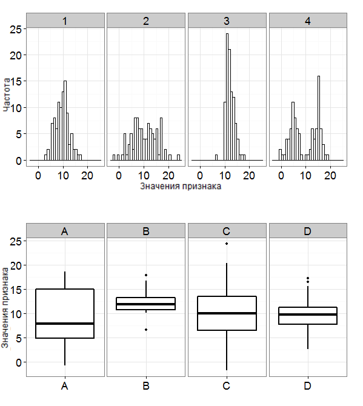

# Описательная статистика

Мы переходим к обсуждению первого вида статистики из двух -- **описательной статистики** **(descriptive statistics)**. Когда мы гооворим об описательной статистике, мы всегда говорим об эмпричиески полученных данных, а не о генеральной совокупности. Чтобы что-то сказать о генеральной совокупности, нам нужно заниматься статистикой вывода, а пока остновимся на эмпирически полученных данных и выборочных распределениях.

Зачем нужна описательная статистика? Мы обсуждали, что описательная статистика:

* описывает данные: мы исследуем сами переменные, смотрим на данные по ним и узнаем их получше
* позволяет заменить набор данных на отдельные цифры -- зачастую это проще для понимания и понятнее для восприятия, чем смотреть на табличку значений

Если вдруг так вышло, что наши собранные данные представляют собой всю генеральную совокупность, то нам даже не нужно заниматься статистикой вывоода -- мы можем сделать какие-то выводы об этих данных уже из эмпирически собранных данных (например, сравнить успеваемость в классе A и Б всего одной школы)

## Описательные визуализации

Мы уже обсуждали два важных графика -- гистограмму и график плотности вероятности -- когда говорили про распределения. Эти графики стоит строить каждый раз, когда мы хотим поисследовать эмпирически полученные данные методами описательной статистики. Такого термина, кажется, официально не существует, но я называю эти графики также описательными.

Например, мы строили их для данных про эмоциональное выгорание:

```{r, eval=TRUE, echo = FALSE, message = FALSE}
library(tidyverse)
library(kableExtra)
teacher_number <- seq(1,30,1)
age <-  sample(22:60, size = 30, replace = T)
exp_years <- sample(1:8, size = 30, replace = T)
exp_scaled <- ifelse(exp_years >= 1 & exp_years <= 2, "от 1 до 2",
                     ifelse(exp_years > 2 & exp_years <= 5, "от 3 до 5",
                            ifelse(exp_years > 5, "больше 5", exp_years)))
burnout_MBI <- sample(19:70, size = 30, replace = T)
univer <-  rep(c("MSU", "HSE", "MSU", "RANEPA", "HSE", "RANEPA"),5)
burnout <- tibble(teacher_number, age, exp_years, exp_scaled, burnout_MBI, univer)
```

```{r}
burnout %>% 
  ggplot(aes(x=exp_years)) +
  geom_histogram(binwidth = 1) +
  theme_minimal()
```

```{r}
burnout %>% 
  ggplot(aes(x=age)) +
  geom_density() +
  theme_minimal()
```

Графики распределений, на самом деле, уже дают нам многое -- как миниум понимание, к какому семейству распределений может принадлежать переменная, и каковы свойства распредедения этих данных. Говоря о свойствах графиков, обычно имеются два.

**Коэффициент ассиметрии, "скошенность" (skewness)** -- показатель симметричности графика: если график симметричен6 этот показатель равен 0, если нет, имеет значение отличное от нуля в ту сторону, в котороую график скошен.

**Эксцесс, "вытянутость" (kurtosis)** -- показатель, насколько график вытянут вверх или "приплюснут" вдоль оси абсцисс.

<p align="center"> 
```{r}
knitr::include_graphics("docs/images/Illustration.jpeg")
```
</p>

## Меры центральной тенденции

Меры центральной тенденции -- это такие описательные статистики, которые позволяют что-то сказать про "центр масс" распределения: где у него центр, где больше всего данных в этом распределении? Это бывает очень полезно на прикладных вопросах. 

> Представим, что нас интересует вопрос: каково благосостояние россиян? Изменилось ли оно с 2008 по 2022 год, и если да, то как? Как можно ответить на этот вопрос? (*представим, что у нас есть доступ к реалистиным данными всех россиян, собранных по этому вопросу, и делать статистический вывод по небольшой выборке нет необходимости*)

Допустим, будем оценивать благосостояние по годовому доходу на душу населения. Первое, что напрашивается -- это посчитать среднее значение дохода в 2008 году и в 2022 году и посмотреть, как они отличаются. Правильный ли это будет расчет? Скорее всего, нет.

Дело в том, что доход на душу населения -- очень неравномерный признак (переменная). https://ru.wikipedia.org/wiki/%D0%9A%D0%BE%D1%8D%D1%84%D1%84%D0%B8%D1%86%D0%B8%D0%B5%D0%BD%D1%82_%D0%94%D0%B6%D0%B8%D0%BD%D0%B8 

Чем это отличается от статистического вывода?

Допустим, мы хотим проверить гипотезу о том, что благосостояние россиян в 2022 снизилось по сравнению с 2008 годом.При этом, у нас нет возможность заглянуть в данные всех россиян, собранные, например, гипотетичким Росстатом. Тогда мы возьмем небольшую выбор  году и провести анализ: сравнить эти данные между собой. Они будут выглядить так: по строкам у нас идет каждый человек, по столбцам -- доход в 2008 и 2022 году, и мы, по сути, будем сравнивать цифры в этих двух колонках между собой. Это пример статистического вывода: мы проводим полноценный анализ 


### Среднее, медиана, мода

**Среднее арифметическое (mean) ** -- сумма всех значений, поделенная на количество наблюдений. Вычисляется поо формуле
$\bar X = \dfrac{\sum_{i=1}^{n}x_i}{n}$

Например, у нас есть набор данных:

```{r}
set.seed(42)
sample_data1 <- sample(1:50, 11)
sample_data1
```
Его среднее

```{r}
mean(sample_data1)
```

```{r}
set.seed(42)
sample(1:10, 8)

```


**Медиана (median)** -- это граница, которая делает упорядочненное множество данных пополам. Для того, чтобы посчитать медиану, нам нужно: 1) расставить все имеющиеся значения в порядке возрастания; 2) найти середину: это будет либо значение, соответствующее месту $\frac{n}{2}+1$, если n -- нечетное, либо среднее из двух центральных значений $\frac{1}{2}(X_{n/2}+X_{n+1/2})$, если n -- четное.
```{r}
sort(sample_data1)
median(sample_data1)
```


```{r}
sample_data2 <- sample(1:50, 10)
sample_data2
sort(sample_data2)
median(sample_data2)
```

На практике нам редко встречаются данные, где каждоое значение представлено только один раз -- мы уже много обсуждали, что в статистике мы работает с вероятностями и частотами. Поэтому d реальности нужно не забывать, что мы делаим пополам не сами значения, как в случае с средним -- а распределение значений. На гистограмме или граифке плотности вероятности или гистограмму медиана -- это линия, которая делает график на две равные по площади части: слева и справа должно остаться одинаковое число данных.

```{r}
burnout %>% 
  ggplot(aes(x=exp_years)) +
  geom_histogram(binwidth = 1) +
  geom_vline(xintercept = median(exp_years)) +
  theme_minimal()
```


**Мода (mode) ** -- то значение признака, которое встречается чаще остальных.

На гистограмме мода вседа будет находиться на самом высоком стролбике, а на графике плотности вероятности -- в его пике *(или очень-очень близко к нему -- помним, что график плотности вероятности -- это финт ушами, где мы рисуем каждую точку как бы "забирая" с собой ее окрестность, поэтому в завиисомости от размера окрестности медиана может чуть-чуть поплыть от пика, но это крошечное отклонение)*

```{r mode_function, include=FALSE}
# mode function
mode <- function(x) {
  sort(unique(x))[which.max(table(x))]
}
```

Взвешенное среднее.

Квадратичное среднее.

### Особенности использования

В примере с оценкой благосостояния мы выяснили, что среднее значение здесь -- плохой вариант для описательной статистики.

Мера ЦТ | Шкала          | Какие данные | 
--------| ---------------| ------------ | 
Среднее | Только количественная | распределение симметрично, нет заметных выборосов |
Медиана | Количественная или порядковая | можем использовать, когда распределение не симметрично, есть выбросы, не можем использовать для номинативной шкалы |
Мода | Номинативная (номинальная), порядковая, количественная | чаще всего используется там, где не можем производить метрические операции, но не можем посчитать ее для непрерывных величин |


```{r central_tendency_sampling,include=FALSE}
set.seed(108)
symm<-sample(x=seq(1,10,0.5),size=600,replace=TRUE, prob=c(.05,.05,.07,.1,.1,.15,.20,.30,.35,.5,.35,.30,.20,.15,.1,.1,.07,.05,.05))
asymm_right<-sample(
x=seq(1,10,0.5),
size=600,
replace=TRUE,
prob=c(.1,.2,.25,.4,.5,.5,.4,.35,.3,.25,.2,.25,.2,.15,.1,.1,.07,.05,.05))
asymm_left<-sample(
x=seq(1,10,0.5),
size=600,
replace=TRUE,
prob=c(.03,.05,.07,.1,.15,.15,.2,.2,.25,.25,.3,.35,.5,.5,.4,.4,.25,.2,.2))
bimodal<-sample(
x=seq(1,10,0.5),
size=600,
replace=TRUE,
prob=c(.05,.05,.07,.1,.1,.2,.3,.35,.3,.15,.1,.15,.20,.40,.50,.25,.1,.05,.05))

colors<-c("Mean"="red4","Median"="blue4","Mode"="green4")
```

```{r central_tendency_symm, echo=FALSE}

ggplot(NULL, aes(symm)) +
  geom_histogram(aes(y = ..density..), alpha =.5, binwidth = .5) +
  geom_density() +
  geom_vline(xintercept = mean(symm), color = colors['Mean']) +
  geom_vline(xintercept = median(symm), color = colors['Median']) +
  geom_vline(xintercept = mode(symm)-0.04, color = colors['Mode']) +
  labs(x = 'Value',
       y = 'Density') +
  theme_minimal()
```

```{r central_tendency_asymm_right, echo=FALSE}
ggplot(NULL, aes(asymm_right)) +
  geom_histogram(aes(y = ..density..), alpha =.5, binwidth = .5) +
  geom_density() +
  geom_vline(xintercept = mean(asymm_right), color = colors['Mean']) +
  geom_vline(xintercept = median(asymm_right), color = colors['Median']) +
  geom_vline(xintercept = mode(asymm_right)-0.04, color = colors['Mode']) +
  labs(x = 'Value',
       y = 'Density') +
  theme_minimal()
```

----
Мы подошли вплотную к понятиям, которые можно (и мы будем) непосредственно применять на даннных. Чтобы сделать эти понятия близкими к реальности, возьмем реальный датасет (собранные данные), на котором будем дальше работать.
В качестве примера возьмем датасет с kaggle <https://www.kaggle.com/datasets/uciml/student-alcohol-consumption>.
Это -- данные из двух португальских школ (скорее колледжей) с подробной социо-демографической информации о студентах, включая ту, как они учатся по математике и португальскому языку и как часто пьют алкоголь. Этот датасет я взяла, так как он содержит переменные разного типа данных в разных шкалах (и шкала отношений, например, возраст, и порядковая шкала, например, рейтинггования образования мамы или папы или поддержка в семье).


```{r, eval=TRUE, echo = FALSE, message = FALSE}
library(tidyverse)
studens_mat <- read_csv("student-mat.csv") %>% 
  rename_with(., ~ paste0(., "_mat"), .cols = c(absences, paid, G1, G2, G3)) -> studens_mat 
studens_por <- read_csv("student-por.csv") %>% 
  rename_with(., ~ paste0(., "_por"), .cols = c(absences, paid, G1, G2, G3)) -> studens_por
studens_mat %>% 
  full_join(studens_por, by = c("school","sex","age","address","famsize","Pstatus","Medu","Fedu",
                             "Mjob","Fjob","reason", "guardian", "traveltime","studytime", "failures", "schoolsup", "famsup",
                             "activities", "nursery", "higher", "internet", "romantic", "famrel", "freetime", "goout", 
                             "Dalc", "Walc", "health")) -> students 

students %>% 
  mutate("student" = paste0("id", row_number()), .before = "school")  %>% 
  drop_na() %>% 
  mutate(G_mat = rowMeans(dplyr::select(., c(G1_mat, G2_mat, G3_mat))),
         G_por = rowMeans(dplyr::select(., c(G1_por, G2_por, G3_por)))) -> students
```

```{r}
kable(students[1:10,]) %>% scroll_box(width = "100%") 
```
```{r}
students %>% 
  ggplot(aes(x=age)) +
  geom_histogram(binwidth = 1) +
  # geom_density(x=age) +
  theme_minimal()
```


```{r}
table(students$age)
prop.table(table(students$age))
# round(prop.table(table(students$age, students$Walc), 1), 2)
```


```{r}
mean(students$age)
```
```{r}
median(students$age)
```
```{r}
mode(students$age)
```


```{r}
students %>% 
  ggplot(aes(x=G_mat)) +
  geom_density() +
  theme_minimal()
```
```{r}
mean(students$G_mat)
```


```{r}
median(students$G_mat)
```


```{r}
table(students$Mjob)
prop.table(table(students$Mjob))
mode(students$Mjob)
```

## Квантили, квартили и перцентили

Мы выяснили, что медиана делит распределение пополам. Это удобно.

Квантили -- делят распределение на кусочки по четверти данных.

Квартиль
Дециль
Перцентиль

## Меры вариативности

Вариативность -- изменичвость значений, как сильно разнятся данные от наблюдения к наблюдению.

Помимо мер центральной тенденции -- меры вариативности, они же меры изменчивости или разброса. 

> Допустим, вы рбнаружили, что ваш показатель эритроцитов в крови равен 3,8 * 10 при норме 4*10. Насколько сильное это отклонение?

Меры центральной тенденции могут совпадать, хотя меры изменчивость значительно отличаться, например

```{r distributions_with_the_same_means_generation}
set.seed(123)
tibble(id = 1:100,
       x1 = rnorm(100, mean = 2, sd = 1),
       x2 = rnorm(100, mean = 2, sd = 3),
       x3 = rnorm(100, mean = 2, sd = 0.5)) -> rnorm_three
la <- c(x1 = "Variable 1", x2 = "Variable 2", x3 = "Variable 3")
rnorm_three %>% 
  pivot_longer(cols = c("x1", "x2", "x3")) %>% 
  ggplot(aes(value)) +
  geom_histogram(binwidth = .5) +
  facet_wrap(~ name,
             labeller = labeller(name = la)) +
  labs(x = "Value",
       y = "Count") +
  scale_x_continuous(breaks = -5:15)
```

### Размах, стандартное отклонение и дисперсия

**Размах (range)** -- разница между максимальным и минимальным значением в выборке, $x_{max}-x_{min}$

```{r}
sample_data1
range(sample_data1)
```

**Стандартное отклонение, оно же среднеквадратичное отклонение (standard deviation)** -- это среднее отклонение наблюдений от их среднег означения.

Свойства дисперсии.

На примере с данными студентов:

```{r}
range(students$age)
range(students$G_mat)
range(students$Walc)
range(students$Mjob)
```

```{r}
sd(students$age)
sd(students$G_mat)
sd(students$Walc)
```


### Степени свободы


## Боксплот и вайолинплот 

<p align="center"> 
```{r fig.align = 'center', out.width="60%"}
knitr::include_graphics("docs/images/Boxplot_vs_PDF.png")
```
</p>

<p align="center"> 
```{r fig.align = 'center', out.width="60%"}

```
</p>


# Центральная предельная теорема

https://gallery.shinyapps.io/CLT_mean/

# Нормальное распределение

## Стандартное нормальное распределение

# Доверительный интервал

