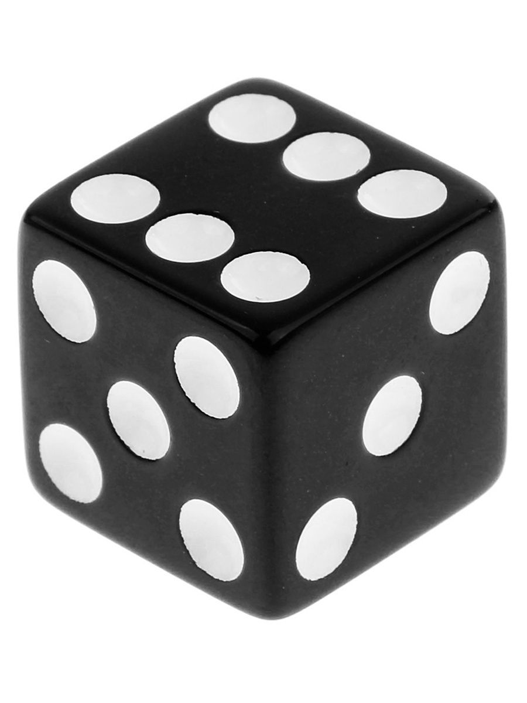
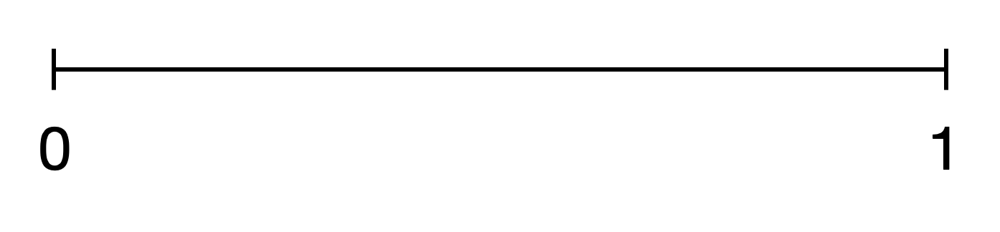

# Вероятность и случайные величины {#probability} 

## Случайная величина {#random-variable} 

Мы немного поговорили про переменные, они же -- признаки исследуего нами объекта (рост, вес, пол, уровень образования и так далее). Поговорили, что чтобы измерить признак, нужно привести в соответствие какое-либо значение из шкалы. Теперь давайте посмотрим на математический смысл переменных и их значений.

С математической точки зрения значения переменных являются **случайными величинами**. В теории вероятностей случайной величиной называется величина, которая *в данный момент времени (момент измерения) может принимать только одно значение, которое нельзя предугадать точно (до измерения)*.

Нам нужно замерить рост? Можем ли мы заранее сказать, сколько точно вплоть до микрометров он будет составлять? Если нет, значит, мы провели **испытание** (статистический термин единичного исследования или измерения), в ходе которого случайная величина рост приняла определенное значение (мы привели ей в соответствие какое-то значение из количественной шкалы). Говоря статистическим языком, наступило **событие** или **явление** "РОСТ = 178 см".

Нужно определить время реакции после выпитой кружки кофе? Все то же самое, время реакции -- случайная величина.

Результат прохождения опросника -- случайная величина.

Название ВУЗа, из которого пришел наш испытуемый -- случайная величина.

Это понятие нужно нам для того, чтобы мы могли считать **вероятности** наступления определенных **событий**, то есть наших измеренных переменных. Дело в том, что про вероятности случайных величин нам плюс-минус понятно и просто, а вот если величина перестает быть случайной, расчет вероятности становится сложнее. И мы пока рассматриваем только случайные величины.


## Вероятность

```{r, eval=TRUE, echo = FALSE, message = FALSE}
library(tidyverse)
```

Что такое вероятность?

По сути, **вероятность** -- это численно выраженая возможность наступления того или иного события.

Вероятность может рассматриваться как **частота наступления** уже свершившегося события: по тому, как часто оно происходило, можно оценить, какова вероятность его наступления в дальнейшем.

Здесь начинается неожиданная развилка: в зависимости от того, как мы понимаем вероятность, приравниваем ли ее к частоте, статистика делится на **байесовскую (bayesian)** и **частотную (фреквинтистскую, frequentist)**. Статистика, в которой мы заменяем вероятности частотами, а не высчитываем вероятность по сложной формуле, и в которой мы будем работать -- частотная (https://en.wikipedia.org/wiki/Frequentist_inference). То есть говоря о вероятности, мы будем понимать ее исключительно так же, как и частоту, забываем про существование условной вероятности, формулу полной вероятности и других сложных концепций: если бы мы провели много раз одно и то же исследование, скажем, тысячу, и посмотрели, сколько раз в этом исследовании выпадает результат, который нас интересует, мы бы сказали, что вероятность наступления этого события -- это сколько раз оно выпадало из тысячи. И будем руководствоваться только этим смыслом.

Есть разные определения, в рамках статистики различают статистическое и геометрическое определение вероятностей. Можно углубиться на http://mathprofi.ru/sluchainaya_velichina.html. Разные определения вероятности используются в зависимости от того, с какими случайными величинами (СВ) мы работаем, различают два их типа: 
* **дискретные СВ**
* **непрерывные СВ**

## Дискретные СВ и статистическое определение вероятности

Самая часто используемая в теории вероятностей модель -- бросание обычного шестигранного игрального кубика. Кубик отличает то, что всего возможно наступление 6 событий (не будем рассматривать, что кубик смещенный или какой-то неправильный). То есть **область допустимых значений** или **область определения** для случайной величины "бросок кубика" это 6 значений: $ D \in \{1, 2, 3, 4, 5, 6\}$

Величина, область значений которой состоит из конечного числа натуральных чисел (1; 2; 3; 4; 5...), называется **дискретной**.

Для определения вероятности дискретной величны воспользуемся ее статистическим определением, не углубляясь в статистические термины: если при проведении испытания возможны $n$ равновероятных исходов значений случайной величины $A$, при этом в $m$ из них случается интересующее нас конкретное событие $A_{i}$,то *вероятность наступления события* $P(A_{i}) = \frac{m}{n}$ 

```{r echo= FALSE, fig.align = 'center', out.width="25%"}

```
<p align="center"> </p>

Бросание игрального кубика -- это *испытание*, выпадение одной из граней -- *исход*, а выпадение конкретно шестерки -- *событие*.

Обозначим выпадние грани в результате бросания кубика буквой $K$. Чему равна вероятность выпадения каждой грани $K_{1}$, $K_{2}$, $K_{3}$, $K_{4}$, $K_{5}$, $K_{6}$?

По статистическому определению вероятности: возможных исходов всего -- 6, интересующее нас событие случается в одном случае из 6, то есть:
$P(K_{1})$ = $P(K_{2})$ = $P(K_{3})$ = $P(K_{4})$ = $P(K_{5})$ = $P(K_{6})$ = $\frac{1}{6}$

Важно, что все события *равновероятны*. Если бы мы жили в мире с кубиками со смещенным центром тяжести, выпадние граней не было бы равновероятным. 

А чему равна **полная** вероятность?

Как можно вывести это математически из вероятностей наступления событий в бросании игрального кубика?
$P(K_{1})$ + $P(K_{2})$ + $P(K_{3})$ + $P(K_{4})$ + $P(K_{5})$ + $P(K_{6})$ = $1$

Единичные события нас мало интересуют (предмет изучения теории вероятностей -- массовые события), поэтому давайте представим, что мы бросили кубик несколько раз. Например, 20.

```{r}
library(TeachingDemos)
rolls <- dice(20,1)
t(rolls)
```

## Столбчатая диаграмма


## Непрерывные СВ и геометрическое определение вероятности

С непрерывными величинами чуть посложнее, поэтому нам понадобится геометрическое определение вероятности.

Построим отрезок на оси $x$ от 0 до 1.
```{r echo= FALSE, fig.align = 'center', out.width="60%"}

```
<p align="center"> </p>


Допустим, мы проводим испытание, где бесконечно малым курсором проводим по этому отрезку. Остановку курсора в какой-то точке обозначим за $L$. Какова вероятность, что курсор остановится в точке с координатами $x=0.4857856$?

Сколько точек лежат в этом отрезке? Вспоминаем, что точка -- бесконечно малая величина, поэтому на этом отрезке лежит бесконечное число точек.
**Область допустимых значений** или **область определения** для случайной величины "остановка курсора в точке" -- бесконечное число значений в диапазоне $D \in [0;1]$

Величина, область допустиимых значений которой состоит из бесконечного числа значений на каком-либо ненеулевом промежутке, которые невозможно посчитать, называется **непрерывной**.

Попробуем воспользоваться статистическим определением вероятности:

$P(L_{.4857856}) = \frac{1}{множество всех точек на отрезке} = \frac{1}{\infty} \sim 0$

В пределе это число равно 0.

Получается, что мы не можем посчитать математически (статистически), и приходится прибегать к геометрическому определению.

## График плотности вероятности и гистограмма

Построим таблицу и график частот для значений из отрезка.
Для это сгенерируем набор из 10 случайных чисел в диапазоне [0;1].

```{r}
set.seed(42)
line_sample <- runif(10, min=0, max=1)
line_sample

table(line_sample)

prop.table(table(line_sample))
```
Видим, что все значения встретились только один раз. Построим график. Можем построить гистограмму для этих значений:

```{r}
as_tibble(line_sample) %>% 
  ggplot(aes(x=value)) +
  geom_histogram(bins = 10) +
  theme_minimal()
```

Получается довольно странно: мы видели, что частота встречаемости разных значений -- всегда была единичка, а на гистограмме кажется по-другому. Так происходит, потому что мы взяли только 10 очень конкретных крошечных значений из непрерывной величины, и нам попались какие-то значения -- рядом друг с другом, и столбики для их частот "слиплись" в один большой столбик, и частота получилась не 1, а 2. А какие-то значения попались далеко друг от друга, поэтому их столбики слиплись не друг с другом, а с более близкими к ним столбиками, и на месте частоты для этого значения образовалась дырка.

Такой график для непрерывной величины не очень верный: чтобы стобики не "слипались" и не обманывали нас визуально, будто где-то в значениях есть дыра, для непрерывных величин мы будем использовать другой график -- **график плотности вероятности (probability density)**
```{r}
as_tibble(line_sample) %>% 
  ggplot(aes(x=value)) +
  geom_density() +
  theme_minimal()
```
Он тоже показывает так, будто какие-то значения более частые, какие-то менее -- но ситуация уже гораздо лучше. Здесь мы сгенерировали 10 значений, а если нам вдруг нужно визуализировать все возможные значения из отрезка [0;1], а х бесконечность? Тогда гистограмма вообще потеряет всякий смысл, так как разбивает все значения на столбики из конечных интервалов, а вот непрерывная линию будет подходящей -- в непрерывной линии бесконечное число значений! То есть выходит следующая логика: для визуализации дискретных величин обычно используют гистограмму, для визуализации непрерывных -- график плотности вероятности.

Почему **плотности вероятности**, а не самой вероятности? Потому что как мы вывели выше, если бы мы считали точно именно вероятность, она бы стремилась к нулю. А засчет того, что это именно плотность, буквально, "тут побольше значений", "тут поменьше значений" -- получается осмысленный график. То есть, простыми словами, плотность вероятности -- характер распределения вероятностей в самом значении и его окрестности. Если в интервале [0.25;0.35] оказалось (чисто случайно) мало значений, а в интервале [0.58;0.65] оказалось побольше -- то на графике плотности вероятности мы увидим различия в вероятности для этих интервалов, хотя вероятность встретить каждое конкретное очень точно заданное число (например, 0.4857856) стремится к 0.
Мы не будем рассматривать математически смысл плотности вероятности, но функция плотности вероятности является производной от функции самой вероятности.

Попробуем сгенерировать этот же график для 500 и 10 000 точек и посмотреть, к чему будет стремиться график плотности вероятности в случае, когда мы случайно генерируем множество значений, все из которых равновероятны?

```{r}
line_sample_500 <- runif(500, min=0, max=1)

as_tibble(line_sample_500) %>% 
  ggplot(aes(x=value)) +
  geom_density() +
  theme_minimal()
```
10000 точек из этого же диапазона
```{r}
line_sample_10000 <- runif(10000, min=0, max=1)

as_tibble(line_sample_10000) %>% 
  ggplot(aes(x=value)) +
  geom_density() +
  theme_minimal()
```
**Гистограмма** -- это частный случай **столбчатой (или столбиковой) диаграммы**. Она отличается от столбчатой диаграммы тем, что, в отличие от нее, мы сами можем регулировать ширину столбика по оси $x$, задавать, сколько значений переменной х в него войдет, и высотка столбика будут пересчитана в зависимости от этого количества. В столбиковой диаграмме мы так сделать не можем, по оси $x$ всегда только одно значение, каждый столбик соотносится с конкретным значением переменной.

Построим таблицу частот выпадения каждой грани

```{r}
table(rolls)
```

```{r}
prop.table(table(rolls))
```

Можем наглядно посмотреть это на **гистограмме** -- графике, отображающем частоты встречаемости событий дискретной переменной.

```{r}
rolls %>% 
  ggplot(aes(x=Red)) +
  geom_histogram(bins = 6, binwidth = 1) +
  theme_minimal()
```


> Итак, запомнили, что мы рассматриваем признаки (переменные) как случайные величины, они могут быть дисркетные и непрерывные, и их вероятности описываются определенными законами распределения.

