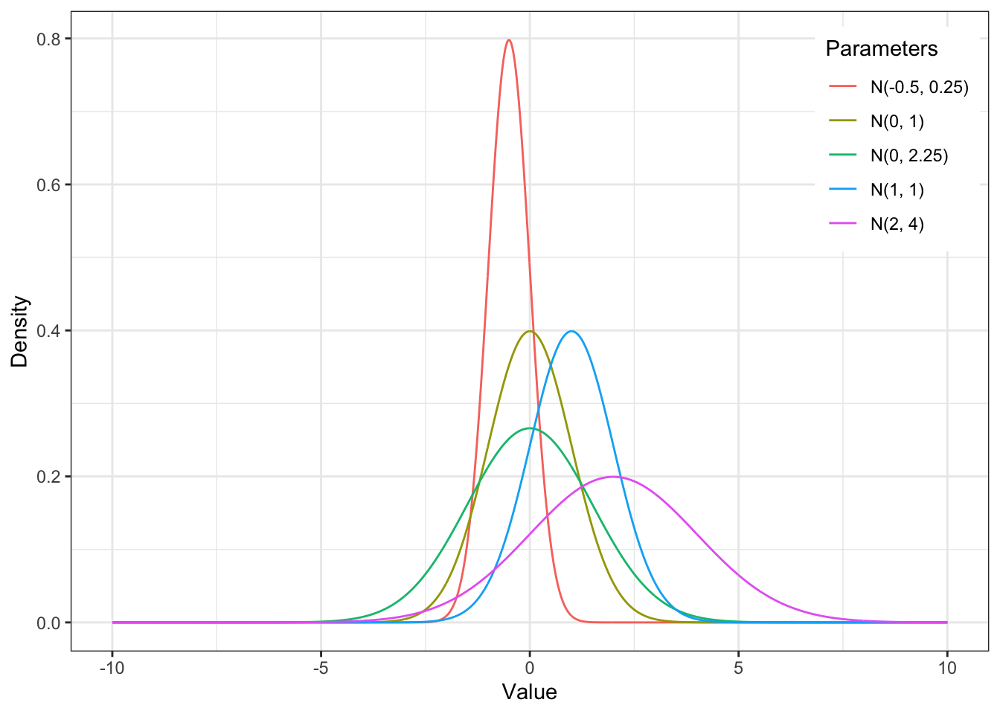
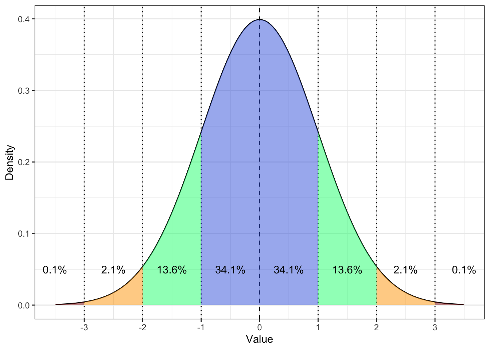

# Нормальное распределение {#normdist} 

## Центральная предельная теорема

**Центральная предельная теорема** -- важное понятие в статистике, применимой к исследованиям в социальных науках. Мы уже выучили, что переменные, с которыми мы работаем -- это случайные величины [#random-variable]. Именно этот факт позволяет нам вычислять могие параметры по тем формулам, которые мы используем: если бы мы работали не с случайными величинами, у нас была бы совсем другая статистика (кажется, куда более сложная)!

В общем виде, ее можно сформулировать так: случайная величина, подверженная влиянию многих факторов, чье значение нельзя предсказать точноо, распределена нормально.

Из нее есть важное следствие:
> Если мы проводим много одинаковых исследований, то выборочные средние этих исследований будут распределены нормально.

```{r}
samplemeans <- replicate(1000, mean(rnorm(100, mean = 100, sd = 15)))
hist(samplemeans, breaks = 30)
```

```{r}
mean(samplemeans)
sd(samplemeans)
```


Стандартное отклонение распределение выборочных срених называется **стандартной ошибкой среднего (standard error of the mean (s.e.m. или se)** и вычисляется по формуле $\sigma_{\overline{x}}= \frac{\sigma} {\sqrt{n}}$ или, используя выборочное стандартное отклонение по одной выборке $s_{\overline{x}}= \frac{s} {\sqrt{n}}$


https://gallery.shinyapps.io/CLT_mean/

## Стандартная ошибка среднего

$\mathrm{se} = \frac{\sigma}{\sqrt{n}} = \frac{sd}{\sqrt{n}}$


## Нормальное распределение и его свойства

Мы уже обсуждали нормальное распределение, когда говорили про распределения в целом [# Распределения]. Это вероятностный закон, где заданным значениям признака приводится в соответствие вероятность встретить признак с таким значением, выраженный по формуле $P(x) = \frac{e^{-(x - \mu)^{2}/(2\sigma^{2}) }} {\sigma\sqrt{2\pi}}$

Часто можно увидеть такую запись, обозначающую нормальное распределение: $\sim \mathcal{N}(\mu, \, \sigma^2)$

<p align="center"> 
```{r fig.align = 'center', out.width="60%"}

```
</p>


Нормальное распределение интересно нам как минимум потому, что многие признаки, которые мы исследуем, согласно центральной предельной теореме распределены номрально. Помимо этого **нормальное распределение обладает рядом свойств**:

* симметрично
* унимодально (только одна мода)
* отклонения от среднего подчинаются вероятностному закону: знаем, сколько процентов данных содержится в скольких стандартных отклонения от среднего

<p align="center"> 
```{r fig.align = 'center', out.width="60%"}
knitr::include_graphics("docs/images/Standard_deviation_diagram.png")
```
</p>


* в пределах одного стандартного отклонения от среднего значения лежит 68% значений — это очень частотные значения;
* в пределах двух стандартных отклонений от среднего значения лежит 95% значений — бо́льшая часть выборки;
* в пределах трех стандартных отклонений от среднего значения лежит практически 100% выборки — то есть вся выборка.

## Стандартное нормальное распределение


<p align="center"> 
```{r fig.align = 'center', out.width="60%"}

```
</p>

## Z-преобразование и стандартизация

$z = \frac{x - \bar x}{s}$

# Доверительный интервал

Мы рассмотрели описательные статистики: меры центральной тенденции и меры вариативности переменной. Этоо были тоочечные оценки: мы используем эти величины, чтобы описать наши данные, перейти от таблички с одному или нескольким числам. Помимо точечных оценок используются также интервальные -- если мы хотим получить не конкретное число, а интервал, в котором зато точно будет содержаться интересующий нас параметр.

Доверительный интервал -- процент выборок из генеральной совокупности, интервальные оценки которых будут содержать популяционное среднее.

https://rpsychologist.com/d3/ci/ 

Интервальные оценки

Доверительные интервал считается как $\pm t \times \mathrm{se} \\$

* $68\%:  \pm  1 \times \mathrm{se} \\$
* $95\%:  \pm  1.96 \times \mathrm{se} \\$
* $99\%:  \pm  3 \times \mathrm{se} \\$
