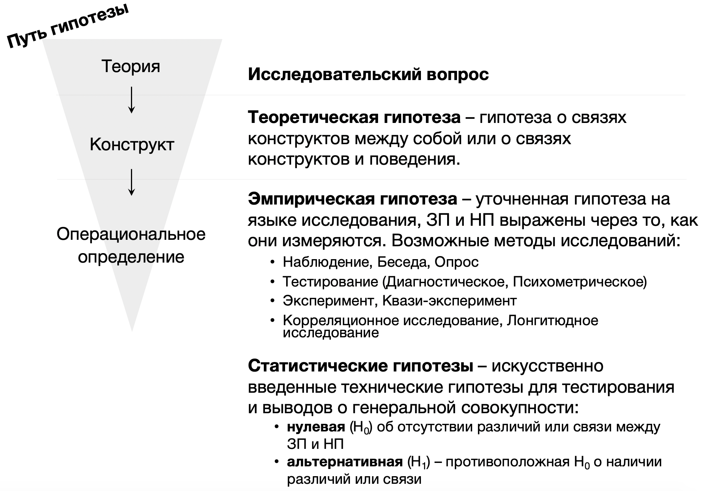
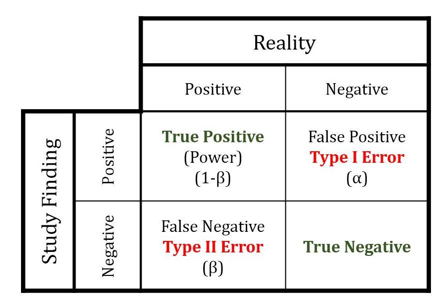

#  Статистический вывод {#inference} 

```{r, eval=TRUE, echo = FALSE, message = FALSE}
library(tidyverse)
library(kableExtra)
studens_mat <- read_csv("student-mat.csv") %>% 
  rename_with(., ~ paste0(., "_mat"), .cols = c(absences, paid, G1, G2, G3)) -> studens_mat 
studens_por <- read_csv("student-por.csv") %>% 
  rename_with(., ~ paste0(., "_por"), .cols = c(absences, paid, G1, G2, G3)) -> studens_por
studens_mat %>% 
  full_join(studens_por, by = c("school","sex","age","address","famsize","Pstatus","Medu","Fedu",
                             "Mjob","Fjob","reason", "guardian", "traveltime","studytime", "failures", "schoolsup", "famsup",
                             "activities", "nursery", "higher", "internet", "romantic", "famrel", "freetime", "goout", 
                             "Dalc", "Walc", "health")) -> students 

students %>% 
  mutate("student" = paste0("id", row_number()), .before = "school")  %>% 
  drop_na() %>% 
  mutate(G_mat = rowMeans(dplyr::select(., c(G1_mat, G2_mat, G3_mat))),
         G_por = rowMeans(dplyr::select(., c(G1_por, G2_por, G3_por)))) %>% 
  mutate(ansences_mat_groups = ifelse(absences_mat <=5, "less", ifelse(absences_mat <=15, "middle", "more"))) %>% 
  mutate(ansences_por_groups = ifelse(absences_por <=5, "less", ifelse(absences_por <=15, "middle", "more"))) -> students-> students
```


Мы закончили со введением в статистику, обсудили случайные величины и вероятность и научились считать описательные статистики: меры центральной тенденции, куда "тяготеет" центр масс наших данных (среднее, медиана, мода), и меры вариативности, показывающие, как сильно изменяются наши данные от наблюдения к наблюдению (дисперсия, стандартное отклонение, межквартильный размах). Описательные статистики были нужны нам, чтобы описать наши данные, заменить большую непонятную табличку сырых данных на конкретные значения и сделать какие-то или предположения о том, есть ли между ними различия, если мы говорим о выборке из генеральной совокупности, либо какие-то выводы, если наши данные представляют всю генеральную совокупность. 

Помимо описания данных, мы говорили о выборочных оценках -- рассчитанных на нашей выборке параметров в попытке оценить эти параметры у генеральной совокупности. Параметры нас, как правило, интересуют те, которые задают распределение признака в популяции. Вспоминаем, что в психологичесуких исследованиях наши признаки чаще всего являются случайными величинами, а значит, по центральной предельной теореме, распределены нормально.

**Оценки, которые мы получали:**

* Точечные оценки: выборочное среднее (M, $\overline X$ ) и выборочное стандартное отклонение (s, sd)
* Интервальные оценки: доверительный интервал, в котором с заданной вероятностью находится популяционное среднее: M ± CI. Чаще всего рассматривается 95% или 99% доверительные интервалы.

Вспомним, что популяционные и выборочные оценки пишутся специально по-разному, чтобы не запутаться, о выборке или генеральной совокупности идет речь:

.        | Генеральная совокупность | Выборка 
-------- | ------------------------ | ------- 
Среднее  |               $\mu$    |    M, $\overline X$   
Стандартное отклонение | 	$\sigma$|  s, sd 

<p align="center"> 
```{r eval=TRUE, echo = FALSE, message = FALSE, fig.align = 'center', out.width="100%"}

```
</p>

Вспомним расчет доверительного интервала:

> Исследование семейных пар в России (объем выборки составил 100 семейных пар), в которых есть дети подросткового возраста, показало, что те пары, где отец и мать работают полный рабочий день, они проводят со своими детьми в среднем 15 часов свободного времени в неделю. Согласно данным проведенного исследования, стандартное отклонение оказалось равным 4,5 (ч). Можно ли на уровне доверия 0,99 утверждать, что в семьях, в которых работают и отец, и мать, в среднем в течение недели родители проводят с детьми подросткового возраста больше 14 часов?

<div>
<details>
<summary>*Решение*</summary>

1. Сначала определеяем, о чем нас спрашивают в этой задаче: нам нужно посотроить доверительный интервал для выборочного среднего = 15 и сравнить его с числом 14: находится оно левее этого интервала, и тогда можно сказать, что родители проводят с детьми в среднем больше 14 часов, или 14 входит в этот интервал, и тогда это утверждение будет неверно

2. Вычисляем доверительный интервал CI (confidence interval): равен $Z_{99\%} \times se$:  Z-значение, при котором охватывается 99% даннных, равно примерно 3.
$se = \frac{\sigma}{\sqrt{n}} = \frac{sd}{\sqrt{n}} = \frac{4.5}{\sqrt{100}} = 0.45$
Доверительный интервал равен $Z_{99\%} \times se = 3 \times 0.45 = 1.35$:

3. Таким образом, можем записать доверительный интервал: $[M-CI; M+CI] = [15-1.35; 15+1.35] = [13.65;16.35]$. Сравним его с числом 14: видимо, что 14 входит в этот интервал, то есть, утверждение, что родители проводят с детьми в среднем больше 14 часов на уровне доверия 0.99 неверно.

</details>
</div>

## Идея статистического вывода

Как сделать правильный вывод и не облажаться?

* Сформулировать осмысленную проверяемую ипотезу
* Подобрать репрезентативную выборку
* Собрать на ней качественные (хорошие) данные
* Обработать данные в соответствии с алгоритмом качественной обработки

*Garbage in, garbage out (GIGO).*

<p align="center"> 
```{r eval=TRUE, echo = FALSE, message = FALSE, fig.align = 'center', out.width="100%"}
knitr::include_graphics("docs/images/garbage.jpg")
```
</p>

Мы находим в рамках фреквентистской (частотной) статистики -- то есть говорим о частотах и вероятностях. На выборочных оценках одного проведенного исследования мы мало что могли бы сказать: допустим, мы поисследовали 100 семейных пар и посчитали, что среднее время, которое родители проводят с детьми в России, равно 15 часов, но как понять, равно ли среднее в генеральной совокупности так же 15, а не, например, тем же 14?

Идея статистического тестирования гипотез (null hypothesis statistical testing) базируется на том, что мы выдвигаем какое-то предположение относительно генеральной совокупности и ее параметров: среднего (математического ожидания), стандартного отклонения или каких-то других параметров, и статистически проверяем это предположение. Если мы будем выбирать много выборок и считать их средние, какова веротность получить такие или более отличающиеся от популяционных выборочные оценки чисто случайным образом, если на самом деле это не так?

Вернемся к нашему примеру про время проведенное с детьми, вспомним датасет о португальских студентах


```{r eval=TRUE, echo = FALSE, message = FALSE}
kable(students[1:10,]) %>% scroll_box(width = "100%") 
```

Зададим три вопроса:

> Допустим, мы исследовали семьи с подростками в крупных (GP school) и небольших городах (MS school) и на нашей выборке посчитали, что в крупных городах родители проводят со своими детьми в среднем 14 часов, а в небольших городах -- 15 часов в неделю (из данных задания на доверительный интвервал). 
1. Отличается ли статически значимо время, которое проводят родители с детьми в России в крупных и небольших городах? 2. Отличается ли статистически значимо частота употребления алкоголя в семьях с менее поддерживающими отношениями и более поддерживающими? 
3. Отличается ли статистически значимо средний балл по математике у тех, кто чаще или реже пропускает занятия?

Мы увидели вопрос о статистической значимости. **Статистическая значимость** -- вероятностный уровень, через который должны перешагнуть наши найденные значения на *выборке* для того, чтобы мы могли сделать вывод о *генеральной совокупности*.
Почему нельзя просто сказать, что 14 и 15 -- очевидно разные числа, значит, и значения различаются? Потому что мы измерили эти значения только на одной выборке, а выводы, которые мы делаем, базируются на вероятностях получить такие или иные значения или частотах их возникновения (фреквентистская статистика!). И мы знаем, что если мы будем повторять исследование много-много раз, то средние в них не будут одинаковы, согласно [центральной предельной теореме](#ctt), они будут распределны нормально, где средним будет -- среднее генеральной совокупности (математической ожидание).

Для того, чтобы ответить на вопрос, есть ли статистически значимые различия, нужно проверить гипотезу о различиях по алгоритму **NHST (null hypothesis statistical testing)**

## NHST: чек-лист проверки гипотезы

* Сформулирована **эмпирическая гипотеза** (гипотеза на языке возможностей того исследования, которое будет проводиться), выделены **зависимая и независимая переменная** и характер исследуемой связи между ними.
* Есть понимание, как будут выглядеть собранные данные.
* Сформулированы **нулевая** $H_0$ и **альтернативная** $H_1$ **гипотезы** 
* Выбраны **уровень значимости** $\alpha$ (чаще всего α=0.05) и **статистическая мощность** $power = 1-\beta$ (чаще всего power=0.8).
* Выбран **статистический метод** проверки гипотезы (например, t-test, Манна-Уитни тест, ANOVA, тест Краскела-Уоллиса, корреляционный тест, линейная регрессия и т.д.).
* На основании α, power и размера эффекта предыдущих исследований для выбранного статистического метода рассчитан **размер необходимой выборки**.
* Выбрана среда анализа данных, данные предобработаны.
* Для выбранных переменных по отдельности посчитаны **описательные статистики**, переменные визуализированы с помощью гистограммы (histogram) или столбчатой диаграммы (barplot) или графика плотности вероятности (density plot).
* Проведен **статистический тест** выбранным статистическим методом, рассчитаны p-value, ключевая статистика (t-значение, F-значение, R, R2 и т.д) и размер эффекта (Cohen’s d, eta squared и тд).
* Полученные в ходе статистического теста **статистики проинтерпретированы**
* На основании полученных статистик **сделаны выводы относительно эмпирической гипотезы**.
* Данные **визуализированы** иллюстрирующим статистический тест графиком (диаграмма рассеяния с линией тренда, боксплот, вайолин плот и другие).

Разберем каждый шаг.

## Эмпирические гипотезы и переменные

**Эмпирические гипотезы** – те, которые мы можем проверить опытным путем. Чтобы правильно их сформулировать, нам надо также определиться с типом эмпирического исследования, которое возможно для проверки наших теоретических гипотез. В психологических исследованиях это чаще всего **эксперимент, квази-эксперимент, корреляционное исследование (и лонгитюдное исследование** как его подвид). Иногдd бывает **case study**, исследование одного конкретного случая, чаще в когнитивной психологии и нейронауках.

Эмпирические гипотезы сформулированы в проверяемом для нашего исследования виде, то есть переведенные на язык исследования, исходя из наших предполагаемых переменных и их значений. 

<p align="center"> 
```{r eval=TRUE, echo = FALSE, message = FALSE, fig.align = 'center', out.width="100%"}

```
</p>

### Эмпирические методы

Разберем несколько примеров

Ситуация 1

> Предположим, что группа ученых хочет исследовать влияние курения на возникновение ментальных расстройств Какие исследования можно провести для исследования этого вопроса?

Ситуация 2

> Предположим, что перед выборам в государственную думу группа социологов проводит опрос общественного мнения с целью выявления предпочтений к кандидатам. Для этого операторы колл-центра обзванивали телефонные номера, выбранные случайным образом из справочника телефонов Москвы, по принципу "каждый десятый номер". Обзвон продолжался в течение недели в рабочее время операторов колл-центра с 10 до 18.

И вернемся к нашей ситуации

> Допустим, мы исследовали семьи с подростками в крупных (GP school) и небольших городах (MS school) и на нашей выборке посчитали, что в крупных городах родители проводят со своими детьми в среднем 14 часов, а в небольших городах -- 15 часов в неделю (из данных задания на доверительный интвервал). 
1. Отличается ли статически значимо время, которое проводят родители с детьми в России в крупных и небольших городах? 2. Отличается ли статистически значимо частота употребления алкоголя в семьях с менее поддерживающими отношениями и более поддерживающими? 
3. Отличается ли статистически значимо средний балл по математике у тех, кто чаще или реже пропускает занятия?

Метод, который здесь используется -- это квази-эксперимент или корреляционное исследование (так как мы не можем взять одинаковые семьи и одним сказать "проводите по 15 часов с детьми", а другим -- "проводите по 14 часов с детьми", у нас уже есть эти группы, мы не проводим манипуляции сами).


Эмпирическая гипотеза 1 может звучать так: `семьи, живущие в крупных  городах, проводят в среднем меньше времени с детьми, чем семьи, живующие в маленьких городах`

Эмпирическая гипотеза 2: `Студенты, кто оценивает отношения с родителями как менее поддерживающие (переменная famrel, менее поддерживающие в значениях 1-2), чаще употребляют алкоголь (переменная Walc, употребление в выходные дни, значения 4-5)`

Эмпирическая гипотеза 3 `Студенты, у кого было много пропусков (absences_mat или absences_por, высокие значения), будут иметь более низкий средний балл (среднее из G1_mat, G2_mat, G3_mat или G1_por, G2_por, G3_por -- низкие значения)`

Давайте сначала подумаем, что это за гипотезы, какие зависимые и независимые переменные, наличие или отсутствие какой связи между зависимой и независимыми переменными нам хочется проверить?

### Зависимые и независимые переменные

**Независимые переменные** – это все, чем мы манипулируем по ходу проведения исследования, какие различия создаем с целью получить разный результат. **Зависимая** – целевая переменная, различия в которой как раз хотим получить путем манипуляции независимыми переменными, то, что мы измереяем. При описании исследования всегда важно записывать ЗП и НП, наряду с эмпирической (если метод это эксперимент, то экспериментальной) гипотезой. Эмпирическая гипотеза и переменные -- сердце нашего исследования, самое основное из языка, на котором описывается исследование, без понимания, что мы хгтим прооверить, чула не получится.

При описании ЗП и НП важно указать, к какой шкале они относятся? Это важно понимать, чтобы потом выбрать, как анализировать данные.

### Уровни НП в категориальных переменных

Об уровнях в НП говорят в категориальных -- порядковых или номинативных -- переменных. Например, условия "часто" и "редко", условия "обеспеченная семья" или "не обеспеченная". В примерах выше для гипотезы `семьи, живущие в крупных  городах, проводят в среднем меньше времени с детьми, чем семьи, живующие в маленьких городах` мы собираемся сравнить две группы, и здесь можно говорить об уровнях НП `город` -- `крупный город` и `небольшой город`. 


Для гипотезы 1

$ Школа \sim {среднее время с детьми / неделю}$

ЗП -- время с детьми, количественная непрерывная -- шкала отношений
НП -- школа в городе (крупном / небольшом), категориальная

Для гипотезы 2

$famrel \sim Walc$

ЗП -- ?
НП -- ?

Для гипотезы 3

$ \sim $

ЗП -- ?
НП -- ?

В зависимости от того, какие выводы мы хотим сделать, нам можем потребоваться разное количество уровней в данных. Сравните гипотезы: `Студенты, кто оценивает отношения с родителями как менее поддерживающие (переменная famrel, менее поддерживающие в значениях 1-2), чаще употребляют алкоголь (переменная Walc, употребление в выходные дни, значения 4-5)` и `Чем ниже студенты оценивают отношения с родителями (переменная famrel), тем чаще они употребляют алкоголь в выходные дни (переменная Walc)`. Чем они отличаются?

<div>
<details>
<summary>*Отличия*</summary>

</details>
</div>


От того, какой вывод мы хотим сделать, хотим ли обнаружить характер связи между уровнями категориальной переменной (чаще всего линейной, но может быть и какой-то еще, экспоненциальной например) или нам достаточноо сравнить двве группы между собой, будет зависеть, какой статистический метод будем выбирать. Вернемся к этому чуть позже.


### Связь между ЗП и НП

Выводы о какой связи мы можем установить?

Два основных вида связи между переменными:

* **Ассоциативная или корреляционная**
* **Причинно-следственная**

Три необходимых условия для установления **причинно-следственной связи**:

1. Изменение НП произошло раньше, чем мы пронаблюдали изменение в ЗП
2. Изменения НП имеют ассоциативную связь с изменениямм в ЗП 
3. Нет никаких альтернативных объяснений изменений в ЗП, помимо изменений НП


Сейчас у нас есть только опросные данные, в которых студенты отвечали на вопросы одновременно. Получается, что в таком дизайне исследования мы не проходим необходимые условия для установления причинно-следственной связи, следовательно, сделать вывод о причинно-следственной связи не можем. Причинно-следственную связь мы можем установить только в ходе **эксперимента** или **квази-эксперимента** (отличается от эксперимента тем, что испытуемые не распределяются в группы рандомно, а используются уже существующие в популяции группы, например, разные страны). Во всех остальных видах исследований, особенно, когда исследуется связь переменных в одном самоотчете или опроснике, мы можем говорить только об ассоциативной или корреляционной связи.

Часто бывает, что Вполне вероятно, что плохие отношения в семье приводят у алкоголизму у детей. Но у нас в нашей выборке есть только такие данные -- из опросника, и из тех данных того исследования, которые у нас есть, мы можем судить только о наличии или отсутствии корреляции.

При формулировании выводов эти выводы могут отличаться так, сравните:
- Вывод 1: "Менее поддерживающие отношения в семье вызывают алкоголизм".
- Вывод 2: "Менее поддерживающие отношения в семье ассоциированы с высоким риском алкоголизма".

Несмотря на то, что мы говорим о корреляции, тут тоже есть варианты. Сравните варианты формулировок для гипотезы 1: `чем меньше возраст студентов (age), чем ниже будут ответы в переменной Walc` и `студенты возраста 15, 16, 17 лет будут выбирать меньшие варианты ответа в переменной Walc` или `студенты возраста 15 лет будут выбирать меньшие варианты ответа в переменной Walc`. Чем они отличаются? 

<div>
<details>
<summary>*Отличия*</summary>

</details>
</div>

Для того, чтобы проверить, есть ли статистически значимые различия между этими группами, нужно сформулировать нулевую и альтенативную гипотезы.


## Нулевая и альтернативные статистические гипотезы

Нулевая и альтернативные гипотезы -- вспомогательные гипотезы, чисто статистические, для того, чтобы проверить нашу эмпирическую гипотезу.


**Нулевая гипотеза** $H_0$ -- это всегда гипотеза об отсутствии различий в генеральной совокупности.
**Альтернативная гипотеза** $H_1$ -- гипотеза, противоположная к $H_0$, то есть гипотеза о наличии различий в генеральной совокупности. $P(H_0) + P(H_1) = 1$

Какие $H_0$ и $H_1$ для гипотез? 

`1. Отличается ли статически значимо время, которое проводят родители с детьми в России в крупных и небольших городах?`
`2. Отличается ли статистически значимо частота употребления алкоголя в семьях с менее поддерживающими отношениями и более поддерживающими? `
`3. Отличается ли статистически значимо средний балл по математике у тех, кто чаще или реже пропускает занятия?`

### Направленные и ненаправленные гипотезы

На этом этапе нам важно, как сформулирована эмпирическая гипотеза, в сторону увеличения / уменьшения значения ЗП в одноой из групп или в общем виде, что значения ЗП в группах ненаправленно различаются?

## Уровень значимости и статистическая мощность

После того, как мы разобрались с гипотезами, эмпирической и статистическими, нам нужно задать критерии, на основании которых будем принимать решение о выводах из нашей выборке на генеральную совокупность.

Уровень значимости $\alpha$  и статистическая мощность $power = 1-\beta$ – это два из самых важных параметров в тестировании гипотез. Эти понятия задают вероятностные рамки, в которых мы будем проводить тест. Первая рамка – это вероятность получить значимый результат (значимые различия между группами или связь между переменными), если его на самом нет в генеральной совокупности – ложноположительный результат, false positive, она же ошибка первого рода $\alpha$. 

<p align="center"> 
```{r eval=TRUE, echo = FALSE, message = FALSE, fig.align = 'center', out.width="70%"}

```
</p>

Вторая рамка – вероятность получить незначимый результат, если его на самом деле он есть в генеральной совокупности – ложноотрицательный результат, false negative, она же ошибка второго рода $\beta$.

<p align="center"> 
```{r eval=TRUE, echo = FALSE, message = FALSE, fig.align = 'center', out.width="80%"}
knitr::include_graphics("docs/images/errors.jpg")
```
</p>

**Уровень значимости** $\alpha$, она же ошибка первого рода -- сделать ложноположительный вывод, то есть когда эффекта нет в генеральной совокупности, но мы делаем вывод, что он есть --  мы задаем сами (!). В психологии есть конвенциональная договоренность считать уровень значимости $\alpha = 0.05$. То есть, мы просто договорились считать 5% вероятность сделать ложноположительный вывод -- компромиссным вариантом между тем, чтобы мочь делать вообще какие-то выводы о генеральной совокупности, и тем, что 5%  наших исследований будут содержать неверные выводы (на самом деле, гораздо больше, об этом поговорим позже).

Но это договоренность, притом спорная!
В физике элементарных частиц  $\alpha = 0.000003$!

Статья "Justify your alpha" в Nature Human Behaviour https://www.nature.com/articles/s41562-018-0311-x


Вероятность, при которой в генеральной совокупности на самом деле есть разница между группами или связь, но мы не смогли зарегистрировать ее на наших данных $\beta$, она же ошибка второго рода – это ошибка второго рода, вероятность сделать ложноотрицательный вывод. И если ошибка первого рода $\alpha$ эксплицитно фигурирует в тестировании гипотезы -- это то значение, с которым мы сравниваем наше получившееся p-value, то $\beta$ не участвует в этом тестировании. То есть, мы можем легко получить ложнооотрицательный вывод, отсутствие результатов, хотя на самом деле они есть. Поэтому нам Нужно ввести $\beta$ в прооверку гипотезы и минимизировать такую вероятность. Для этого введено понятие статистической мощности теста $power = 1 - \beta$.

**Уровень статистической мощности (statistical power)** – это положительная метрика, уровень вероятности, при которой мы гарантируем, что если различия между группами или связь между переменными есть в генеральной совокупности, то мы сможем найти ее на наших данных при помощи нашего статистического теста. Если смотреть на таблицу ошибок первого и второго рода, статистическая мощность -- обратная величина к вероятности ошибки второго рода, не найти значимый эффект, если он есть. В психологии конвенционально сложилось, что чаще всего статистическую мощность принимают на уровне  $power = 1 - \beta$. Снова договоренность!


## Выбор статистического критерия

Как понять, какой тест выбрать? Это, наверное, один из самых сложных вопросов в статистике.

**Вопросы, которые влияют на принятие решения относительно статистического теста:**

1. Зависимая переменная количественная (интервальная шкала или шкала отношений) или категориальная (номинативная или порядковая шкала)?
2. Если ЗП количественная -- она описывается параметрическим (чаще всего нормальным) распределением? *(определяется чаще "на глаз" по графику плотности вероятности или QQ-графиками, тесты на нормальность почти всегда будут давать негативный результат из-за чувствительности и поэтому в современном анализе данных используются мало)*
3. Сколько независимых переменных?
4. НП количественные (интервальная и шкала отношений) или категориальные (номинативная и порядковая)?
5. Если НП категориальные и мы сравниваем группы -- данные в группах зависимы или нет? Если нет, как сильно отличаются данные в группах, можем ли сказать, что дисперсия ЗП примерно одинакова в группах или нет? (*равенство дисперсий называется Homogeneity of Variance, проверяется с помощью Levene's test*)

Есть большое количество схем, но обычно они сильно перегруженны и сложны в использовании, больше путают, чем помогают. 

<p align="center"> 
```{r eval=TRUE, echo = FALSE, message = FALSE, fig.align = 'center', out.width="100%"}

```
</p>

## Размер выборки

**Расчет размера выборки** -- важнейший этап, потому что именно он отвечает за нивелирование ошибки второго рода, сделать ложноотрицательный вывод. Вполне может оказаться так, что из-за маленькой выборки мы просто не смогли зафиксировать различия, которые на самом деле есть в генеральной совокупности! 

Этот пункт раньше часто пропускался: казалось, что размер выборки не требует определенного расчета, и достаточно опираться на предыдущие исследование. Оказалось, что это не так, подробнее о последствиях такого подхода поговорим далее.

Чтобы посчитать необходимую выборку, нужно знать примерный размер эффекта, который мы можем обнаружить, уровень значимости $\alpha$, и статистическую мощность.

**Размер эффекта** -- это величина наблюдаемых различий. За степень различий отвечает не полученная статистика после примененного статистического критерия (например, t-значение, F-значение), и не p-значение, а отдельная метрика. Эта метрика расчитывается по формулам индивидуально для каждого статистического теста. Например, для t-test размер эффекта -- это $Cohen's d$ или его нормализованная версия $Hedges` g$. Исключение составляет только коэффициент корреляции $r$ -- он как раз будет являться и статистикой, и величиной эффекта. Для линейной регрессии с одинм предиктором размером эффекта может также являться $R^2$, а для множественной, когда много предикторов, лучше уже использовать метрику $Cohen’s f^2$ В психологических исследованиях размер эффекта редко бывает большим. И чем меньше ожидаемый размер эффекта, тем больше наблюдений нам надо собрать для возможности сделать точный вывод о наличи или отсутствии различий в генеральной совокупности.

Есть хорошая визуализация размера эффекта дла t-test *Cohen's d*  https://rpsychologist.com/d3/cohend/

Размер эффекта обычно используется в двух случаях:

1. Для расчета размера выборки при планировании исследования *(текущий момент)* --  в этом с лучае используется размер эффекта из аналогичных уже проведенных исследований для того, чтобы примерно оценить возможности поймать популяционный эффект на нашей выборке и набрать нужное количество.
2. При репортинге результатов уже проведенного собственного статистического теста. Здесь он указывается вместе со статистиками, об этом в разделе [Статистики вывода: расчет разных статистических методов для проверки гипотез]

Если в статьях, на которые вы опираетесь при планировании исследования, не указан размер эффекта, его можно посчитать самостоятельно.

Разделение размеров эффекта https://imaging.mrc-cbu.cam.ac.uk/statswiki/FAQ/effectSize 

Стат критерий | Метрика размера эффекта | Маленький эффект | Средний эффект | Сильный эффект 
------------- | ----------------------- | ---------------- | -------------- | -------------
t-test | $Cohen's d, Hedges' g$ | 0.2 | 0.5 | 0.8
ANOVA | $\eta^2, \omega^2$ | 0.01 | 0.06 | 0.14

"Calculating and reporting effect sizes to facilitate cumulative science: a practical primer for t-tests and ANOVAs" https://www.frontiersin.org/articles/10.3389/fpsyg.2013.00863/full 

**Размер эффекта, уровень значимости $\alpha$, статистическая мощность и размер выборки -- связанные параметры. Зная 3 их них, всегда можно вычислить четвертый!** 

<p align="center"> 
```{r eval=TRUE, echo = FALSE, message = FALSE, fig.align = 'center', out.width="80%"}
knitr::include_graphics("docs/images/power_samplesize.jpg")
```
</p>

Куда будут попадать выборочные средние при справедливости альтернативной гипотезы?
https://rpsychologist.com/d3/nhst/

Underpowered studies -- огромнная проблема многих наук. "Power failure: why small sample size undermines the reliability of neuroscience" https://www.nature.com/articles/nrn3475

Зная статистическую мощность, уровень значимости и размер эффекта -- размер выборки можно рассчитать в Gpower https://www.psychologie.hhu.de/arbeitsgruppen/allgemeine-psychologie-und-arbeitspsychologie/gpower или в R, например, с помощью пакета `pwr` https://cran.r-project.org/web/packages/pwr/pwr.pdf. Рассчитаем вторым способом.

Допустим, мы решили проверять гипотезу о том, что студенты, чьи родители получили магистерское образование, учатся лучше, чем те, чьи родители закончили колледж. Выбрали уровень статистической значимости $\alpha = 0.05$, с которым будем сравнивать p-values, которые получим. Выбрали уровень статистической мощности $power = 0.8$ (то есть ошибка второго рода $\beta = 0.2$). Выбрали, что будем проверять эти гипотезу с помощью t-test. Из предыдущего похожего исследования узнали, что размер эффекта в аналогичном исследовании был равен Cohen's d = 0.37. И теперь можем оценить, сколько данных нам нужно набрать, чтобы если различие между такими студентами было в генеральной совокупности, мы смогли обнаружить его на наших данных. Эти 4 величины связаны между собой математически, поэтому зная 3 любых, мы можем вычислить четвертую. https://rpsychologist.com/d3/nhst/ 

```{r}
library(pwr)
pwr::pwr.t.test(d=0.37,power=0.8,sig.level=0.05,type="two.sample", alternative="greater")
```
Анлогично, расчет размера выборки для проверки гипотезы о том, что образование родителей и прохождение подготовительного курса как-то связано с успеваемостью студентов с помощью построения линейной модели.
```{r, message=FALSE}
library(WebPower)
WebPower::wp.regression(n = NULL, p1 = 2, f2 = 0.24, alpha = 0.05, power = 0.8)
```

У пакета есть веб-приложение https://webpower.psychstat.org/models/reg01/

Важный момент про статистическую мощность: именно она как раз показывает, с какой частотой будут выпадать $p$-values < $\alpha$ в случае верности альтернативной гипотезы (что различия или связь есть!)

<p align="center"> 
```{r eval=TRUE, echo = FALSE, message = FALSE, fig.align = 'center', out.width="100%"}
knitr::include_graphics("docs/images/pvalue_dist_2.png")
```
</p>

Для того, чтобы детально поразбираться в нюансах размера эффекта и выборки, можно пройти курс Лакенса https://www.coursera.org/learn/statistical-inferences (кажется, теперь только с vpn)

<div>
<details>
<summary>*Мем про статистически вывод*</summary>
<p align="center"> 
```{r eval=TRUE, echo = FALSE, message = FALSE, fig.align = 'center', out.width="100%"}
knitr::include_graphics("docs/images/meme_effsize.png")
```
Мем из Когнитивного патимейкера
</p>

</details>
</div>

## Расчет статического критерия и проверка значимости

$\mu$ = 18, M = 15, n = 100, sd = 4.5

Построим распределение выборочных средних. Мы предположили, что популяционное среднее равно 18, а чему равно стандартное отклонение этого распределения?

<p align="center"> 
```{r eval=TRUE, echo = FALSE, message = FALSE, fig.align = 'center', out.width="80%"}
knitr::include_graphics("docs/images/means_dist.png")
```
</p>

Сначала считаем стандартную ошибку среднего $\mathrm{se} = \frac{\sigma}{\sqrt{n}} = \frac{sd}{\sqrt{n}}$

Как понять, насколько далеко наше выборочное среднее отклонилось от популяционного в 18? 

Надо посчитать z-оценку!

<p align="center"> 
```{r eval=TRUE, echo = FALSE, message = FALSE, fig.align = 'center', out.width="80%"}
knitr::include_graphics("docs/images/z_dist.png")
```

https://gallery.shinyapps.io/dist_calc/ 

Статья "A Dirty Dozen: Twelve P-Value Misconceptions" https://sixsigmadsi.com/wp-content/uploads/2020/10/A-Dirty-Dozen-Twelve-P-Value-Misconceptions.pdf

<!-- $z = \frac{x - \bar x}{s}$ -->


