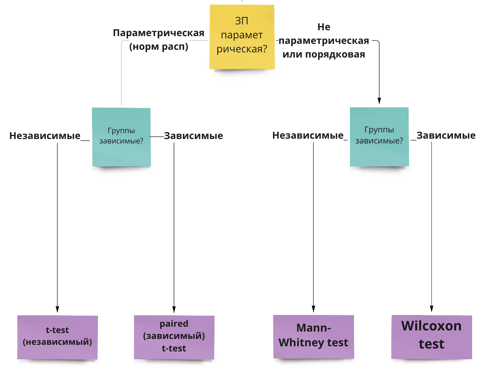

#  Статистические критерии {#stats_criteria} 

```{r, eval=TRUE, echo = FALSE, message = FALSE}
library(tidyverse)
library(kableExtra)
studens_mat <- read_csv("student-mat.csv") %>% 
  rename_with(., ~ paste0(., "_mat"), .cols = c(absences, paid, G1, G2, G3)) -> studens_mat 
studens_por <- read_csv("student-por.csv") %>% 
  rename_with(., ~ paste0(., "_por"), .cols = c(absences, paid, G1, G2, G3)) -> studens_por
studens_mat %>% 
  full_join(studens_por, by = c("school","sex","age","address","famsize","Pstatus","Medu","Fedu",
                             "Mjob","Fjob","reason", "guardian", "traveltime","studytime", "failures", "schoolsup", "famsup",
                             "activities", "nursery", "higher", "internet", "romantic", "famrel", "freetime", "goout", 
                             "Dalc", "Walc", "health")) -> students 

students %>% 
  mutate("student" = paste0("id", row_number()), .before = "school")  %>% 
  drop_na() %>% 
  mutate(G_mat = rowMeans(dplyr::select(., c(G1_mat, G2_mat, G3_mat))),
         G_por = rowMeans(dplyr::select(., c(G1_por, G2_por, G3_por)))) %>% 
  mutate(absences_mat_groups = ifelse(absences_mat <=5, "less", ifelse(absences_mat <=15, "middle", "more"))) %>% 
  mutate(absences_por_groups = ifelse(absences_por <=5, "less", ifelse(absences_por <=15, "middle", "more"))) -> students
```


Статистическим критерием называется правило, по которому мы будем пытаться отвергнуть нулевую гипотезу. Разным гипотезам и данным подходят разные критерии.

Статистический критерий включает:

* **Теоретическое распределение**, на графике плотности вероятности которого мы будем располагать сравниваемые средние: вид кривой и математическая формула этого вероятностного закона (Т-распределение, F-распределение, $\chi^2$-распределение и другие)
* **Формулу**, по которой мы будем рассчитывать искомое **значение критерия** (как уже рассчитывали $Z_{Mмаленькие}$) исходя из наших данных на выборке для Z-оценки)
* Cоответствие каждого посчитанного по этой формуле значения (например, Z-значения или Т-значения) проценту данных, расположенных за этим значением на графике плотности вероятности этого распределения (*мы не будем пользоваться такими таблицами соответствий, за нас все считают бесдушные машины*)
* **Формулу для рассчета числа степеней свободы** для этого критерия

## Степени свободы

Число степененй свободы (Degrees of Freedom, df) -- количество направления для изменения признака. Формула для расчета степеней свободы своя для каждого статистического критерия (нам не нужно рассчитывать самостоятельно) и зависит, собственно, от вида статистического критерия, дизайна нашего исследования (сколько сравнений мы проводим) и числа наблюдений в выборке.

Для t-критерия число степеней свободы высчитывается очень просто: $df = n_1 -1 + n_2 - 1 = n_1 + n_2 - 2$

## Ключевые распределения и статистики критериев (Z, T, F)

**Z-распределение**

В прошлый раз мы рассмотрели пример, когда сравнивали среднее время, которое проводят родители с детьми, в больших и маленьких городах, и сравнивали эти значения на примере [Z-распределения] {stat_test_example): мы получали Z-статистику и находили соответствующий распределению Z-оценок процент данных для найденной точки.

<p align="center"> 
```{r eval=TRUE, echo = FALSE, message = FALSE, fig.align = 'center', out.width="100%"}
knitr::include_graphics("docs/images/z-dist_2.png")
```


$Z = \frac{M - \mu}{\frac{\sigma}{\sqrt{n}}} = \frac{M - \mu}{\frac{sd}{\sqrt{n}}}$

</p>

Это самый простой вариант критерия для проверки статистических гипотез -- но не единственный. На самом деле, в качестве распределения, на которое мы помещаем точки (средние) и сравниваем их друг с другом, могут быть и другие, в зависимости от характера наших данных. Рассмотрим основные из них.

https://gallery.shinyapps.io/dist_calc/ 

**T-распределение Стьюдента**

<p align="center"> 
```{r eval=TRUE, echo = FALSE, message = FALSE, fig.align = 'center', out.width="70%"}
knitr::include_graphics("docs/images/t-dist.png")
```
</p>

Как мы видим, оно очень похоже на Z-распределение, но у него чуть более приподнятые хвосты.

Формула, которой задается вероятностный закон Т-распределения Стьюдента:

<p align="center"> 
```{r eval=TRUE, echo = FALSE, message = FALSE, fig.align = 'center', out.width="50%"}
knitr::include_graphics("docs/images/t-dist-pdf.png")
```
</p>


Негласно считается, что при объеме выборки от n=30 t-распределение считается близким к Z-распределению, которе является нормальным, и можем использовать его. Но в реальности это не совсем так.

Формула для расчета T-значения исходя из наших данных:

<p align="center"> 
$t = \frac{M_1 - M_2}{\frac{sd_{1;2}}{\sqrt{n_{1;2}}}} = \frac{M_1 - M_2}{\sqrt{\frac{sd_1^2}{n_1} + \frac{sd_2^2}{n_2}}}$
</p>

**F-распределение**

<p align="center"> 
```{r eval=TRUE, echo = FALSE, message = FALSE, fig.align = 'center', out.width="100%"}
knitr::include_graphics("docs/images/F-dist.png")
```
</p>

$\chi^2$**-распределение**

<p align="center"> 
```{r eval=TRUE, echo = FALSE, message = FALSE, fig.align = 'center', out.width="100%"}
knitr::include_graphics("docs/images/chisq_dist.png")
```
</p>


## Выбор статистического критерия 

**Вопросы, которые влияют на выбор статистического теста:**

1. Зависимая переменная: количественная (интервальная шкала или шкала отношений) или категориальная (номинативная или порядковая шкала)?
2. Если ЗП количественная -- она описывается параметрическим (чаще всего нормальным) распределением? *(определяется чаще "на глаз" по графику плотности вероятности или QQ-графиками, тесты на нормальность почти всегда будут давать негативный результат из-за чувствительности и поэтому в современном анализе данных используются мало -- [подробнее чуть ниже](#param_nonparam))*
3. Сколько независимых переменных?
4. НП количественные (интервальная и шкала отношений) или категориальные (номинативная и порядковая)?
5. Если НП категориальные и мы сравниваем группы -- данные в группах зависимы или нет? Если нет, как сильно отличаются данные в группах, можем ли сказать, что дисперсия ЗП примерно одинакова в группах или нет? (*равенство дисперсий называется Homogeneity of Variance, проверяется с помощью Levene's test*)

Есть большое количество схем, но обычно они сильно перегруженны и сложны в использовании, больше путают, чем помогают. 

Но я зачем-то все равно решила попробовать нарисовать свою, и вот результат:
<https://miro.com/app/board/uXjVOxmKhr8=/?share_link_id=245423331470> (будет обновляться)

<p align="center"> 
```{r eval=TRUE, echo = FALSE, message = FALSE, fig.align = 'center', out.width="100%"}

```
</p>


### Параметрические и непараметрические критерии {#param_nonparam}

В списке вопросов, которые влияют на выбор статистического критерия, вторым пунктом идет вопрос о параметрике. Что это значит?

Под **параметрическими** распределением имеется в виду любое распределение, которое можно описать законом. Вспоминаем: закон распределения -- это формула, по которой можем привести любому числу вероятность встретить такое значение в природе (разбирали это в теме про [распределения](#distributions) ). В этой формуле есть параметры -- неизвестные переменные, которые мы стремимся узнать. Для нормально распределения это среднее генерально совокупности (математическое ожидание) и стандартное отлокнение генеральной совокупности. Посмотрим еще раз на формулу нормального распределения и найдем их:
$P(x) = \frac{e^{-(x - \mu)^{2}/(2\sigma^{2}) }} {\sigma\sqrt{2\pi}}$

Вспомним еще, что признаки, которые мы исследуем в психологических исследованиях, являются в основном [случайными величинами](#random-variable), а при большом объеме данных случайные величины, согласно [центральной предельной теореме](#ctt), распределены нормально. Поэтому в исследования психологических признаков под параметрическим распределением обычно имеется в виду одно конкретное распределение -- **нормальное**.

Если переменная, которая выражает исследуемый признак, распределена нормально, то мы можем применять для ее изучения параметрические статистические критерии, предполагающие нормальное распределение данных: т-тест, ANOVA. Если переменная распределна не нормально, то нужно использовать их непараметрические аналоги: тест Манна-Уитни или Вилкоксона, тест Краскела-Уоллиса. 

Проверка на нормальность -- довольно устоявшаяся в алгоритме проверки гипотез рутина. Но есть один нюанс.

1. При малом объеме данных сложно понять, как распределены данные, нормально или нет.
2. При большой объеме данных любое, даже малейшее отклонение от нормального распределения будет значимым.

Поэтому в современной культуре исследований проверке на нормальность уже не отводится такое сакральное значение. Важнее, например, оперировать размером выборки: если она достаточно большая (можем вернуться к эмприческому правилу к n >= 30), то достаточно взлянуть на распределение данных и QQ-plot, и если они не вызывают подозрений, смело использовать параметрические методы. Если выборка маленькая или если данные при большой выборке явно сильно отличаются от колоколообразной гауссианы, то лучше использовать a) непараметрические аналоги б) обобщенные линейные модели (про них поговорим позже).

Итак, я бы не рекомендовала делать тщательную проверку на нормальность вроде теста Колмогорова-Смирноова или Шапиро-Улика (хотя можно их считать, это не возбраняется), а оценить принадлежность к параметрическому (в данном случае нормальному) распределению следующим образом:

1. График плотности вероятности или гистограмма: симметричность и эксцесс [обсуждали их тут](#descriptive_vis)
2. QQ-plot

<p align="center"> 
```{r eval=TRUE, echo = FALSE, message = FALSE, fig.align = 'center', out.width="70%"}

```
Графики из книжки Энди Филда "Discovering Statistics Using R"</p>

Верхняя строка графиков показывает, как могут выглядить графики в случае близкого к норрмальному распределению: гистограмма или график плотности вероятности зависимой переменной похож на колоколообразную гауссиану, на QQ-плоте теоретические квартили почти соответствую фактическим на данных -- чем больше этот график похож на прямую линию y = x, тем лучше.

Нижняя строка графиков показывает обратную историю, как могут выглядить визуализации распределения ЗП, которую мы НЕ будем считать нормально распределенной: график плотности и вероятности и гистограмма сильно скошенны влево, QQ-плот уже мало похож на прямую.
 
### Зависимые и независимые выборки

Еще один пункт при выборе статистического критерия -- это зависимые у нас наблюдения или нет. Мы обсуждали [зависимые и независимые выборки вначале](#dependent_samples). Теперь это знание пригодится нам, чтобы правильно подбирать статистический метод.

<p align="center">
```{r echo= FALSE, fig.align = 'center', out.width="100%"}
knitr::include_graphics("docs/images/samples.png")
```
</p>

## T-тест (сравнение средних двух групп) {#ttest}

Первым из статистических критериев мы рассмотрим один из самых простых вариантов -- т-тест.

Это статистический критерий, распределение которого относится к семейству Т-распределений -- очень похоже на нормальное, но с более приподнятыми хвостами. Используется для сравнения средних двух групп, измеренных в метрической (количественной) шкале. Для остальных шкал т-тест не подходит *(хотя признаки, измеренные по шкале Лайкерта, например, по шкале от 1 до 5, иногда могут приписываться к количественным измерениям, но в рамках этого курса мы не будем это затрагивать)*

Нулевая и альтернативная гипотезы:


<p align="center">$H_0$: $\mu_1 = \mu_2$ </p>
<p align="center">$H_1$: $\mu_1 \neq \mu_2$ </p>


Вернемся к данным про студентов и нашим вопросам и разберем теперь следующий вопрос:

> 
3. Отличается ли статистически значимо средний балл по математике у тех, кто чаще или реже пропускает занятия?

```{r eval=TRUE, echo = FALSE, message = FALSE}
kable(students[1:10,]) %>% scroll_box(width = "100%") 
```

Мы уже [обсуждали в предыдущей главе](#variables), что ЗП здесь -- средний балл по математике (колонка `G_mat`), НП -- количество пропусков занятий по этом предмету (`absences_mat`). И ЗП, и НП -- количественные, закодированы в шкале отношений. Значит, можем пользоваться той веткой статистических тестов, которая подходит для количественных ЗП.

Пройдем по алгоритму выбора статистического теста: <https://miro.com/app/board/uXjVOxmKhr8=/?share_link_id=245423331470>

Помимо основных отраженных ответвлений, видим, что для каждого критерия существует ряд допущений.

**Допущения (assumptions)** -- это утверждения про характер наших данных, без соблюдения которых параметрические тесты будут работать некорректно (поэтому их никто и не любит).

### Допущения для т-теста

1. Данные распределены нормально (или, если измеряемый признак является случайной велиичной, в группах больше 30 наблюдений) -- обсуждали эту проверку [здесь](#param_nonparam)
2. Дисперсии однородны (гомогенны) -- проверяется с помощью теста Ливеня (Homogeneity of Variance test, он же Levene's test).

### Непараметрические аналоги

В случае, если допущения нормальности и однородности дисперсий нарушаются, мы не можем использовать т-тест. 

<p align="center"> 
```{r eval=TRUE, echo = FALSE, message = FALSE, fig.align = 'center', out.width="70%"}

```
</p>

### Независимые и парные тесты

Тут тоже все довольно просто:

* Если у нас независимые выборки, то мы используем независмый т-тест или его непараметрический аналог -- тест Манна-Уитни.
* Если выборки зависимые, то мы используем парный т-тест или его непараметрический аналог -- тест Вилкоксона.

Обилие наименований может быть пугающим, но по сути, это один и тот же тест с небольшими поправками -- просто в разных названиях увековечено больше статистиков!

### Вычисление т-теста и непараметрических аналогов

Средний балл и стандартное отклонение в группах тех, кто прогуливает меньше всего (на паре мы назвали их прихожанами):

```{r eval=TRUE, echo = FALSE, message = FALSE}
students %>% 
  filter(absences_mat_groups == "less") %>% 
  summarise(mean = mean(G_mat), sd = sd(G_mat), n = length(G_mat))
```
Средний балл в группах прогулищиков:

```{r eval=TRUE, echo = FALSE, message = FALSE}
students %>% 
  filter(absences_mat_groups == "more") %>% 
  summarise(mean = mean(G_mat), sd = sd(G_mat), n = length(G_mat))
```


```{r, eval=TRUE}
students %>% 
  filter(absences_mat_groups != "middle") -> students_2

t.test(students_2$G_mat ~ students_2$absences_mat_groups, paired = FALSE)
```

```{r eval=TRUE, echo = FALSE, warning=FALSE}
students_2 %>% 
  ggplot(aes(x=absences_mat_groups, y = G_mat)) +
  geom_boxplot(aes(fill = absences_mat_groups)) +
  # scale_fill_viridis(discrete=TRUE) +
  theme_minimal()
```

```{r eval=TRUE, echo = FALSE, warning=FALSE}
students_2 %>% 
  ggplot(aes(x=absences_mat_groups, y = G_mat)) +
  geom_violin(aes(fill = absences_mat_groups)) +
  geom_boxplot(aes(fill = absences_mat_groups), width=0.2) +
  stat_summary(fun.y = "mean", colour = "black", size = 2, geom = "point") +
  # stat_summary(fun.data=mean_se, geom="errorbar", color="black", width=0.2) +
  theme_minimal()
```

## ANOVA (дисперсионный анализ)

**ANOVA (ANalysis Of VAriance)** -- статистический критерий, распределение и ключевая статистика которого относятся к семейству F-распределений. Это то чуть скошенное влево распределение, уже сильно отличающееся от нормального. На этом распределении мы (точнее специально обученные программы) будут располагать F-значение, которое будет вычисляться. Этот критерий используется, когда зависимая переменная (ЗП) измерена в метрической (количественной) шкале, а независимые переменные (НП) -- категориальные (порядковые или номинативные). ANOVA применяется, когда число проводимых сравниваемых становится больше двух -- то есть, либо это одна НП, которая может принимать три значения (уровня), либо число НП больше или равно двум. 

**ANOVA используется тогда, когда число сравнений, которые нам нужно сделать, становится больше двух**. Можно сделать и два сравнения с помощью ANOVA, но это будет бессмысленно, так как по сути это старый добрый т-тест. 

Нулевая и альтернативные гипотеза для ANOVA:

<p align="center">$H_0$: $\mu_1 = \mu_2 = ... =\mu_n$ </p>
<p align="center">$H_1$: $\mu_1 \neq \mu_2 \neq ... \neq \mu_n$ </p>


Как вообще получается, что нам нужно сделать больше двух сравнений?

### Факторы и уровни {#levels}

**Фактором** или **предиктором** в линейных моделях и дисперсионном анализе называется независимая переменная. 

Как правило, мы применяем ANOVA для сравнения групп, поэтому эта независимая переменная -- категориальная, она принимает конечное число значений. Значений НП -- это те группы, которые мы сравниваем между собой, они называются **уровнями НП или уровнями фактора**. 

<p align="center"> 
```{r eval=TRUE, echo = FALSE, message = FALSE, fig.align = 'center', out.width="70%"}
knitr::include_graphics("docs/images/levels.png")
```
</p>

В зависимости от числа НП и уровней НП можно конкретизировать экспериментальный план и план для ANOVA:

<p align="center"> 
```{r eval=TRUE, echo = FALSE, message = FALSE, fig.align = 'center', out.width="100%"}
knitr::include_graphics("docs/images/factors_levels.png")
```
</p>


### Почему он дисперсионный

Чтобы перейти к непосредственно анализу, надо немного разобраться, что это воообще за метод, и почему он называется дисперсионным, хотя предположения мы строим, как и в большинстве статистических критериев, относительно средних значений по группам. Дело в том, что этот метод действительно учитывает дисперсию, а точнее, разницу дисперсий. Математика ANOVA основана на том, что при объединении нескольких выборок с примерно одинаковой дисперсией, но разными средним, дисперсия увеличивается пропорционально средним этих значений. Это связано с тем, что всю дисперсию можно разделить на межгрупповую и внутригрупповую. Если окажется, что дисперсия между группами больше, чем внутри, то можно сделать вывод в пользу различий между группами. Для того, чтобы зафиксировать различия между группами, внутригрупповая дисперсия здесь должна быть как можно меньше: чем она меньше внутри групп и больше между групп, тем более серьезный вывод об отличиях групп мы сможем сделать.

F-значение считается, по сути, как отношение дисперсий двух групп.

В качесте дисперсии для математики ANOVA обычно берется только ее числитель, без деления на число элементов в группе ([а саму дисперсию мы считали здесь](#varm). Числитель дисперсии без знаменателя -- **это сумма квадратов (Sum of Squares)**

<p align="center">$D = \frac{\sum_{i=1}^{n} (x_i - \overline{x})^2}{n}$</p>

Заодно вспомним, что стандартное отклонение -- это корень из дисперсии:

<p align="center">$\sigma = \frac{\sum_{i=1}^{n} (x_i - \overline{x})}{\sqrt{n}}$</p>

А сумма кавдратов -- это числитель дисперсии, SST (Sum of Squares Total):

<p align="center"> $SST = \sum_{i=1}^{n} (x_i - \overline{x})^2$</p>

Общая сумма квадратов SST складывается из **межгрупповой** суммы квадратов (SSE, Sum of Squares Explained или SSB, Sum of Squares Between groups) и **внутригрупповой** (SSR, Sum of Squares Random или SSW, Sum of Squares Within groups)

<p align="center"> 
```{r eval=TRUE, echo = FALSE, message = FALSE, fig.align = 'center', out.width="70%"}
knitr::include_graphics("docs/images/anova_SS.jpg")
```
</p>

<p align="center">$SST = SSE + SSR$</p>

Предположим, что у нас есть m групп по n наблюдений в каждой из них (для простоты возьмем равные по численности группы).
Тогда общая сумма квадратов (дисперсия без знаменателя) равна:

<p align="center">$SST = \sum_{i=1}^{m \times n} (x_i - \bar x)^2$</p>


Как вычислить межгрупповую и внутригрупповую сумму квадратов?

<p align="center">$SSE = \sum_{j=1}^m (\bar x_j - \bar x)^2$</p>
<p align="center">$df_{SSE} = m-1$, m -- количество групп </p>

<p align="center">$SSR = \sum_{j=1}^m\sum_{i=1}^n (x_{ij} - \bar x_j)^2$</p>
<p align="center">$df_{SSR} = m \times n - m$, n -- количество элементов во группе, m -- число групп </p>

Желаемый результат здесь -- наименьшее значение SSR (внутригрупповой) и наибольшее SSE (межгрупповой).

Отсюда логически вытекает один из важных показателей для интпреретации результатов ANOVA: 

<p align="center">$R^2 = \frac{SSE}{SST}$ -- процент объясненной факторами дисперсии (коэффициент детерминации), то есть то, насколько хорошо наши факторы объясняют изменчивость данных. </p>

А до подсчета F-значения остается один шаг -- посчитать средние суммы квадратов, то есть поделить их на число степененй свобооды для каждой суммы квадратов (точно так же, как мы делили дисперсию на число наблюдений! Возвращаемся к ее смыслу)

<p align="center">$MSE = \frac{SSE}{df_{SSE}} = \frac{SSE}{m-1}$</p>
<p align="center">$MSR = \frac{SSR}{df_{SSR}} = \frac{SSR}{m \times n - m}$</p>

И можем посчитать F-значение, которое будем располагать на F-распределении (напомню, что за нас обычно это делают специально обученные машины)

<p align="center">$F = \frac{MSE}{MSR} = \frac{SSE \times (m \times n - m)}{(m-1) \times SSR}$</p>

### F-распределение (Фишера)

<p align="center"> 
```{r eval=TRUE, echo = FALSE, message = FALSE, fig.align = 'center', out.width="70%"}
knitr::include_graphics("docs/images/F-dist.png")
```
</p>

F-распределение или распределение Фишера -- это распределение величины, которая высчитывается как отношение средних квадратов внутригрупповой и межгрупповой изменчивости (очень похоже на дисперсию) и включает туда рассчитанное количество степеней свободы для внутригрупповой и межгрупповой изменчивости. При очень большой выборке, большом значении степеней свободы, оно тоже будет походить на нормальное!

При малом числе степеней свободы (малой выборке) F-распределение визуально отличается от нормального -- но для проверки допущения это не имеет никакого значения, так как это распределение F-статистик, а не зависимой переменной -- к ним все еще действует допущение о нормальности или большог ообъема выборки.

### Допущения для ANOVA

Пройдем по алгоритму выбора статистического теста: <https://miro.com/app/board/uXjVOxmKhr8=/?share_link_id=245423331470>

Помимо основных отраженных ответвлений, для каждого критерия существует ряд допущений.

Допущения (assumptions) -- это утверждения про  характер наших данных, без соблюдения которых параметрические тесты будут работать некорректно (поэтому их никто и не любит).

1. Данные распределены нормально (или, если измеряемый признак является случайной велиичной, в группах больше 30 наблюдений) -- обсуждали эту проверку [здесь](#param_nonparam)
2. Если независимые -- дисперсии однородны (гомогенны), проверяется с помощью теста Левеня (Levene's Test of Homogeneity of Variance), если зависимые группы -- сферичность дисперсий, проверяется с помощью теста на сферичноость (Sphericity test, Mauchly test)

### Непараметрические аналоги

В случае, если допущения нормальности (помним, что это скорее про большое число наблюдений в выборке и визуально значительное отличие от гауссианы) и однородности дисперсий нарушаются, мы не можем использовать ANOVA, и нужно использовать непараметрические аналоги . 

<p align="center"> 
```{r eval=TRUE, echo = FALSE, message = FALSE, fig.align = 'center', out.width="70%"}
knitr::include_graphics("docs/images/anova-tests.png")
```
</p>

### Просто ANOVA и с повторными измерениями

Тут тоже все довольно просто:

* Если у нас независимые выборки, то мы используем ANOVA или его непараметрический аналог -- тест  Краскелла-Уоллиса.
* Если выборки зависимые, то мы используем ANOVA c повторными измерениями (repeated measures) или его непараметрический аналог -- тест Фридмана.

Обилие наименований может быть пугающим, но по сути, это один и тот же тест с небольшими поправками -- просто в разных названиях увековечено больше статистиков!

### Нелинейные эффекты

Большое преимущество в сравнении трех и более групп -- такие сравнения позволяют выявить нелинейные эффекты.

<p align="center"> 
```{r eval=TRUE, echo = FALSE, message = FALSE, fig.align = 'center', out.width="80%"}
knitr::include_graphics("docs/images/nonlinear.png")
```
</p>

### Многофкторый ANOVA и взаимодействие факторов {#multiple_anova}

Многофакторный ANOVA -- тот же ANOVA, только когда у нас больше одной [независимой переменной (фактора)](#levels). Многофакторный ANOVA обычно обозначается примерно так: $ANOVA \ 2 \times 3$ -- это значит, что у нас два фактора, 2 уровня в первом фактора и 3 уровня во втором.

Многофакторный ANOVA интересен тем, что позволяет изучать еще и взаимодействие этих НП. Нелийность одного фактора может накладываться на нелинейность другого, или эффект фактора может проявиться только в определенных специальных условиях -- за этим нужен многофакторный дизайн. Например, мы исследуем ту же концентрацию кофеина на внимание, даем испытуемым выпить 1 или 2 кружки кофе, а еще хотим поизучать этот эффект в зависимости от времени суток, в которое испытуемые выписывают кофе. Может оказаться, что эффект кофеина на внимание растет с увеличением концентрации кофе, но это происходит только в утренние часы -- а в вечернее время не обнаруживается разница во внимании, 1 и 2 кружки кофе действует абсолютно оодинаково. Это назвается взаимодействием фактором и проявляется, когда у нас в исследовании 2 и более НП.

Визуально взаимодействие проявляется так: если нарисовать график зависимой переменной от одного из факторов и поместить на этот график линию, соответствующую другому фактору, то если линии окажутся не параллельны -- то можно говорить о наличии взаимодействия.

<p align="center"> 
```{r eval=TRUE, echo = FALSE, message = FALSE, fig.align = 'center', out.width="80%"}
knitr::include_graphics("docs/images/anova_interaction1.jpg")
```
Картинка  </p>

В случае нескольких факторов (независимых переменных), расчет и логика применения ANOVA точно такие же, добавляется только еще один фактор и взаимодействие первогоо фактора со вторым:

<p align="center">$SST = SSE_{factor1} + SSE_{factor2} + SSE_{factor1} \times SSE_{factor2} +SSR$</p>

### Пост-хоки и множественные сравнения

Допустим, мы провели ANOVA (любой из его видов), сравнили полученное p-значение с $\alpha$, и оказалось, что p-значение < $\alpha$, и мы можем отвергнуть нулевую гипотезу $H_0$ в пользу альтернативной $H_1$. Значит ли это, что отличаются средние во всех группах? Или может быть так, что $\mu_1 = \mu_2$ и $\mu_1 \neq \mu_3$? Может.

ANOVA говорит, что в каких-то группах есть значимые отличия между средними, но не говорит, в каких именно. А чтобы узнать, в каких группах есть значимые отличия, нужно провести серию пост-хок (post hoc), апостериорных тестов. Это просто попарные т-тесты ([разбирали их здесь](#ttest)) для сравнения каждого уровня НП с каждым, но уже с **поправкой на множественные сравнения**.

Что это за поправки? Они нужны нам, чтобы ибежать увеличения ошибки первого рода. Оказывается, что если мы на оодних и тех же данных будем тестировать несколько гипотез, то вероятность случайно получить статистически значимые различия будет увеличиваться пропорционально количеству тестируемых гипотез, то есть сделанных сравнений! Это происхоодит потому, что нарушается важное предположение о независимости наших выводов.

И вероятность сделать ложноположительный вывод будет уже никак не 0.05, а гораздо больше. Чтобы этого избежать, вводятся поправки на множественные сравнения, которые корректируют уровень $\alpha$ и занижают его. 

Самые популярные поправки:

* Бонферонни
* Тьюки
* FDR

Попарные пост-хок тесты нужны, когда результаты ANOVA оказались значимыми -- это следующий шаг, чтобы разобраться, какие именно уровни факторов или их взаимодействия внесли значимость. Если ANOVA не значим, то последующие попарные сравнения не нужны -- у нас совсем ничего не значимо (вспоминаем, что нулевой гипотезой для ANOVA является наличие хотя бы одного отличающегося среднего), так что и сравнивать нечего.

### Вычисление ANOVA и непараметрических аналогов

Посмотрим опять на данные и поисследуем зависимость балла по математике от того, живут ли студенты в городах (переменная `address` значение U (urban)) или деревнях (переменная `address` значение R).

```{r eval=TRUE, echo = FALSE, message = FALSE}
kable(students[1:10,]) %>% scroll_box(width = "100%") 
```

```{r, eval=TRUE, message = FALSE, warning= FALSE}
library("ez")
model_abs_mat_ez = ezANOVA(data = students, dv = G_mat, wid = student,
                           between = absences_mat_groups)
model_abs_mat_ez
```

Еще хорошую и более поробную главу (даже две) про ANOVA написал мой друг и коллега Антон Ангельгардт, если интересно углубиться, можно почитать его материал.
https://angelgardt.github.io/SFDA2022/book/oneway-anova.html
```{r, eval=TRUE, message = FALSE, warning= FALSE}

model_address_mat_ez = ezANOVA(data = students, dv = G_mat, wid = student,
                           between = address)
model_address_mat_ez
```

```{r}
students %>% 
  ggplot(aes(x=absences_mat_groups, y = G_mat)) +
  geom_boxplot(aes(fill = absences_mat_groups)) +
  # scale_fill_viridis(discrete=TRUE) +
  theme_minimal()
```

```{r, eval=TRUE}
students %>% 
  ggplot(aes(x=absences_mat_groups, y = G_mat)) +
  geom_violin(aes(fill = absences_mat_groups)) +
  geom_boxplot(aes(fill = absences_mat_groups), width=.1) +
  # scale_fill_viridis(discrete=TRUE) +
  theme_minimal()
```
