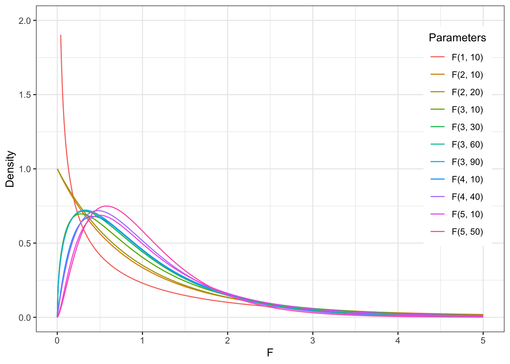

#  Статистические критерии {#stats_criteria} 

```{r, eval=TRUE, echo = FALSE, message = FALSE}
library(tidyverse)
library(kableExtra)
studens_mat <- read_csv("student-mat.csv") %>% 
  rename_with(., ~ paste0(., "_mat"), .cols = c(absences, paid, G1, G2, G3)) -> studens_mat 
studens_por <- read_csv("student-por.csv") %>% 
  rename_with(., ~ paste0(., "_por"), .cols = c(absences, paid, G1, G2, G3)) -> studens_por
studens_mat %>% 
  full_join(studens_por, by = c("school","sex","age","address","famsize","Pstatus","Medu","Fedu",
                             "Mjob","Fjob","reason", "guardian", "traveltime","studytime", "failures", "schoolsup", "famsup",
                             "activities", "nursery", "higher", "internet", "romantic", "famrel", "freetime", "goout", 
                             "Dalc", "Walc", "health")) -> students 

students %>% 
  mutate("student" = paste0("id", row_number()), .before = "school")  %>% 
  drop_na() %>% 
  mutate(G_mat = rowMeans(dplyr::select(., c(G1_mat, G2_mat, G3_mat))),
         G_por = rowMeans(dplyr::select(., c(G1_por, G2_por, G3_por)))) %>% 
  mutate(absences_mat_groups = ifelse(absences_mat <=5, "less", ifelse(absences_mat <=15, "middle", "more"))) %>% 
  mutate(absences_por_groups = ifelse(absences_por <=5, "less", ifelse(absences_por <=15, "middle", "more"))) -> students
```

```{r}
# students %>% 
#   write_csv(file = "students.csv")
```


Статистическим критерием называется правило, по которому мы будем пытаться отвергнуть нулевую гипотезу. Разным гипотезам и данным подходят разные критерии.

Статистический критерий включает:

* Теоретическое распределение, на котором мы будем располагать сравниваемые средние: вид кривой и математическая формула этого вероятностного закона
* Формулу, по которому мы будем рассчитывать искомое значение критерия (как уже рассчитывали $Z_{Mмаленькие}$) исходя из наших данных на выборке
* Соответствие рассчитанного значения и процентов расположенных данных до этого значения на распределении
* Формулу для рассчета числа степеней свобооды для этого критерия

### Степени свободы

Число степененй свободы (Degrees of Freedom, df) -- количество направления для изменения признака. Формула для расчета степеней свободы своя для каждого статистического критерия (нам не нужно рассчитывать самостоятельно) и зависит, собственно, от вида статистического критерия, дизайна нашего исследования (сколько сравнений мы проводим) и числа наблюдений в выборке.

Для t-критерия число степеней свободы высчитывается очень просто: $df = n_1 -1 + n_2 - 1 = n_1 + n_2 - 2$

## Ключевые статистики критериев

### Статистики (Z, T, F)

**Z-распределение**

В прошлый раз мы рассмотрели пример, когда сравнивали среднее время, которое проводят родители с детьми, в больших и маленьких городах, и сравнивали эти значения на примере [Z-распределения] {stat_test_example): мы получали Z-статистику и находили соответствующий распределению Z-оценок процент данных для найденной точки.

<p align="center"> 
```{r eval=TRUE, echo = FALSE, message = FALSE, fig.align = 'center', out.width="100%"}
knitr::include_graphics("docs/images/z_dist.png")
```
</p>

$Z = \frac{M - \mu}{\frac{\sigma}{\sqrt{n}}} = \frac{M - \mu}{\frac{sd}{\sqrt{n}}}$

Это самый простой вариант критерия для проверки статистических гипотез -- но не единственный. На самом деле, в качестве распределения, на которое мы помещаем точки (средние) и сравниваем их друг с другом, могут быть и другие, в зависимости от характера наших данных. Рассмотрим основные из них.

https://gallery.shinyapps.io/dist_calc/ 

**T-распределение Стьюдента**

<p align="center"> 
```{r eval=TRUE, echo = FALSE, message = FALSE, fig.align = 'center', out.width="100%"}
knitr::include_graphics("docs/images/t-dist.png")
```
</p>

Как мы видим, оно очень похоже на Z-распределение, но у него чуть более приподнятые хвосты.

Формула, которой задается вероятностный закон Т-распределения Стьюдента:

<p align="center"> 
```{r eval=TRUE, echo = FALSE, message = FALSE, fig.align = 'center', out.width="100%"}
knitr::include_graphics("docs/images/t-dist-pdf.png")
```
</p>


Негласно считается, что при объеме выборки от n=30 t-распределение считается близким к Z-распределению, которе является нормальным, и можем использовать его. Но в реальности это не совсем так.

Формула для расчета T-значения исходя из наших данных:

$t = \frac{M_1 - M_2}{\frac{sd_{1;2}}{\sqrt{n_{1;2}}}} = \frac{M_1 - M_2}{\sqrt{\frac{sd_1^2}{n_1} + \frac{sd_2^2}{n_2}}}$

**F-распределение**

<p align="center"> 
```{r eval=TRUE, echo = FALSE, message = FALSE, fig.align = 'center', out.width="100%"}

```
</p>

$\chi^2$**-распределение**


## Выбор статистического критерия 

**Вопросы, которые влияют на принятие решения относительно статистического теста:**

1. Зависимая переменная: количественная (интервальная шкала или шкала отношений) или категориальная (номинативная или порядковая шкала)?
2. Если ЗП количественная -- она описывается параметрическим (чаще всего нормальным) распределением? *(определяется чаще "на глаз" по графику плотности вероятности или QQ-графиками, тесты на нормальность почти всегда будут давать негативный результат из-за чувствительности и поэтому в современном анализе данных используются мало)*
3. Сколько независимых переменных?
4. НП количественные (интервальная и шкала отношений) или категориальные (номинативная и порядковая)?
5. Если НП категориальные и мы сравниваем группы -- данные в группах зависимы или нет? Если нет, как сильно отличаются данные в группах, можем ли сказать, что дисперсия ЗП примерно одинакова в группах или нет? (*равенство дисперсий называется Homogeneity of Variance, проверяется с помощью Levene's test*)

Есть большое количество схем, но обычно они сильно перегруженны и сложны в использовании, больше путают, чем помогают. 

Но я зачем-то все равно решила попробовать нарисовать свою, и вот результат:
<https://miro.com/app/board/uXjVOxmKhr8=/?share_link_id=245423331470>


## T-тест (сравнение средних двух групп)

Вернемся к данным про студентов и нашим вопросам

> Допустим, мы исследовали семьи с подростками в крупных (GP school) и небольших городах (MS school) и на нашей выборке посчитали, что в крупных городах родители проводят со своими детьми в среднем 14 часов, а в небольших городах -- 15 часов в неделю (из данных задания на доверительный интвервал). 
1. Отличается ли статически значимо время, которое проводят родители с детьми в России в крупных и небольших городах? 2. Отличается ли статистически значимо частота употребления алкоголя в семьях с менее поддерживающими отношениями и более поддерживающими? 
3. Отличается ли статистически значимо средний балл по математике у тех, кто чаще или реже пропускает занятия?

```{r eval=TRUE, echo = FALSE, message = FALSE}
kable(students[1:10,]) %>% scroll_box(width = "100%") 
```

Первый вопроос мы подробно разбирали в прошлый раз. Сейчас остановимся на третьем, который уже затрагивали.

Пройдем по алгоритму выбора статистического теста: <https://miro.com/app/board/uXjVOxmKhr8=/?share_link_id=245423331470>

Помимо осноовных отраженных ответвлений, для каждого критерия еще существует ряд допущений.

### Допущения для т-теста

1. Данные распределены нормально (или, если измеряемый признак является случайной велиичной, в группах больше 30 наблюдений) ()
2. Дисперсии гомогенны


### Зависимые и независимые выборки

### Вычисление т-теста

Средний балл и стандартное отклонение в группах тех, кто прогуливает меньше всего (на паре мы назвали их прихожанами):

```{r eval=TRUE, echo = FALSE, message = FALSE}
students %>% 
  filter(absences_mat_groups == "less") %>% 
  select(G_mat) %>% 
  summarise(mean = mean(G_mat), sd = sd(G_mat), n = length(G_mat))
```
Средний балл в группах прогулищиков:

```{r eval=TRUE, echo = FALSE, message = FALSE}
students %>% 
  filter(absences_mat_groups == "more") %>% 
  select(G_mat) %>% 
  summarise(mean = mean(G_mat), sd = sd(G_mat), n = length(G_mat))
```


```{r, eval=TRUE}
students %>% 
  filter(absences_mat_groups != "middle") -> students_2

t.test(students_2$G_mat ~ students_2$absences_mat_groups, paired = FALSE)
```

```{r}
students_2 %>% 
  ggplot(aes(x=absences_mat_groups, y = G_mat)) +
  geom_boxplot(aes(fill = absences_mat_groups)) +
  # scale_fill_viridis(discrete=TRUE) +
  theme_minimal()
```

## ANOVA (дисперсионный анализ)

https://angelgardt.github.io/SFDA2022/book/oneway-anova.html

