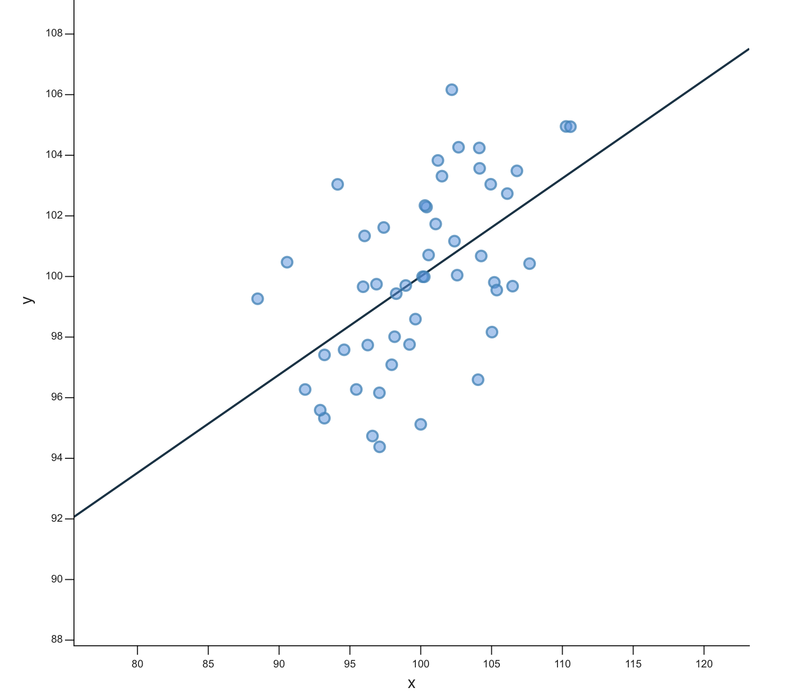
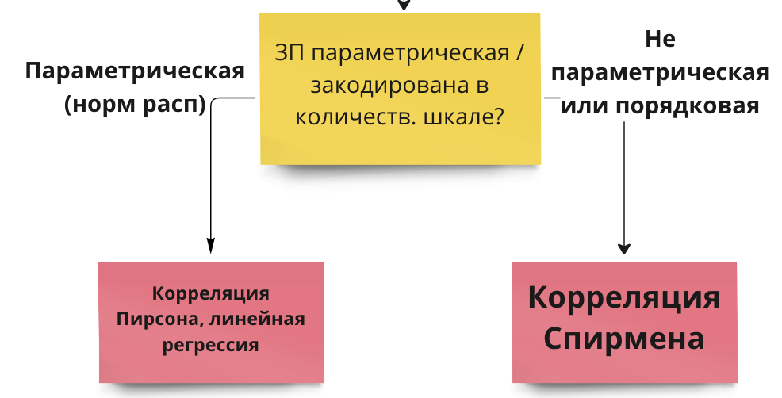
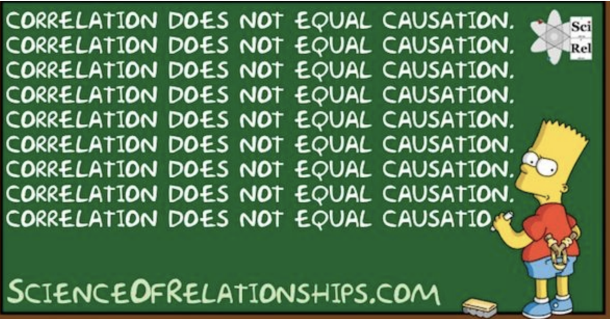
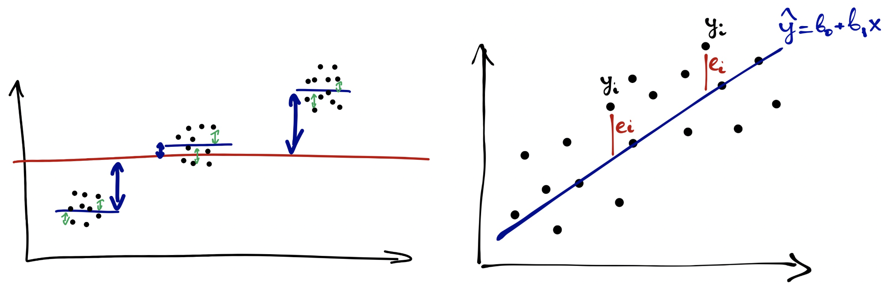

#  Проверка линейной свзяи {#stats_criteria_linear} 

До этого мы рассматривали виды статистического анализа, когда нужно было сравнить средние значения в нескольких группах. Зависимая переменная всегда была количественная (ее среднее значение по группам мы и сравнивали), а независимая -- категориальная, принимала конечное число значений, и каждое ее значение -- отдельный уровень НП, отдельная группа.

Теперь мы переходим к статистическим критериям, которые используются, когда обе переменные, и ЗП, и НП -- количественные.

```{r, eval=TRUE, echo = FALSE, message = FALSE}
library(tidyverse)
library(kableExtra)
library(viridis)
studens_mat <- read_csv("student-mat.csv") %>% 
  rename_with(., ~ paste0(., "_mat"), .cols = c(absences, paid, G1, G2, G3)) -> studens_mat 
studens_por <- read_csv("student-por.csv") %>% 
  rename_with(., ~ paste0(., "_por"), .cols = c(absences, paid, G1, G2, G3)) -> studens_por
studens_mat %>% 
  full_join(studens_por, by = c("school","sex","age","address","famsize","Pstatus","Medu","Fedu",
                             "Mjob","Fjob","reason", "guardian", "traveltime","studytime", "failures", "schoolsup", "famsup",
                             "activities", "nursery", "higher", "internet", "romantic", "famrel", "freetime", "goout", 
                             "Dalc", "Walc", "health")) -> students 

students %>% 
  mutate("student" = paste0("id", row_number()), .before = "school")  %>% 
  drop_na() %>% 
  mutate(G_mat = rowMeans(dplyr::select(., c(G1_mat, G2_mat, G3_mat))),
         G_por = rowMeans(dplyr::select(., c(G1_por, G2_por, G3_por)))) %>% 
  mutate(absences_mat_groups = ifelse(absences_mat <=5, "less", ifelse(absences_mat <=15, "middle", "more"))) %>% 
  mutate(absences_por_groups = ifelse(absences_por <=5, "less", ifelse(absences_por <=15, "middle", "more"))) -> students
```

## Корреляционный анализ {#corr_test}

**Корреляция** -- это связь между переменными. Несмотря на то, что она называется так же, как и один из двух видов связи между переменными, корреляционную связь можно выявить с помощью в целом любых видов анализа -- ведь когда мы получаем результаты статистических критериев, мы понимем только, что две переменные связаны (или нет), но не можем сделать вывод о том, причинно-следственная это связь или корреляционная.

Здесь речь пойдет именно про **корреляционный анализ** -- специальный вид анализа для определения значимости линейной связи только между двумя количественными или порядковыми переменными. 

Чтобы вывести формулу и смысл корреляции, познакомимся с понятием ковариации.

**Ко-вариация (co-variance)** -- это мера со-изменчивости данных, показатель того, как наблюдения по двум количественным переменным меняются друг относительно друга.

<p align="center"> 
```{r eval=TRUE, echo = FALSE, message = FALSE, fig.align = 'center', out.width="70%"}
knitr::include_graphics("docs/images/correlation.jpeg")
```
Картинка [отсюда](https://angelgardt.github.io/SFDA2022/book/twoway-anova.html#factor_interaction) </p>

<p align="center"> $\text{cov}(x,y)=\frac{\sum_{i=1}^n (x_i - \bar x) (y_i - \bar y )}{n-1}$</p>

*Шок-контент: попробуйте посчитать ковариацию переменной самой с собой и посмотрите на получившуюся формулу: ничего не напоминает?*

<div>
<details>
<summary>*Ковариация самой с собой*</summary>
<p align="center"> $\text{cov}(x,x)=\frac{\sum_{i=1}^n (x_i - \bar x) (x_i - \bar x )}{n-1} = \frac{\sum_{i=1}^n (x_i - \bar x )^2}{n-1}$</p>

И это дисперсия!

</details>
</div>

**Коэффициент корреляции** -- это показатель силы и направления связи между переменными. За силу связи отвечает модуль числа, за направление -- знак корреляции. По сути, это ковариация переменных, но взвешенная на стандартные отклонения этих переменных. Это сделано для того, чтобы стандартизовать коэффициент, уйти от абсолютных значений к относительным и расположить этот коэффицент в границах [-1;1]. Для коэффициента корреляции Пирсона (корреляции двух количественных переменных):

<p align="center"> $\text{corr}(x,y) = r_{xy} = \frac{\text{cov(x, y)}}{sd_x sd_y} = \frac{\sum_{i=1}^n (x_i - \bar x) (y_i - \bar y )}{(n-1)sd_x sd_y}$</p>

**Коэффициент детерминации** -- показатель, в какой степении изменчивость данных объясняется этой выбранной независимой переменной. В случае, если у нас только одна НП, то коэффициент детерминации -- практически то же самое, что и корреляция, только взятая в квадрат:

<p align="center"> $R^2 = r_{xy}^2 = \frac{\text{cov(x, y)}}{sd_x sd_y} = \frac{\sum_{i=1}^n (x_i - \bar x) (y_i - \bar y )}{(n-1)sd_x sd_y}$</p>

<p align="center"> 
```{r eval=TRUE, echo = FALSE, message = FALSE, fig.align = 'center', out.width="70%"}

```
Из статьи в википедии про [корреляцию](https://en.wikipedia.org/wiki/Correlation)</p>

https://rpsychologist.com/correlation/

http://guessthecorrelation.com/

### Корреляционный тест

Гипотезы о наличии линейной связи между переменными проверяются при помощи корреляционного теста. Это точно такой же статистический критерий, как и те, что мы уже разобрали. По сути -- ровно то же самое, что линейная регрессия с одной переменной. Корреляционный тест применяется, когда и ЗП, и НП являются количественными переменными либо выраженными в порядковкой шкале (но не номинативной). Для количественной шкалы обычно используется коэффициент корреляции Пирсона, для порядковой или для количественной переменной с малым числом наблюдений -- коэффициент корреляции Спирмена.

Корреляционный тест использует -- вы не поверите -- уже знакомое нам T-распределение Стьюдента!
(*то есть, нам надо запомнить вообще всего два распределения: T-распределение и F-распределение*)

Число степеней свободы вычисляется по формуле

<p align="center">$df = n - 2$, n -- число наблюдений </p>

Нулевая и альтернативная гипотезы для корреляционного теста:

<p align="center">$H_0$: $r_{xy} = 0$ </p>
<p align="center">$H_1$: $r_{xy} \neq 0$ </p>

Как и остальные критерии, он имеет допущения.

### Допущения для корреляционного теста

1. ЗП и НП измерены в количественной или порядковой шкале
2. Распределение НП по ЗП линейно -- то есть нет выборосов, нет картины нелинейной взаимосвязи или скоплений данных в разных местах.
3. (не обязательно) ЗП распределена нормально -- обсуждали эту проверку [здесь](#param_nonparam)

Примеры, как может выглядеть нелинейное распределение:

<p align="center"> 
```{r eval=TRUE, echo = FALSE, message = FALSE, fig.align = 'center', out.width="100%"}
knitr::include_graphics("docs/images/Correlation_examples2.svg.png")
```
Картинка из [википедии про корреляцию](https://en.wikipedia.org/wiki/Correlation) </p>

### Непараметрические аналоги

Если ЗП сильно отличается от нормального распределения, или выборка мала, или ЗП закодирована в порядковой шкале -- в корреляционном тесте используется коэффициент корреляции Спирмена вместо Пирсона, и это единственное различие.

Есть еще тау-Кендалла, это почти то же самое, что и корреляция Спирмена, но мы не будем ее рассматривать, так как она применяется крайне редко.

<p align="center"> 
```{r eval=TRUE, echo = FALSE, message = FALSE, fig.align = 'center', out.width="70%"}

```
Из статьи в википедии про [корреляцию](https://en.wikipedia.org/wiki/Correlation)</p>

### Расчет корреляционного теста

Проведем тест для следующей гипотезы.

> `Чем ниже студенты оценивают качество семейных отношений famrel, тем выше они отмечают частоту употребления алкоголя Walc `

```{r eval=TRUE, echo = FALSE, message = FALSE}
kable(students[1:10,]) %>% scroll_box(width = "100%") 
```

Пойдем также по алгоритму.

ЗП -- порядковая, НП -- порядковая. Наша гипотеза не о сравнении групп между собой, а то, что эти переменные коррелируют, между ними есть линейная связь.

Так как ЗП и НП порядковые, мне нужно использовать непараметрический аналог корреляциии Пирсона -- ранговую корреляцию Спирмена (либо порядковую логистическую регрессию (если я хочу, чтобы связь имела предсказательную силу), но об этом не в этот раз).

```{r, eval=TRUE,  message = FALSE, warning= FALSE}
cor.test(students$famrel, students$Walc, method = 'spearman')
```
Если бы у нас были две количественные переменные, то мы бы просто визуализировали их диаграммой рассеяния с уже привычной линией посреди точек. Но у нас две порядковые переменные, поэтому диаграмма рассеяния даст непонятный вариант.

Поэтому будем использовать мозаичный плот: размер плитки отражает частоту совпадения таких значений двух переменных.

```{r corr mosaic, eval=TRUE, echo = FALSE, message = FALSE, warning= FALSE}
library(ggmosaic)
students %>% 
  ggplot(aes()) + 
  geom_mosaic(aes(x = product(famrel), fill = Walc)) +
  scale_fill_viridis(discrete=TRUE) +
  theme_minimal() 
```

Другой вариант -- хитмеп, тут размеры фиксированные, а за частоту совпадений отвечает цвет.
```{r corr heatmap, eval=TRUE, echo = FALSE, message = FALSE, warning= FALSE}
students %>% 
  ggplot(aes(x = as.factor(famrel), y = as.factor(Walc))) + 
  geom_bin2d() +
  scale_fill_viridis() +
  theme_minimal() +
  theme(panel.grid.major = element_blank(), 
        panel.grid.minor = element_blank())
```
### Интерпретация результатов

Важно, что при очень большой выборке даже совсем слабая корреляционная связь будет достигать статистической значимости!

Еще один важный момент -- в корреляционном тесте, даже при правильно простроенном эксперименте, мы не сможем заключить причинно-следственную связь. Возможна ситуация

<p align="center"> 
```{r eval=TRUE, echo = FALSE, message = FALSE, fig.align = 'center', out.width="80%"}

```
</p>

https://tylervigen.com/view_correlation?id=12692

### Корреляционные матрицы

Часто встречется анализ корреляционных матриц -- когда корреляции вычисляются попарно для каждой матрицы переменных. Это можно встретить, например, при корреляции опросников: допустим, есть опросник О1 и О2. В опроснике О1 есть субшкалы С11, С12, С13, С14, С15, а в О2 соответственно -- С21, С22, С23, С24, С25. Тогда мы можем построить корреляционную матрицу для субшкал этих опросников.

## Линейный регрессионный анализ

Линейная регрессия -- это ровно та же известная нам ANOVA, только если заменить категориальные НП на количественные!

А еще линейная регрессия -- это то же самое, что корреляция, только для нескольких НП. Совмещая ANOVA и корреляционный анализ, получили линейный регрессионный!

Регрессионный анализ -- довольная мощная штука, потому что здесь мы впервые начинаем говорить о *предсказательной функции* анализа. Выходит, что регрессионный анализ может применяться:

* Для проверки гипотез о наличии линейной связи между количественными или порядковыми переменными
* Для предсказания значений ЗП за пределами имеющихся данных 


### Коэффициенты регрессии

Уравнение регрессионной прямой:
<p align="center">$y = b_o + b_1x$ </p>

<p align="center"> 
```{r eval=TRUE, echo = FALSE, message = FALSE, fig.align = 'center', out.width="70%"}

```
</p>

Есть несколько формул для вычисления коэффициентов линейной регрессии, но все они взаимовычисляемы. Вручную считать мы их не будем, поэтому что важно запомнить:

* Коэффициент $b_1$ отвечает на наклон прямой **(slope)**
* Коэффициент $b_0$ отвечает за смещение прямой вдоль оси y **(intercept)**
* При подсчете коэффициентов первым высчитывается $b_1$, и он зависит от величины вариативности данных по переменным x и y (стандартных отклонений или дисперсий) и **в случае равной вариативности является коэффициентом корреляции** $r_{xy}$

<p align="center">$b_{1_{xy}} = \frac{sd_y}{sd_x} r_{xy}$</p>

<p align="center">$b_o = \bar y -b_{1_{xy}}\bar x$</p>

Коэффициенты считаются таким образом, чтобы сумма квадратов остатков была минимальна. Это называется **методом наименьших квадратов**.

### Регрессионный анализ (тестирование коэффициентов регрессии)

Регрессионный анализ принадлежит семейству Т-распределения, так же, как и корреляционный анализ. Число степеней свободы рассчитывает по формуле:

<p align="center">$df = n - 2$, n -- число наблюдений </p>

Нулевая и альтернативная гипотезы:

<p align="center">$H_0$: $b_{1_{xy}} = 0$ </p>
<p align="center">$H_1$: $b_{1_{xy}} \neq 0$ </p>

Ключевой статистикой является Т-значение, оно вычисляется по формуле:

<p align="center">$T = \frac{b_1}{se}$</p>

Еще одно, если не самое важное значение для линейной регрессии -- это коэффициент детерминации. Мы уже сталкивались с ним, когда говорили про ANOVA и корреляцию:
<p align="center">$R^2 = \frac{SSE}{SST} = 1 - \frac{SSR}{SST}$ </p>
<p align="center"> $R^2 = r_{xy}^2 = \frac{\text{cov(x, y)}}{sd_x sd_y} = \frac{\sum_{i=1}^n (x_i - \bar x) (y_i - \bar y )}{(n-1)sd_x sd_y}$</p>

### Допущения для регрессионного анализа

(ЗП и НП измерены в количественной или порядковой шкале)

1. Распределение НП по ЗП линейно -- то есть нет выборосов, нет картины нелинейной взаимосвязи или скоплений данных в разных местах.
2. Остатки (residuals) распределены нормально -- все то же самое, как [здесь](#param_nonparam), только для остатков (график плотности вероятности или QQ-plot)
3. Остатки (residuals) варьируются примерно одинаково вдоль всей прямой -- гомогенность (или гомоскедастичность, homoscedasticity) остатков. Проверяется тестом Левеня (Levene's Test of Homogeneity of Variance)

https://gallery.shinyapps.io/slr_diag/

### Расчет регрессионного анализа

```{r, eval=TRUE}
model_Gmat <- lm(students$G_mat ~ students$absences_mat)
summary(model_Gmat)
```
