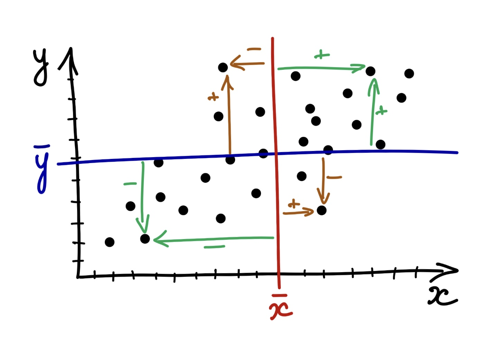
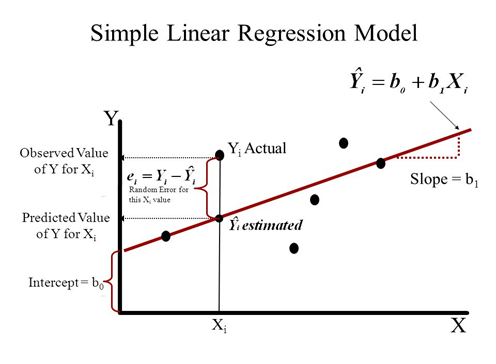

#  Проверка линейной свзяи {#stats_criteria_linear} 

До этого мы рассматривали виды статистического анализа, когда нужно было сравнить средние значения в нескольких группах. Зависимая переменная всегда была количественная (ее среднее значение по группам мы и сравнивали), а независимая -- категориальная, принимала конечное число значений, и каждое ее значение -- отдельный уровень НП, отдельная группа.

Теперь мы переходим к статистическим критериям, которые используются, когда обе переменные, и ЗП, и НП -- количественные.

```{r, eval=TRUE, echo = FALSE, message = FALSE}
library(tidyverse)
library(kableExtra)
library(viridis)
studens_mat <- read_csv("student-mat.csv") %>% 
  rename_with(., ~ paste0(., "_mat"), .cols = c(absences, paid, G1, G2, G3)) -> studens_mat 
studens_por <- read_csv("student-por.csv") %>% 
  rename_with(., ~ paste0(., "_por"), .cols = c(absences, paid, G1, G2, G3)) -> studens_por
studens_mat %>% 
  full_join(studens_por, by = c("school","sex","age","address","famsize","Pstatus","Medu","Fedu",
                             "Mjob","Fjob","reason", "guardian", "traveltime","studytime", "failures", "schoolsup", "famsup",
                             "activities", "nursery", "higher", "internet", "romantic", "famrel", "freetime", "goout", 
                             "Dalc", "Walc", "health")) -> students 

students %>% 
  mutate("student" = paste0("id", row_number()), .before = "school")  %>% 
  drop_na() %>% 
  mutate(G_mat = rowMeans(dplyr::select(., c(G1_mat, G2_mat, G3_mat))),
         G_por = rowMeans(dplyr::select(., c(G1_por, G2_por, G3_por)))) %>% 
  mutate(absences_mat_groups = ifelse(absences_mat <=5, "less", ifelse(absences_mat <=15, "middle", "more"))) %>% 
  mutate(absences_por_groups = ifelse(absences_por <=5, "less", ifelse(absences_por <=15, "middle", "more"))) -> students
```

## Корреляционный анализ {#corr_test}

**Корреляция** -- это связь между переменными. Несмотря на то, что она называется так же, как и один из двух видов связи между переменными, корреляционную связь можно выявить с помощью в целом любых видов анализа -- ведь когда мы получаем результаты статистических критериев, мы понимем только, что две переменные связаны (или нет), но не можем сделать вывод о том, причинно-следственная это связь или корреляционная.

Здесь речь пойдет именно про **корреляционный анализ** -- специальный вид анализа для определения значимости линейной связи только между двумя количественными или порядковыми переменными. 

Чтобы вывести формулу и смысл корреляции, познакомимся с понятием ковариации.

**Ко-вариация (co-variance)** -- это мера со-изменчивости данных, показатель того, как наблюдения по двум количественным переменным меняются друг относительно друга.

<p align="center"> 
```{r eval=TRUE, echo = FALSE, message = FALSE, fig.align = 'center', out.width="70%"}

```
Картинка [отсюда](https://angelgardt.github.io/SFDA2022/book/twoway-anova.html#factor_interaction) </p>

<p align="center"> $\text{cov}(x,y)=\frac{\sum_{i=1}^n (x_i - \bar x) (y_i - \bar y )}{n-1}$</p>

*Шок-контент: попробуйте посчитать ковариацию переменной самой с собой и посмотрите на получившуюся формулу: ничего не напоминает?*

<div>
<details>
<summary>*Ковариация самой с собой*</summary>
<p align="center"> $\text{cov}(x,x)=\frac{\sum_{i=1}^n (x_i - \bar x) (x_i - \bar x )}{n-1} = \frac{\sum_{i=1}^n (x_i - \bar x )^2}{n-1}$</p>

И это дисперсия!

</details>
</div>

**Коэффициент корреляции** -- это показатель силы и направления связи между переменными. За силу связи отвечает модуль числа, за направление -- знак корреляции. По сути, это ковариация переменных, но взвешенная на стандартные отклонения этих переменных. Это сделано для того, чтобы стандартизовать коэффициент, уйти от абсолютных значений к относительным и расположить этот коэффицент в границах [-1;1]. Для коэффициента корреляции Пирсона (корреляции двух количественных переменных):

<p align="center"> $\text{corr}(x,y) = r_{xy} = \frac{\text{cov(x, y)}}{sd_x sd_y} = \frac{\sum_{i=1}^n (x_i - \bar x) (y_i - \bar y )}{(n-1)sd_x sd_y}$</p>

**Коэффициент детерминации** -- показатель, в какой степении изменчивость данных объясняется этой выбранной независимой переменной. В случае, если у нас только одна НП, то коэффициент детерминации -- практически то же самое, что и корреляция, только взятая в квадрат:

<p align="center"> $R^2 = r_{xy}^2 = \frac{\text{cov(x, y)}}{sd_x sd_y} = \frac{\sum_{i=1}^n (x_i - \bar x) (y_i - \bar y )}{(n-1)sd_x sd_y}$</p>

<p align="center"> 
```{r eval=TRUE, echo = FALSE, message = FALSE, fig.align = 'center', out.width="50%"}
knitr::include_graphics("docs/images/correlation2.png")
```
Пример с сайта https://rpsychologist.com/correlation/</p>

Игра по угадывание корреляции:
http://guessthecorrelation.com/

### Корреляционный тест

Гипотезы о наличии линейной связи между переменными проверяются при помощи корреляционного теста. Это точно такой же статистический критерий, как и те, что мы уже разобрали. По сути -- ровно то же самое, что линейная регрессия с одной переменной. Корреляционный тест применяется, когда и ЗП, и НП являются количественными переменными либо выраженными в порядковкой шкале (но не номинативной). Для количественной шкалы обычно используется коэффициент корреляции Пирсона, для порядковой или для количественной переменной с малым числом наблюдений -- коэффициент корреляции Спирмена.

Корреляционный тест использует -- вы не поверите -- уже знакомое нам T-распределение Стьюдента!
(*то есть, нам надо запомнить вообще всего два распределения: T-распределение и F-распределение*)

Число степеней свободы вычисляется по формуле

<p align="center">$df = n - 2$, n -- число наблюдений </p>

Нулевая и альтернативная гипотезы для корреляционного теста:

<p align="center">$H_0$: $r_{xy} = 0$ </p>
<p align="center">$H_1$: $r_{xy} \neq 0$ </p>

Как и остальные критерии, он имеет допущения.

### Допущения для корреляционного теста

(ЗП и НП измерены в количественной или порядковой шкале)

1. Распределение НП по ЗП линейно -- нет картины нелинейной взаимосвязи или скоплений данных в разных местах.
2. ЗП распределена нормально (не обязательно строгое соответствие) и нет заметных выбросов -- обсуждали эту проверку [здесь](#param_nonparam)

Примеры, как может выглядеть нелинейное распределение:

<p align="center"> 
```{r eval=TRUE, echo = FALSE, message = FALSE, fig.align = 'center', out.width="100%"}
knitr::include_graphics("docs/images/Correlation_examples2.svg.png")
```
Картинка из [википедии про корреляцию](https://en.wikipedia.org/wiki/Correlation) </p>

### Непараметрические аналоги

Если ЗП сильно отличается от нормального распределения, или выборка мала, или ЗП закодирована в порядковой шкале -- в корреляционном тесте используется коэффициент корреляции Спирмена вместо Пирсона, и это единственное различие.

Есть еще тау-Кендалла, это почти то же самое, что и корреляция Спирмена, но мы не будем ее рассматривать, так как она применяется крайне редко.

<p align="center"> 
```{r eval=TRUE, echo = FALSE, message = FALSE, fig.align = 'center', out.width="70%"}
knitr::include_graphics("docs/images/scheme-corr.png")
```
</p>

### Расчет корреляционного теста

Проведем тест для следующей гипотезы.

> `Чем ниже студенты оценивают качество семейных отношений famrel, тем выше они отмечают частоту употребления алкоголя Walc `

```{r eval=TRUE, echo = FALSE, message = FALSE}
kable(students[1:10,]) %>% scroll_box(width = "100%") 
```

Пойдем также по алгоритму.

ЗП -- порядковая, НП -- порядковая. Наша гипотеза не о сравнении групп между собой, а то, что эти переменные коррелируют, между ними есть линейная связь.

Так как ЗП и НП порядковые, мне нужно использовать непараметрический аналог корреляциии Пирсона -- ранговую корреляцию Спирмена (либо порядковую логистическую регрессию (если я хочу, чтобы связь имела предсказательную силу), но об этом не в этот раз).

```{r, eval=TRUE,  message = FALSE, warning= FALSE}
cor.test(students$famrel, students$Walc, method = 'spearman')
```
Если бы у нас были две количественные переменные, то мы бы просто визуализировали их диаграммой рассеяния с уже привычной линией посреди точек. Например, такой:

<p align="center"> 
```{r eval=TRUE, echo = FALSE, message = FALSE, fig.align = 'center', out.width="60%"}
knitr::include_graphics("docs/images/scatterplot.png")
```
Картинка [отсюда](https://angelgardt.github.io/SFDA2022/book/correlations.html) </p>

Но у нас две порядковые переменные, поэтому диаграмма рассеяния даст непонятный вариант.
Поэтому будем использовать мозаичный плот: размер плитки отражает частоту совпадения таких значений двух переменных.

```{r corr mosaic, eval=TRUE, echo = FALSE, message = FALSE, warning= FALSE, fig.align = 'center', out.width="60%"}
library(ggmosaic)
students %>% 
  ggplot(aes()) + 
  geom_mosaic(aes(x = product(famrel), fill = Walc)) +
  scale_fill_viridis(discrete=TRUE) +
  theme_minimal() 
```

Другой вариант -- хитмеп, тут размеры фиксированные, а за частоту совпадений отвечает цвет.
```{r corr heatmap, eval=TRUE, echo = FALSE, message = FALSE, warning= FALSE, fig.align = 'center', out.width="60%"}
students %>% 
  ggplot(aes(x = as.factor(famrel), y = as.factor(Walc))) + 
  geom_bin2d() +
  scale_fill_viridis() +
  theme_minimal() +
  theme(panel.grid.major = element_blank(), 
        panel.grid.minor = element_blank())
```

### Интерпретация результатов

Когда мы интерпретируем результаты корреляционного теста, нас, как обычно, интересует значение статистики (t-значение или F-значение), p-value и размер эффекта. Для корреляционного теста значением статистики будет t-значение, но обычно фигурирует не оно, а коэффциент корреляции между переменными x и y $r_xy$ -- он же является и размер эффекта, показателем величины различий. Корреляционный тест -- это единственный тест, где нам не нужна дополнительная метрика о размере эффекта (например Cohen's d), а мы уже по самому коэффициенту судим о силе различий. 

В примере выше мы получили r = -0.13. В коэффициенте корреляции мы смотрим на два параметра: это знак и модуль числа. Здесь у нас отрицательная корреляция, то есть связь будет обратной: с увеличением одной переменной (например, оценки качества семейных отношений `famrel`) будет уменьшаться вторая переменная (частота употребления алкоголя `Walc`). 0.13 по модулю -- небольшое число, это довольно слабая корреляция (свериться с разбиением по размерам можно в разделе про [размеры эффекта](#sample_size)).

Важно, что при очень большой выборке даже совсем слабая корреляционная связь будет достигать статистической значимости! Поэтому не стоит увлекаться корреляционными тестами для поиска связей всего со всем: вы ее точно найдете, и она даже будет значимой. Как видите, даже r=0.1 может достигать порог статистической значимости. 

Искать корреляцию стоит между осмысленными переменнами: так как при больших выборках она может быть значимой, может оказаться, что коррелируют между собой число фильмов, где снимался Николас Кейдж, и число самоубийств путем утопления -- очевидно, что эти величины не связаны между собой, и корреляция тут случайна. Можно посмотреть на странные корреляции на сайте https://tylervigen.com/view_correlation?id=12692

Еще один важный момент -- в корреляционном тесте, даже при идеально простроенном эксперименте, мы не сможем заключить причинно-следственную связь. Но важно не путь теоретическую возможность сделать вывод о причинно-следственной связи и методы статистического анализа: они как теплое и красное, относятся к разным вещам. За возможность сделать вывод говорит дизайн исследования, а не статистический тест. Если у нас хорошо проведенный контролируемый эксперимент, и соблюдаются 3 условия установления причинно-следственной связи ([обсуждали это здесь](#relationship)), то мы можем ее заключить. При этом, применение того же ANOVA может относиться и не к эксперименту, и вывод мы все равно будем делать о корреляционной (ассоциативной) связи. 

<p align="center"> 
```{r eval=TRUE, echo = FALSE, message = FALSE, fig.align = 'center', out.width="80%"}
knitr::include_graphics("docs/images/corr_causation.png")
```
</p>

### Корреляционные матрицы

Часто встречется анализ корреляционных матриц -- когда корреляции вычисляются попарно для каждой матрицы переменных. Это можно встретить, например, при корреляции опросников: допустим, есть опросник О1 и О2. В опроснике О1 есть субшкалы С11, С12, С13, С14, С15, а в О2 соответственно -- С21, С22, С23, С24, С25. Тогда мы можем построить корреляционную матрицу для субшкал этих опросников.

<p align="center"> 
```{r eval=TRUE, echo = FALSE, message = FALSE, fig.align = 'center', out.width="70%"}
knitr::include_graphics("docs/images/corrplot.png")
```
</p>

## Линейный регрессионный анализ {#linreg}

**Линейный регрессионный анализ** -- это ровно тот же известный нам ANOVA (дисперсионный анализ), только если заменить категориальные НП на количественные!

Сама линейная регрессия -- это прямая, которую мы пытаемся провести через все наши точки таким образом, чтобы она захватывала наибольшее их количество. По сути это то же самое, что и корреляция, только более мощный инструмент -- сюда мы можем вводить несколько НП. 

<p align="center"> 
```{r eval=TRUE, echo = FALSE, message = FALSE, fig.align = 'center', out.width="90%"}
knitr::include_graphics("docs/images/anova_to_regression.png")
```
</p>

Регрессионный анализ -- довольная мощная штука, потому что здесь мы впервые начинаем говорить еще и о *предсказательной функции* анализа. Выходит, что регрессионный анализ может применяться:

* Для проверки гипотез о наличии линейной связи между количественными или порядковыми переменными
* Для предсказания значений ЗП за пределами имеющихся данных 

Пока что нас интересует первая из этих функций, хотя очень часто линейный регрессионный анализ интересен именно с точки зрения второй.

Регрессионный анализ строится на построении регрессионной прямой: любая прямая имеет вид $y = kx + b$, в регрессионном анализе это уравнение часто записывается как $y = b_0 + b_1x$. И задача регрессионного анализа -- это определение и тестирование коэффициентов $b_0$ и $b_1$ линейной регрессии.

### Коэффициенты регрессии

Уравнение проведенной нами регрессионной прямой:
<p align="center">$\hat y = b_o + b_1x$ </p>

Мы видим, что большинство точек не ложатся на прямую идеально -- остается еще некоторое расстояние по оси y до самой точки. Поэтому еслимы будем записывать уравнение для каждой точки, используя уравнение регрессионной прямой, оно будет иметь вид:
<p align="center">$y = b_o + b_1x + e$ </p>

То расстояние по оси y, что осталось до точек после того, как мы провели через них прямую, называется **остатками** -- то есть это отличия исходных данных от описываемых нашей моделью (прямой), то, что "остается":
<p align="center">$e = y - \hat y$</p>

Обратите внимание: когда мы говорим про уравнение прямой линии, мы обозначаем y как $\hat$, а когда говорим о фактических точках -- обозначем его просто $y$.

Регрессионная прямая часто еще называется **моделью**. Уравнение регрессионной прямой с каждыми новыми коэффициентами -- новая модель.

<p align="center"> 
```{r eval=TRUE, echo = FALSE, message = FALSE, fig.align = 'center', out.width="70%"}

```
</p>

* Коэффициент $b_1$ отвечает на наклон прямой **(slope)**
* Коэффициент $b_0$ отвечает за смещение прямой вдоль оси y **(intercept)**

Коэффициенты считаются таким образом, чтобы сумма квадратов остатков была минимальна. Это называется **методом наименьших квадратов**.

При построении регрессионной прямой нам надо стремиться к уменьшению суммы остатков:
<p align="center">$\sum_{i=1}^{n} e^2 = \sum_{i=1}^{n}(y - \hat y)^2$</p>

Формулы коэффициентов по методу наименьших квадратов получаются равнымм:

<p align="center">$b_{1_{xy}} = \frac{sd_y}{sd_x} r_{xy}$</p>

<p align="center">$b_o = \bar y - b_{1_{xy}}\bar x$</p>

При подсчете коэффициентов первым высчитывается $b_1$, и он, как видно из формулы, зависит от величины вариативности данных по переменным x и y (стандартных отклонений или дисперсий). **В случае равной вариативности** $b_1$ **является коэффициентом корреляции** $r_{xy}$

### Коэффициент детерминации и доля объясненной изменчивости

В линейной регрессии, так же, как и в ANOVA, коэффициент детерминации говорит о **проценте объясненной изменчивости**, то есть как хорошо наша регрессионная модель объясняет изменчивость зависимой переменной.

Так же, как и в ANOVA, сумма квадратов SST складывается из **межгрупповой** суммы квадратов (SSE, Sum of Squares Explained или SSB, Sum of Squares Between groups) и **внутригрупповой** (SSR, Sum of Squares Random или SSW, Sum of Squares Within groups).

<p align="center">$SST = SSE + SSR$</p>

<p align="center"> 
```{r eval=TRUE, echo = FALSE, message = FALSE, fig.align = 'center', out.width="100%"}

```
</p>

Общая изменчивость считается от прямой со средним значением y. 

<p align="center">$SST = \sum_{i=1}^n (\bar y - y_i)^2$</p>

По картинке видно, что

<p align="center">$SSE = \sum_{i=1}^n (\bar y - \hat y_i)^2$</p>

Остаточная изменчивость:

<p align="center">$SSR = \sum_{i=1}^n (y_i - \hat y_i)^2$

Для того, чтобы оценить, насколько хороша модель, мы снова прибегаем к коэффициенту детерминации:

<p align="center">$R^2 = \frac{SSE}{SST} = 1 - \frac{SSR}{SST}$ </p>

Коэффициент детерминации можно рассматривать как размер эффекта -- и это ни что иное, как уже знакомая нам $\eta^2$!

<p align="center">$\eta^2 = \frac{SSE}{SST}$ </p>

В линейном регрессионном анализе коэффициент детерминации рассматривается еще и как степень корреляции между исходными значениями переменной $y$ и предсказанными $\hat y$. И как мы помним, он же равен квадрату корреляции между исходными значениями переменной $y$ и предсказанными $\hat y$:

<p align="center"> $R^2 = r_{xy}^2 = \frac{\text{cov(x, y)}}{sd_x sd_y} = \frac{\sum_{i=1}^n (x_i - \bar x) (y_i - \bar y )}{(n-1)sd_x sd_y}$</p>


### Регрессионный анализ (тестирование коэффициентов регрессии)

Регрессионный анализ -- интересная штука, так как состоит из нескольких слоев, которые берут что-то от ANOVA, а что-то -- от корреляционногоо анализа. Тестирование значимости коэффициентов проводится на основании критерия, принадлежащего семейству Т-распределений, так же, как и корреляционный анализ. А тестирование всей модели целиком проводится с использованием F-критерия, так же, как и ANOVA. Нас в регрессионном анализе больше интересует тестирование значимости коэффициентов -- так как именно по коэффциентам, с которыми берутся факторы в модели, мы определяем, является влияние этих факторов значимым.

Число степеней свободы рассчитывается по формуле:

<p align="center">$df = n - 2$, n -- число наблюдений </p>

Уравние модели:

<p align="center">$\hat y = b_o + b_1x$ </p>

Нулевая и альтернативная гипотезы:

<p align="center">$H_0$: $b_{1_{xy}} = 0$ </p>
<p align="center">$H_1$: $b_{1_{xy}} \neq 0$ </p>

Ключевой статистикой для коэффициентов является Т-значение, оно вычисляется по формуле:

<p align="center">$T = \frac{b_1}{se}$</p>

### Множественный регрессионный анализ

**Множественный регрессионный анализ** -- подразумевает все то же самое, только появляются новые предикторы (независимые переменные, они же факторы)

<p align="center">$\hat y = b_o + b_1x_1 + b_2x_2 + ... + b_nx_n$ </p>

### Допущения для регрессионного анализа

(ЗП и НП измерены в количественной или порядковой шкале)

1. Распределение НП по ЗП линейно -- нет картины нелинейной взаимосвязи или скоплений данных в разных местах.
2. Остатки (residuals) варьируются примерно одинаково вдоль всей прямой -- гомогенность (или гомоскедастичность, homoscedasticity) остатков. Проверяется тестом Левеня (Levene's Test of Homogeneity of Variance)
3. Остатки (residuals) распределены нормально -- все то же самое, как [здесь](#param_nonparam), только для остатков (график плотности вероятности или QQ-plot)
4. Для множественной линейной регрессии -- отсутствие мультиколлинеарности (сильной корреляции между независимыми переменными)

https://gallery.shinyapps.io/slr_diag/

### Расчет регрессионного анализа

Когда мы проводим расчет регрессионного анализа, у нас в результате получается табличка вроде этой:

|    Обозначение    |           Коэффициент          | Статистика |     SE    |  p-value |
|:-----------------:|:------------------------------:|:----------:|:---------:|:--------:|
|             $b_0$ |            Intercept           |  $t_{b0}$  | $SE_{b0}$ | $p_{b0}$ |
|             $b_1$ |        Коэф для фактора1       |  $t_{b1}$  | $SE_{b1}$ | $p_{b1}$ |
| (если есть) $b_2$ |  (если есть) Коэф для фактора2 |  $t_{b2}$  | $SE_{b2}$ | $p_{b2}$ |
| (если есть) $b_3$ |  (если есть) Коэф для фактора3 |  $t_{b3}$  | $SE_{b3}$ | $p_{b3}$ |

Так же, как и везде, нас интересуют в первую очередь значение статистики (t-значение), уровень значимости (p-value) и здесь нас еще интересует само значение коэффициентов. В случае значимости (p-value < alpha), то есть получения результата, что данный фактор значимо влияет на изменчивость данных, и мы можем построить регрессионную прямую -- мы будем записывать уравнение регрессионной прямой на основании этих значений:

<p align="center">$\hat y$ = Intercept + Коэф для фактора1 * Фактор1 + Коэф для фактора2 * Фактор2 + Коэф для фактора3 * Фактор3</p>


Для примера возьмем другой датасет с данными об информации курсов Udemy

```{r, eval=TRUE, echo = FALSE, message = FALSE, warning= FALSE}
udemy <- read_csv("Course_info.csv")
udemy %>% 
  select(!headline) -> udemy
udemy_sample <- sample_n(udemy, 1000, replace = T)
udemy_sample %>% 
  filter(num_subscribers > 1 & price > 0 & content_length_min>0 & num_lectures>0) %>% 
  mutate(price_log = log(price), num_subscribers_log = log(num_subscribers)) -> udemy_sample
kable(udemy_sample[1:10,]) %>% scroll_box(width = "100%") 
```
И попробуем построить модель стоимости курса по количеству студентов (*вы могли не заметить, но вот мы приблизились вплотную к реальным задачам, которые решают аналитики данных*)

Спойлер: так как это реальные данные, то пришлось повозиться с их предобработкой, и даже после этого лучший вариант построения модели выглядит на них так: 
```{r, eval=TRUE, echo = FALSE, message = FALSE, warning= FALSE}
udemy_sample %>%
  filter(price > 1 & price<200 & price_log > 3 & num_subscribers < 10000) %>% 
  ggplot(aes(x=num_subscribers_log, y = price_log)) +
  geom_point(aes()) +
  geom_smooth(method="lm") +
  theme_minimal()
```
Здесь очевидно, что модель будет плохо работать. Возьмем еще один неудачный пример для построения регрессионных моделей:

```{r, eval=TRUE, echo = FALSE, message = FALSE, warning= FALSE}
udemy_sample %>%
  filter(num_subscribers > 0 & num_subscribers < 5000 & avg_rating >=3) %>% 
  ggplot(aes(x=num_subscribers, y = avg_rating)) +
  geom_point(aes()) +
  geom_smooth(method="lm") +
  theme_minimal()
```

Поэтому идею предсказать цену и рейтинг мы пока отбросим и перейдем к более прозаичной -- построим модель длительности курса от количества лекций.

1) Гипотеза: длительность `content_length_min` определяется количество лекций `num_lectures`

<p align="center">`content_length_min` ~ `num_lectures`</p>

2) Формулируем нулевую гипотезу:

Коэффициент $b_1$ для `num_lectures` не должен быть равен нулю (то есть `num_lectures` влияет на вариативность данных)

<p align="center">$H_0$: $b_{1_{xy}} = 0$ </p>
<p align="center">$H_1$: $b_{1_{xy}} \neq 0$ </p>

3) Зафиксируем, что будем проверять гипотезу на уровне $\alpha = 0.05$

4) Выберем статистический критерий для проверки. Посмотрим, насколько линейно распредены переменные и остатки:

```{r linreg final model, eval=TRUE, echo = FALSE, message = FALSE, warning= FALSE}
udemy_sample %>% 
  filter(content_length_min<300 & num_lectures<80) %>%  
  ggplot(aes(x=num_lectures, y = content_length_min)) +
  geom_point(aes(color = num_lectures)) +
  geom_smooth(method="lm") +  
  scale_color_viridis() +
  theme_minimal()
```
Не самый лучший вариант, но с этим уже можно работть *(почему? в чем отличие от предыдущей кртинки?)*

5) Строим регрессионную модель и проводим регрессионный анлиз, смотрим на значимость коэффициентов
```{r, eval=TRUE, echo = FALSE, message = FALSE, warning= FALSE}
options(scipen=999)
udemy_sample %>% 
  filter(content_length_min<300 & num_lectures<80 & num_subscribers < 5000) -> udemy_model 
model_length <- lm(udemy_model$content_length_min ~ udemy_model$num_lectures) 
summary(model_length)
```

6) Интерпретируем результаты: чему равно p-value для коэффициента `num_lectures`? Видим, что оно очень маленькое и явно меньше зявленного уровня alpha -- то есть коэффициент значим, наша гипотеза о том, что количество уроков определяет длительность курса, подтвердилось, ура! Чему равно само значение коэффиента? Примерно 2.16. То есть с увеличением количества уроков на 1 длина курса будет увеличиваться на 2.16 минуты! Чему равен $R^2$? Он равен 0.19, что в целом вообще-то не очень много, но уже результат. То есть, 19% изменчивости наших данных по длительности курса определяются количеством уроков!

Уравнение регрессионной прямой я теперь могу записать так:

<p align="center">$\hat content\_length\_min = 81.94 + 2.16 \times num\_lectures$ </p>

Проведем тот же анализ, но с учетом нескольких факторов (предикторов). Предположим, что длительность курса также объясняется числом подписчиков `num_subscribers`
```{r, eval=TRUE}

model_length2 <- lm(udemy_model$content_length_min ~ udemy_model$num_lectures + udemy_model$num_subscribers_log) 
summary(model_length2)
```
Что можно сказать про эти результата? Оба ли коэффициента значимы?
