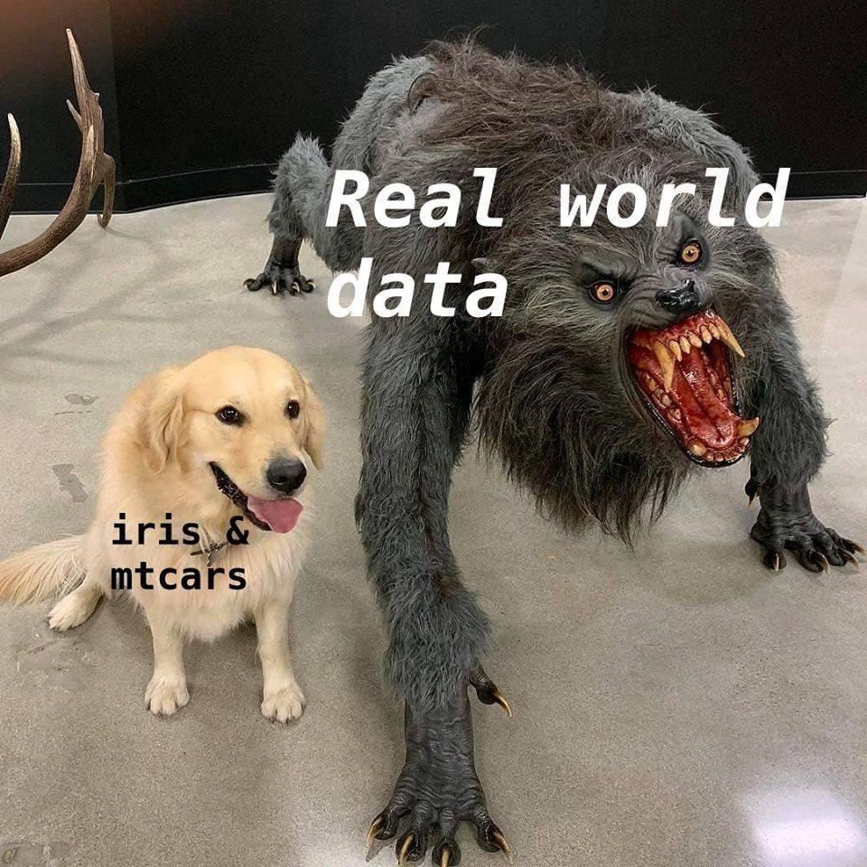

#  Кластерный анализ {#cluster_analysis} 

Мы закончили проверку статистических гипотез c помощью статистичекой нулевой гипотезы (NHST). Значит ли это, что мы закончили весь анализ данных? Совсем нет! Мы рассмотрели только одну задачу -- проверку гипотез -- из множества. 

Какие задачи мы кратко рассмотрим еще:

* Кластеризация
* Понижение размерности
* Факторный анализ

Начнем с кластеризации.

Кластеризация -- это процесс объединения похожих данных (наблюдений) в группы. Это может быть полезно, например, чтобы определить, какие категории пользователей нашего сервиса выделяются, и работать с ними практически персонально (например, какие-то специальные предложения для этой группы), или выделять группы сотрудников и также делать им индивидуальные предложения, чтобы мотивировать к работе (потому что мотивация не универсальна для всех).

Кластеризация немного похожа на [дисперсионный анализ](#anova) по виду данных: она осмысленна тогда, когда на диаграмме рассеяния выделяются группы наблюдений.

Для изучения кластерного анализа будем использовать датасет `iris` https://en.wikipedia.org/wiki/Iris_flower_data_set

```{r eval=TRUE, echo = FALSE, message = FALSE, fig.align = 'center', out.width="60%"}

```


