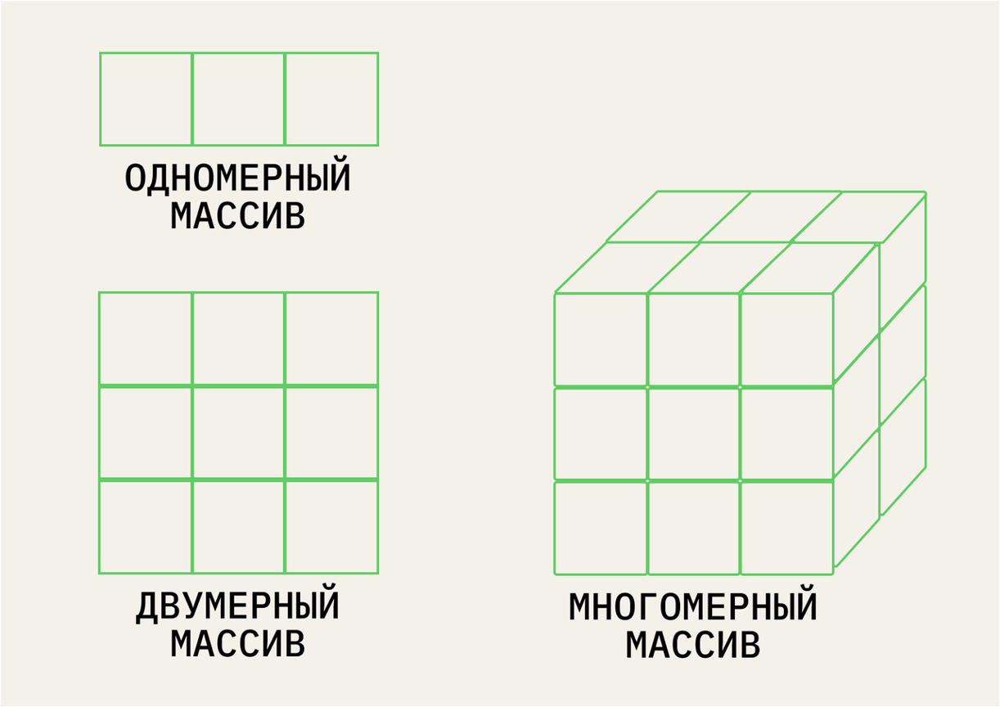

#  Введение в анализ данных в R {#R_analysis} 

Эта книжка написана с помощью языка программирования и обработки данных R и пакета Bookdown в среде работы с данными RStudio.

Чтобы начать в ней работать, нужно скачать и установить сам язык R https://cran.r-project.org/ и скачать и установить RStudio, среду для работы https://posit.co/downloads/.

## Данные и переменные

**Данные** – это информация, представленная в форме, пригодной для хранения и обработки человеком или информационными системами (ISO/IEC/IEEE 24765-2010).
Если данные представлены в форме для обработки информационными системами, они формализованы.

**Переменная** – это оболочка, которую мы задаем, чтобы хранить в ней данные и выполнять операции с ними.
У переменной есть *название* и те *данные*, которая она хранит.

<p align="center"> 
```{r eval=TRUE, echo = FALSE, message = FALSE, fig.align = 'center', out.width="80%"}
knitr::include_graphics("docs/images/variable.png")
```
</p>

### Основные типы данных

* **Числовой** (целые числа – **integer** или **numeric**, вещественные числа – **real**, числа с плавающей точкой (дробные) – **float**)
* **Текстовый** (**character**, если один символ, или **string** – много символов)
* **Логический** (logical – принимает только значения True / False)
* **NA** – пропущенные значения (not available)
* **NaN** – not a number, результат выполнения невозможной числовой операции (например, деление на 0)

### Основные структуры данных {#data_structures}

* **Вектор (vector)** – одномерный массив одного типа данных
* **Массив (array)** – многомерный массив одного типа данных, состоящий из векторов одной длины 
* **Матрица (matrix)** – двумерный массив только числовых данных
* **Список (list)** – по сути, многомерный массив, но может состоять из векторов разной длины и иметь данные разных типв
* **Данные, датафрейм (dataframe)** – по сути, cписок, но все вектора одной длины

<p align="center"> 
```{r eval=TRUE, echo = FALSE, message = FALSE, fig.align = 'center', out.width="80%"}

```
https://practicum.yandex.ru/blog/10-osnovnyh-struktur-dannyh/
</p>


## Операции с переменными и функции

В зависимости от того, с переменными какого типа мы работаем, мы можем выполнять с ними разные операции.

**Операция** – это выполнение каких-либо действий над данными. То, что выполняет это действие, называется **оператором** или **функцией**. Разница между ними в том, что оператор выполняет атомарные (единичные и простые действия), например, оператором может быть знак сложения, деления, больше или меньше и тд. Функция делает более сложные действия: например, создать вектор с помощью функции `c()`, прочитать данные с помощью функции `read_csv()`, отфильтровать данные с помощью функции `select()`. Обратите внимание, что при вызове функции после ее названия всегда ставятся круглые скобки.

| **Тип данных** |                      **Возможные атомарные операции**                     |
|:--------------:|:---------------------------------------------------------------:|
|    Числовой    |                  = (присвоение), +, -, /, *, %                  |
|    Текстовый   | = (присвоение),+ (конкатенация), поиск по определенному символу |
|   Логический   |          = (присвоение),>, <, == (равно), != (не равно)         |


## Начало рабты в среде

В этом учебнике я буду приводить задания для тренировки в любой среде работы с данными и код работы с данными в R.

Для большинства интересных операций в R нам понадобятся дополнительные пакеты -- набор функций, которые уже кто-то написал за нас (то же самое, как, например, `import numpy as np` в питоне). Нам в основном понадобится пакет `tidyverse`, дословно -- "вселенная чистых данных`. Сразу скажу, что все помеченной символом # -- это комментарии, наши подсказки, которые не будут исполняться. Их важно всего оставлять для себя, чтобы не забыть, что вообще здесь происходит.

Чтобы пакет заработал, его нужно 1. установить и 2. подключить

```{r eval=FALSE, echo = TRUE, message = FALSE}
# устанавливаем пакет
install.packages("tidyverse")
```

```{r eval=TRUE, echo = TRUE, message = FALSE}
# подключаем пакет
library(tidyverse)
```

Установить пакет достаточно всего один раз после установки R, подключать через `library` нужно всегда, когда открываем RStudio. Ошибка вида "could not find function" в 99% случаев говорит о том, что пакет, из которого она используется, не подключен.

## Начало рабты с данными

Мы будем работать с данными World Happiness Report за 2016 год https://www.kaggle.com/datasets/unsdsn/world-happiness. Это Всемирный доклад о счастье https://en.wikipedia.org/wiki/World_Happiness_Report , которой показывает, как жители разных стран оценивают свой уровень счастья. В данных за 2016 год, с которыми мы будем работать, участвую 157 стран. *Кстати, вы можете скачать данные за разные года и посмотреть, как менялось количество стран-участниц? Чуть позже мы научимся делать это с помощью кода*. Здесь есть следующие переменные:

* Happiness Rank - позиция в рейтинге
* Happiness Score - абсолютное значение, набранное по уровню счастья
* SE - стандартная ошибка 
* Economy - ВВП на душу населения
* Family - Социальная поддержка, ощущение семье
* Health - Продолжительность жизни
* Freedom - Свободы
* Trust (Goverment Corruption) - воспринимаемый уровень коррупции
* Generosity - сколько жертвуют на благотворительность
* Distopia - страна-антиутопия, где самые низкие показатели по всем парметрам из существующих


Economy, Family, Health, Freedom, Trust, Generosity -- 6 показателей, по которым считается уровень счастья.

Чтобы совершать операции с данными, их сначала нужно *прочитать*, загрузить в среду работы с данными. В современных традициях R это проще всего сделать с помощью функции `read_csv()` из пакета `tidyverse`. Не забывайте, что любой вызов функции сопровождается круглыми скобками, в которые передаются аргументы. В функции `read_csv()`в скобках нужно передать путь к файлу, который мы хотим прочитать.Его можно скопировать через свойства файла. Но чтобы не заморачиваться с путем, проще всего положить файл с данными в ту же папку, где и лежит наш сам файл с кодом (для этого его нужно сохранить). А самое элегентное и используемое решение -- создать проект File - New Project, и хранить все файл в папке проекта, это уберагает от большого числа ошибок. Про импорт файлов очень подробно расписано у Ивана Позднякова https://pozdniakov.github.io/tidy_stats/030-import_data.html


```{r eval=TRUE, echo = TRUE, message = FALSE}

whr <- read_csv("2016.csv") # читаем данные 

View(whr) # просматриваем, что получилось передать в объект с названием whr 
```


Теперь я хочу поизучать эти данные. Помните, с чего мы начинаем изучение данных? С [описательных статистик](descriptives)

Я могу отобрать все переменные по одной и посчитать для них среднее и стандартное отклонение -- это то, что в Jamovi находится во вкладке Descriptives. Так как колонка существует не в вакууме, а внутри датасета, то нам необходимо как-то указать, что нас интересует конкретная колонка внутри конкретного датасета. Пока что проще всего это сделать -- с помощью значка `$`:

```{r eval=TRUE, echo = TRUE, message = FALSE}
whr$Family # отбираем всю колонку 
```

Или можем вспомнить, что датафрейм имеет два измерения, как и [двумерный массив](data_structures), и можем обратиться по индексу (в квадртных скобках): номер строки (первое число) и номер колонки (второе число). Если нас интересует не конкретная строка, а все строки, то на месте этого индекс ничего не ставится, как бы пропускаем его.

```{r eval=TRUE, echo = TRUE, message = FALSE}
whr[,8] # отбираем всю колонку другим способом
```
Обратите внимание на выдачу: как вы думаете, какым структурам данных принадлежат результаты первого и второго способа?


Посчитаем среднее и стандартное отклонение для этой колонки

```{r eval=TRUE, echo = TRUE, message = FALSE}
mean(whr$Family) # среднее
sd(whr$Family) # стандартное отклонение
```

## Задания после семинара 2

1. Прочитайте в среде, в которой вы работаете, данные WHR за 2016 год. 
2. Посчитайте среднее, стандартное отклонение, медиану и размах (разброс от максимального до минимального значения) по всем 6 показателям, составляющим уровень счастья. Что можно сказать про них? Где самый большой размах? Где среднее и медиана оказались близко друг к другу, а где не очень? *(для подсчета медианы и размаха в R нужно будет немножко поучиться гуглить или использовать другие материалы)*

