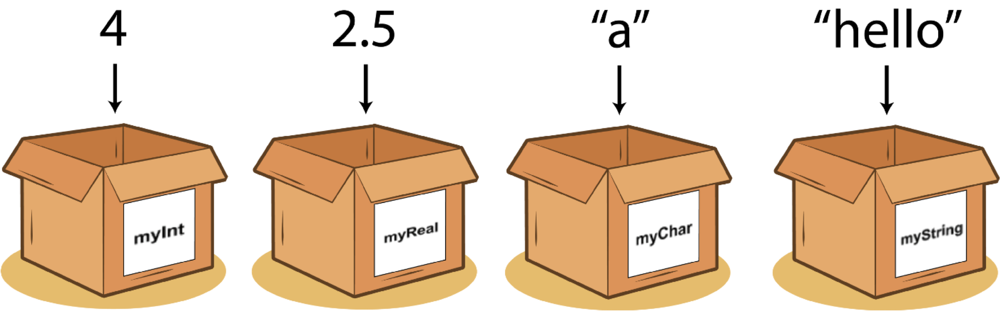
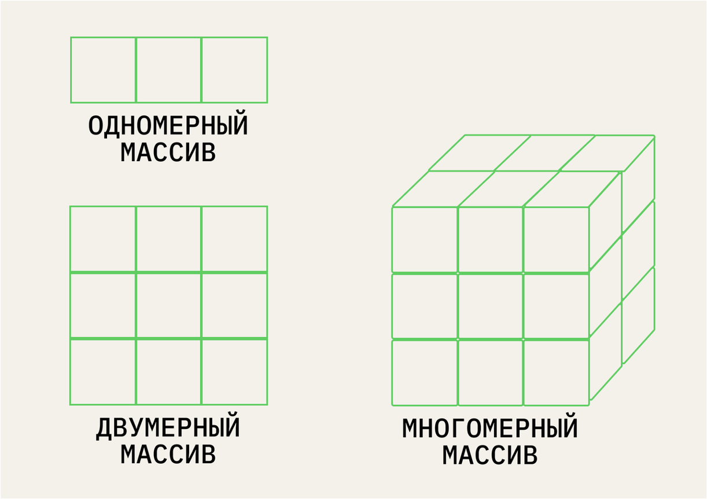

#  Введение в анализ данных в R {#R_analysis} 

Эта книжка написана с помощью языка программирования и обработки данных R и пакета Bookdown в среде работы с данными RStudio.

Чтобы начать в ней работать, нужно скачать и установить сам язык R https://cran.r-project.org/ и скачать и установить RStudio, среду для работы https://posit.co/downloads/.

## Данные и переменные

**Данные** – это информация, представленная в форме, пригодной для хранения и обработки человеком или информационными системами (ISO/IEC/IEEE 24765-2010).
Если данные представлены в форме для обработки информационными системами, они формализованы.

**Переменная** – это оболочка, которую мы задаем, чтобы хранить в ней данные и выполнять операции с ними.
У переменной есть *название* и те *данные*, которая она хранит.

<p align="center"> 
```{r eval=TRUE, echo = FALSE, message = FALSE, fig.align = 'center', out.width="80%"}

```
</p>

### Основные типы данных {#data_types}

* **Числовой** (целые числа – **integer** или **numeric**, вещественные числа – **real**, числа с плавающей точкой (дробные) – **float**)
* **Текстовый** (**character**, если один символ, или **string** – много символов)
* **Логический** (**logical** или **boolean** – принимает только значения True / False)
* **NA** – пропущенные значения (not available)
* **NaN** – not a number, результат выполнения невозможной числовой операции (например, деление на 0)

### Основные структуры данных {#data_structures}

* **Вектор (vector)** – одномерный массив одного типа данных
* **Массив (array)** – многомерный массив одного типа данных, состоящий из векторов одной длины 
* **Матрица (matrix)** – двумерный массив только числовых данных
* **Список (list)** – по сути, многомерный массив, но может состоять из векторов разной длины и иметь данные разных типв
* **Данные, датафрейм (dataframe)** – по сути, cписок, но все вектора одной длины

<p align="center"> 
```{r eval=TRUE, echo = FALSE, message = FALSE, fig.align = 'center', out.width="80%"}

```
https://practicum.yandex.ru/blog/10-osnovnyh-struktur-dannyh/
</p>


## Операции с переменными и функции {#operarions}

В зависимости от того, с переменными какого типа мы работаем, мы можем выполнять с ними разные операции.

**Операция** – это выполнение каких-либо действий над данными. То, что выполняет это действие, называется **оператором** или **функцией**. Разница между ними в том, что оператор выполняет атомарные (единичные и простые действия), например, оператором может быть знак сложения, деления, больше или меньше и тд. Функция делает более сложные действия: например, создать вектор с помощью функции `c()`, прочитать данные с помощью функции `read_csv()`, отфильтровать данные с помощью функции `select()`. Обратите внимание, что при вызове функции после ее названия всегда ставятся круглые скобки.

| **Тип данных** |                      **Возможные атомарные операции**                     |
|:--------------:|:---------------------------------------------------------------:|
|    Числовой    |                  = (присвоение), +, -, /, *, %                  |
|    Текстовый   | = (присвоение),+ (конкатенация), поиск по определенному символу |
|   Логический   |          = (присвоение),>, <, == (равно), != (не равно)         |


```{r eval=TRUE, echo = TRUE, message = FALSE}
# создание векторов  -------------------------------------------------------
c(1, 2, 3, 4, 5) # c() -- это  функция, которая создает вектор, вне зависимости от типа данных

# Числовые векторы  -------------------------------------------------------
c(1, 2, 3, 4, 5, 7, 21, 143)

vector1 <- c(1, 2, 3, 4, 5) # vector1 -- название переменной, 1, 2, 3, 4, 5 -- аргументы функции с()

age <- c(18, 22, 25, 20, 21)

1:10 # функция : создает числовой вектор от 1 до 10 только с шагом 1
10:1

seq(2, 10, 2) # функция seq() создает числовой вектор-перечисление значений от 2 до 10 с шагом 2 
seq(1, 10, 2) # функция seq() создает числовой вектор-перечисление значений от 1 до 10 с шагом 2

# Текстовые векторы -------------------------------------------------------

answers <- c("нет", "да", "да", "да", "нет")

#пример приведения типов -- TRUE и FALSE превратились в 1 и 0
c(1, 2, 3, 4, 5, TRUE, FALSE)
c(1, 2, 3, 4, 5, "1", "0")

# Логические вектора и приведение типов ------------------------------------------------------

condition <- c(TRUE, FALSE, TRUE, TRUE, FALSE) #логический вектор

#примеры приведения типов, когда в векторе встречаются разные типы данных -- R приводит их к одному
c(1, 2, 3, 4, TRUE, FALSE)
c(1, 2, 3, 4, 5, 6)
c(1, 10, 3, -4, "зеленый", "карий")

# Логические выражения ------------------------------------------------------

a <- 5
b <- 10

a > b
a >= b
a == b
a != b
a <= b
a < b

#функция, которая выполняет действия в зависимости от условия ...если ... то:
# ifelse() содержит 3 аргумента: ( условие; что делать, если условие верно;
# что делать, если условие ложно)

ifelse(a < b, a+b, "а не меньше b")


# датафрейм ---------------------------------------------------------------

eye_color <- c("green", "brown", "grey", "blue", "red")
  
data <- data.frame(vector1, age, answers, condition, eye_color) #функция data.frame() создает датафрейм (табличку с данными) из существующих векторов
View(data) # функция View() открвает эту табличку в отдельной вкладке (то же, что и по клику иконки в окне Environment)

data$age # отбираем колонку из датафрейма: название_датафрейма$название_колонки

# описательные визуализации
hist(data$age, breaks = c(18, 22, 27))
lines(density(data$age)) #добавляет график плотности вероятности на гистограмму

?hist
plot(density(data$age))

# описательные статистики
mean(data$age)
sd(data$age)
round(sd(data$age),1) #округляет до 1 цифры после запятой

min(data$age)
max(data$age)
range(data$age)
summary(data$age)
```
## Начало работы в среде

В этом учебнике я буду приводить задания для тренировки в любой среде работы с данными и код работы с данными в R.

Для большинства интересных операций в R нам понадобятся дополнительные пакеты -- набор функций, которые уже кто-то написал за нас (то же самое, как, например, `import numpy as np` в питоне). Нам в основном понадобится пакет `tidyverse`, дословно -- "вселенная чистых данных`. Сразу скажу, что все помеченной символом # -- это комментарии, наши подсказки, которые не будут исполняться. Их важно всего оставлять для себя, чтобы не забыть, что вообще здесь происходит.

Чтобы пакет заработал, его нужно 1. установить и 2. подключить

```{r eval=FALSE, echo = TRUE, message = FALSE}
# устанавливаем пакет
install.packages("tidyverse")
```

```{r eval=TRUE, echo = TRUE, message = FALSE}
# подключаем пакет
library(tidyverse)
```

Установить пакет достаточно всего один раз после установки R, подключать через `library` нужно всегда, когда открываем RStudio. Ошибка вида "could not find function" в 99% случаев говорит о том, что пакет, из которого она используется, не подключен.

## Начало работы с данными

Мы будем работать с данными World Happiness Report за 2016 год https://www.kaggle.com/datasets/unsdsn/world-happiness. Это Всемирный доклад о счастье https://en.wikipedia.org/wiki/World_Happiness_Report , которой показывает, как жители разных стран оценивают свой уровень счастья. Их можно скачать так же по ссылке https://raw.githubusercontent.com/elenary/StatsForDA/main/2016.csv (правой кнопкой мыши в открывшемся файле - Сохранить как). В данных за 2016 год, с которыми мы будем работать, участвую 157 стран. *Кстати, вы можете скачать данные за разные года и посмотреть, как менялось количество стран-участниц? Чуть позже мы научимся делать это с помощью кода*. Здесь есть следующие переменные:

* Happiness Rank - позиция в рейтинге
* Happiness Score - абсолютное значение, набранное по уровню счастья
* SE - стандартная ошибка 
* Economy - ВВП на душу населения
* Family - Социальная поддержка, ощущение семье
* Health - Продолжительность жизни
* Freedom - Свободы
* Trust (Goverment Corruption) - воспринимаемый уровень коррупции
* Generosity - сколько жертвуют на благотворительность
* Dystopia - страна-антиутопия, где самые низкие показатели по всем парметрам из существующих


Economy, Family, Health, Freedom, Trust, Generosity -- 6 показателей, по которым считается уровень счастья.

Чтобы совершать операции с данными, их сначала нужно *прочитать*, загрузить в среду работы с данными. В современных традициях R это проще всего сделать с помощью функции `read_csv()` из пакета `tidyverse`. Не забывайте, что любой вызов функции сопровождается круглыми скобками, в которые передаются аргументы. В функции `read_csv()`в скобках нужно передать путь к файлу, который мы хотим прочитать.Его можно скопировать через свойства файла. Но чтобы не заморачиваться с путем, проще всего положить файл с данными в ту же папку, где и лежит наш сам файл с кодом (для этого его нужно сохранить). А самое элегентное и используемое решение -- создать проект File - New Project, и хранить все файл в папке проекта, это уберагает от большого числа ошибок. Про импорт файлов очень подробно расписано у Ивана Позднякова https://pozdniakov.github.io/tidy_stats/030-import_data.html


```{r eval=TRUE, echo = TRUE, message = FALSE}

whr <- read_csv("2016.csv") # читаем данные 

View(whr) # просматриваем, что получилось передать в объект с названием whr 
```


Теперь я хочу поизучать эти данные. Помните, с чего мы начинаем изучение данных? С [описательных статистик](descriptives)

Я могу отобрать все переменные по одной и посчитать для них среднее и стандартное отклонение -- это то, что в Jamovi находится во вкладке Descriptives. Так как колонка существует не в вакууме, а внутри датасета, то нам необходимо как-то указать, что нас интересует конкретная колонка внутри конкретного датасета. Пока что проще всего это сделать -- с помощью значка `$`:

```{r eval=TRUE, echo = TRUE, message = FALSE}
whr$Family # отбираем всю колонку 
```

Или можем вспомнить, что датафрейм имеет два измерения, как и [двумерный массив](data_structures), и можем обратиться по индексу (в квадртных скобках): номер строки (первое число) и номер колонки (второе число). Если нас интересует не конкретная строка, а все строки, то на месте этого индекс ничего не ставится, как бы пропускаем его.

```{r eval=TRUE, echo = TRUE, message = FALSE}
whr[,8] # отбираем всю колонку другим способом
```
Обратите внимание на выдачу: как вы думаете, какым структурам данных принадлежат результаты первого и второго способа?


Посчитаем среднее и стандартное отклонение для этой колонки

```{r eval=TRUE, echo = TRUE, message = FALSE}
mean(whr$Family) # среднее
sd(whr$Family) # стандартное отклонение
```

## Задания после семинара 2 {#tasks_sem2}

1. Прочитайте в среде, в которой вы работаете, данные WHR за 2016 год (в R -- используйте функцию `read_csv()` из пакета `tidyverse`). 
2. Посчитайте среднее, стандартное отклонение, медиану и размах (разброс от максимального до минимального значения) по всем 6 показателям, составляющим уровень счастья (Economy, Family, Health, Freedom, Trust, Generosity). Что можно сказать про них? Где самый большой размах? Где среднее и медиана оказались близко друг к другу, а где не очень? *(для подсчета медианы и размаха в R нужно будет немножко поучиться гуглить или использовать другие материалы)*
3. Постройте гистограмму и график плотности вероятности для всех 6 показателей, составляющим уровень счастья.

## Предобработка данных {#preprocessing}

После того, как мы считали данные данные в переменную (мы использовали функцию `read_csv()` для этого), часто нужно эти данные сначала **предобработать**. Во-первых, данные сами по себе могут быть не очень хорошего качества, и их нужно почистить. Во-вторых, мы никогда не работаем со всей табличкй сразу -- мы отбираем данные, например, определенную колонку, и часто нам нужны не все данные, а только соответствующие определенным условиям (например, нам нужно отобрать время реакции в группе, где испытуемые употребляли кофеин, а не плацебо). 

В предобработку данных чаще всего входит:

* Отбор определенных колонок
* Фильтрация -- отбор определенных строк, удовлетворяющих определенным условиям
* Создание новых колонок и заполнение их в соответствии с определенными услвиями
* Работа с пропущенными значениями -- удаление или замена на какое-либо (например, среднее) значение

Пойдем по порядку.

### Отбор колонок {#columns}

Любое почти всегда можно сделать разными способами. Чаще всего не существует правильного, если работает -- значит, правильно. Но некоторые решения бывает более оптимальными в разных контекстах. Рассмотрим разные способы отбора колонок. Обратите внимание, чем они различаются?

*Сразу комментарий -- когда мы делаем операцию присвоения <-, у нас ничего не выводится в консоль. Чтобы посмотреть, что мы присвоили переменной, можно вывести ее по названию или, если речь про данные -- посмотреть с помощью функции View(). Если вы только пробуете написать операцию -- не спешите присваивать ее в переменную! Так мы сразу будем видеть результат в консоли, и если он ошибочный, это будет понятно.*

**Отбор в базовом R по названию колонки**

```{r eval=TRUE, echo = TRUE, message = FALSE}
var1 <- whr$`Happiness Score`
var1
str(var1)
```

**Отбор в базовом R по индексу**

Индекс -- это номер элемента в структуре данных. Мы говорили про них, когда обсуждали многомерные массивы: в одномерной структуре, например, векторе, индекс будет состоять из одного числа, в двумернй (например, матрице или датафрейме) -- индекс состоит из двух чисел, разделенных запятой, в трехмерной -- из трех, и так далее. Индекс в R всегда пишется в квадратных скобках, например, чтобы узнать, что находится во второй строчке третьего столбца, индекс элемента будет `[2,3]`.
**Сначала идет номер строки, затем -- номер столбца.** Если мы хотим вывести все строки или все столбцы -- на месте этого индекса ничего не ставится. Например, если я хочу вывести все строки из третьей колонки, я напишу `[,3]`

```{r eval=TRUE, echo = TRUE, message = FALSE}
var2 <- whr[,4]
var2
str(var2)
```
**Отбор с помощью пакета tidyverse по названию**

Сначала пара важных моментов отнсосительно работы с пакетом и кульурой написания кода `tidyverse`. Последовательность операций в рамках одной задачи пишется построчно с переносом на следующую строку в виде [пайпа](https://magrittr.tidyverse.org/reference/pipe.html) ` %>% ` -- символа, который позволяет испльзовать в качестве аргумента функции следующей строки то, что получилось в результате выполнения предыдущей. На первой строке в пайп передаются сами данные, то есть название переменной, в которую мы их записали. Далее на каждой следующей строке в качестве первого аргумента функции в скобках будет применяться результат выполнения предыдущей. Подробнее про tidyverse https://pozdniakov.github.io/tidy_stats/110-tidyverse_basic.html и про пайпы https://pozdniakov.github.io/tidy_stats/110-tidyverse_basic.html

Внутри `tidyverse` используется такая структура данных, как `tibble`(https://tibble.tidyverse.org/). Тиббл -- это модицифированный датафрейм, о чем мы уже говорили, когда обсуждали [структуры данных](#data_structures)

Вывод в датафрейм (тиббл):
```{r eval=TRUE, echo = TRUE, message = FALSE}
var3 <- whr %>%
  select(`Happiness Score`)
var3

#смотрим структуру данных
str(var3)
```

С помощью функции `select()` мы можем вытаскивать даже не одну колонку, а несколько:

```{r eval=TRUE, echo = TRUE, message = FALSE}
whr %>%
  select(Country,`Happiness Score`)
```

**Отбор с помощью пакета tidyverse по названию**

Обратите внимание -- предыдущий вывод так же является тибблом, а не вектором. Чтобы вывести в вектор, надо выполнить еще один шаг с помощью функции `pull()`, которая как бы "вытягивает" значения из тиббла:
```{r eval=TRUE, echo = TRUE, message = FALSE}
var4 <- whr %>%
  select(`Happiness Score`) %>%
  pull() #вытягивает числовые значения и превращает в числовой вектор
var4

#смотрим структуру данных
str(var4)
```

В этом случае мы можем даже в этом же пайпе посчитать медиану или среднее:
```{r eval=TRUE, echo = TRUE, message = FALSE}
whr %>%
  select(`Happiness Score`) %>% #результат -- тиббл
  pull() %>% #результат -- вектор
  median()
```

А так будет ошибка

```{r eval=FALSE, echo = TRUE, message = FALSE}
whr %>%
  select(`Happiness Score`) %>% #результат -- тиббл
  median()
```
### Фильтрация (отбор строк) {#filter}

Очень часто встает задача фильтрации строк: когда нужны не все данные, а удовлетворяющие какому-либо условию


```{r eval=TRUE, echo = TRUE, message = FALSE}
whr[1:10,]
```

```{r eval=TRUE, echo = TRUE, message = FALSE}
whr %>% 
  slice(1:10)
```

```{r eval=TRUE, echo = TRUE, message = FALSE}
whr %>%
  filter(Region == "Central and Eastern Europe") 
```

А теперь отфильтруем эти значения и возьмем только те значения `Happiness Score`, которые соответствуют Центральной и восточной Европе

```{r eval=TRUE, echo = TRUE, message = FALSE}
whr %>%
  filter(Region == "Central and Eastern Europe")  %>%
  select(`Happiness Score`) 
```

.. и "вытащим" эти значения в числовой вектор, чтобы с ними было проще всего работать

```{r eval=TRUE, echo = TRUE, message = FALSE}
whr %>%
  filter(Region == "Central and Eastern Europe") %>%
  select(`Happiness Score`) %>%
  pull() 
```

И посчитаем среднее

```{r eval=TRUE, echo = TRUE, message = FALSE}
whr %>%
  filter(Region == "Central and Eastern Europe") %>%
  select(`Happiness Score`) %>%
  pull() %>% 
  mean()
```

Теперь можем сравнить средний `Happiness Score` по всем странам (считали его ранее) и только по Центральной и восточной Европе. Что можно про них сказать?

Или посмотрим, какие страны находятся в топе-10 по `Happiness Rank`

```{r eval=TRUE, echo = TRUE, message = FALSE}
whr %>%
  filter(`Happiness Rank` <= 10) 
```

Если нам нужно выполнить несколько условий одновременно (например, странны с `Happiness Score` не менее 10, но более 7), то мы можем пользоваться логическим "и" и логическим "или" (разница между ними в том, что "и" отбирает только те строки, которые удовлетворяют И первому, И второму условию, а "или" отбирает строки, которые удовлетворяют любому из условий, ИЛИ первому, ИЛИ второму)

```{r eval=TRUE, echo = TRUE, message = FALSE}
whr %>% 
  filter(`Happiness Rank` <= 10 | `Happiness Score` >=7) %>% #логическое или
  View() 

whr %>% 
  filter(`Happiness Rank` <= 10 & `Happiness Score` >=7) %>% #логическое и
  View() 
```


### Создание колонок {#mutate}

Часто возникает задача перекодировать переменную -- например, разбить непрерывные значения на группы, чтобы посмотреть различия между ними.

Например, продолжая предыдущий пример с фильтрацией первых 10 в рейтинге стран: для сравнения показателей, вклдывающихся в уровень счастья, нас может интересовать, отличаются ли "топовые" страны от всех остальных. Для этого нам проще создать отдельную колонку, которая служит индикатором, является ли страна "топовой". Разберем, что это значит: нам нужно 1) создать новую колонку и 2) записать в нее значения, удовлятворяющие определенному условию. (1) достигается с помощью функции `mutate()` (как бы "измени" датафрейм, "примутируй" к нему колонку), а (2) достигается очень похожим на фильтрацию способом -- с помощью функции `ifelse` ([пример выше](#operarions))

На паре топовые и не топовые страны превратились в `hehe` и `not hehe`, так и оставим.

```{r eval=FALSE, echo = TRUE, message = FALSE}
whr_top <- whr %>% 
  mutate("Rank Category" = ifelse(`Happiness Rank` <=10, "hehe", "not hehe"))

View(whr_top)
```

Если выведем датафрейм, увидим, что на последнем месте появилась новая колонка `Rank Category`.

Новые значения могут соответствовать и какой-либо математической операции, например, создадим новую колонку, показывающую, во сколько раз уровень счастья в стране превышает значения страны-дистопии:

```{r eval=FALSE, echo = TRUE, message = FALSE}
whr %>% 
  mutate("Times" = `Happiness Score` / `Dystopia Residual`) %>% 
  View()
```

### Работа с пропущенными значениями (NA) {#NA}

Как уже говорилось в разделе про [типы данных](#data_types), есть отдельный тип данных, который кодирует пропущенные значения -- NA, Not Available. Это особенный тип, потому что из-за пропущенных значений мы не можем оценить данные целиком. Такие ситуации встречаются крайне часто, поэтому придуманы специальные способы обращения с NA.

Для изучения этого раздела нам понадобятся данные `2016-2` по ссылке https://raw.githubusercontent.com/elenary/StatsForDA/main/2016-2.csv (правая кнопка мыши -- сохранить как)
```{r eval=TRUE, echo = TRUE, message = FALSE}
whr_new <-read_csv("2016-2.csv")
# View(whr_new)
```

Первая важная функция работы с промущенными значениями -- это `is.na()`, проверка того, является ли каждый элемент вектора или датафрейма NA, и механизмы подсчета количества таких значений.
```{r eval=TRUE, echo = TRUE, message = FALSE}
is.na(whr_new$`Happiness Score`)

#помним, что TRUE -- это 1, а FALSE -- 0. Поэтому можем перевести результаты в числовой вектор
as.numeric(is.na(whr_new$`Happiness Score`))

#подсчет количества NA
sum(as.numeric(is.na(whr_new$`Happiness Score`)))
sum(is.na(whr_new$`Happiness Score`))
```

Одна из больших проблем с этими значениями -- они мешают производить вычисления. Когда часть данных отсутствует, невозможно сказать, каково среднее выборки.

```{r eval=TRUE, echo = TRUE, message = FALSE}
whr_new %>% 
  select(`Happiness Score`) %>% 
  pull() %>% 
  mean()

mean(whr_new$`Happiness Score`)
```

Так происходит, потому что невозможно прибавить, вычесть или даже сравнить с чем-то значение, которое недоступно
```{r eval=TRUE, echo = TRUE, message = FALSE}
1 == NA
"NA" == NA
NA == NA
```

Для этого пропущенные значения обычно удаляют из рассмотрения. Например, с помощью функции `na.omit()` в базовом R или с помощью `drop_na()` в нотации `tifdyverse`. **Важно!** В зависимости от того, к чему мы применяем эту функции, мы либо удаляем NA из отобранной нами колонки, либо, если применяем ко всему датафрейму -- удалятся **все строки**, в которых есть NA хотя бы в одной из колонок.

```{r eval=TRUE, echo = TRUE, message = FALSE}

whr_new$`Happiness Score` 
mean(whr_new$`Happiness Score`) # выдает NA
mean(na.omit(whr_new$`Happiness Score`)) # выдает среднее

# выдает NA
whr_new %>% 
  select(`Happiness Score`) %>% 
  pull() %>% 
  mean()

# выдает среднее
whr_new %>% 
  select(`Happiness Score`) %>% 
  drop_na() %>% 
  pull() %>% 
  mean()

# обратите внимание -- так тоже работает, но среднее другое! Почему?
whr_new %>% 
  drop_na() %>% 
  select(`Happiness Score`) %>% 
  pull() %>% 
  mean()
```

Для работы конкретно с описательным статистиками и аггрегирующими функциями вроде суммы еще есть один лайфхак работы с пропущенными значениями -- аргумент `na.rm = TRUE` внутри функций `mean()`, `median()`, `sum()`. `na.rm = TRUE` буквально значит "na remove = true"

```{r eval=TRUE, echo = TRUE, message = FALSE}
#  через базовый R
mean(whr_new$`Happiness Score`, na.rm = TRUE)

#  или с помощью тайдиверс
whr_new %>% 
  select(`Happiness Score`) %>% 
  pull() %>% 
  mean(na.rm = TRUE)
```

### Сортировка {#sorting}

Еще одна часто встречающая задача -- отсортировать датафрейм по возрастанию или убыванию одной переменной.

Когда у нас есть только один вектор (числовой или текстовый), а не вся табличка данных, мы можем сделать это так средствами базового R:

```{r eval=TRUE, echo = TRUE, message = FALSE}
sort(whr_new$`Happiness Score`) #сортировка только вектора
sort(whr_new$`Happiness Score`, decreasing = TRUE)
```

Если нам нужно отсортировать всю табличку по какой-то колонке, придется прибегнуть к тайдиверс и отсортировать таблицу с помощью функции `arrange()`, где в качестве аргумента передается название колонки, по которой будем делать сортировку. А если нам нужно указать, что сортировка должна быть по убыванию, от большого к меньшего -- необходимо вставить аргумент `desc()`

```{r eval=TRUE, echo = TRUE, message = FALSE}
whr_new %>% 
  drop_na() %>% 
  arrange(Freedom) # сорировка  всей таблицы по колонке Freedom

whr_new %>% 
  drop_na() %>% 
  arrange(`Trust (Government Corruption)`) # сорировка  всей таблицы по колонке Trust

whr_new %>% 
  drop_na() %>% 
  arrange(desc(`Happiness Score`)) # сортировка всей таблицы по колонке Happiness Score по убыванию
```

Выбрать одну колонку и отсортировать ее мы тоже можем, мы уже умеет выбирать одну колонку -- нужно сначала применить функцию `select()`: 

```{r eval=TRUE, echo = TRUE, message = FALSE}
whr_new %>% 
  drop_na() %>% 
  select(`Happiness Score`) %>% 
  arrange(`Happiness Score`) # сортировка одной колонки по возрастанию

whr_new %>% 
  drop_na() %>% 
  select(`Happiness Score`) %>% 
  arrange(desc(`Happiness Score`)) # сортировка одной колонки по колонке по убыванию
```

## Задания после семинара 3 {#tasks_sem3}

1. Выполните все примеры, которые есть в этом разделе, убедитесь, что все работает верно.
2. Посмотрите, какие страны находятся на местах с 1 по 10 и с 147 по 157 (в выводе должно быть по две колонки: `Region` и `Happiness Rank`)
3. Сравните средний показатель экономики `Economy (GDP per Capita)` и уровень счастья `Happiness Score` в странах Восточной и центральной (Central and Eastern Europe) и Западной Европы (Western Europe). Что можно сказать про них? Где показатель экономики выше? Где люди чувствуют себя счастливее?
4. Сравните средний показатель экономики`Economy (GDP per Capita)` и уровень счастья `Happiness Score`  в странах Западной Европы (Western Europe) и Южной Азии (Southern Asia). Что можно сказать про них? Где показатель экономики выше? Где люди чувствуют себя счастливее?
5. *(Только для тех, кто работает в R)* Посчитайте средний `Happiness Score` по всем странам и выведете страны, которые лежат в границах ± 1 от среднего `Happiness Score` (в выводе должно быть по две колонки: `Region` и `Happiness Score`) *Подсказка: возможно, будет проще посчитать среднее отдельно и сначала сохранить его в переменную*
6. Создайте колонку, в которой будет содержаться информация, в текущей стране `Happiness Score` выше или ниже среднего значения (колонка может быть заполнена, например, значениями upper и lower или любыми другими обозначениями)

## Описательные статистики и агрегация {#descriptives_r}

### Описательные статистики

Мы уже немножко считали описательные статистики в самом начале работы с данными, чтобы было пободрее продвигаться. Теперь давайте остановимся на них поподробнее.

Самые частые описательные статистики из мер центральной тенденции -- среднее, медиана и мода. Среднее и медиану мы уже строили, а как построить моду?

```{r eval=TRUE, echo = TRUE, message = FALSE}
mean(whr_new$`Happiness Score`, na.rm = TRUE)
median(whr_new$`Happiness Score`, na.rm = TRUE)

summary(whr_new$`Happiness Score`)

# mode(whr_new$`Happiness Score`, na.rm = TRUE) #выдаст ошибку
# mode(whr_new$`Happiness Score`)
```

Так получилось, что в R нет специальной функции для моды. У этого есть и логическая причина -- жанные, с которыми мы в основном работаем -- количественные непрерывные, и мы обсуждали, что для такого рода данных понятие моды немного искуственно. Но нам все равно бывает нужно посчитать моду. Поэтому можно либо написать функцию для ее расчета самостоятельно, либо воспользоваться готовой функцией из пакета. Я погуглила, что можно сделать, и вам рекомендую всегда так делать в таких ситуациях -- и выбрала функцию  `mlv()` (most likely value)  из пакета `modeest` 

```{r eval=TRUE, echo = TRUE, message = FALSE}
# install.packages("modeest")
library(modeest)
mlv(whr_new$`Happiness Score`, na.rm = TRUE)
mlv(whr_new$Region, na.rm = TRUE)
```

Либо, можно воспользоваться простой функцией `table()`, которая считает количество значений указанной переменной.
```{r eval=TRUE, echo = TRUE, message = FALSE}
table(whr_new$Region)
```

Помимо мер центральной тенденции можем посчитать меры изменчивости -- минимальное и максимальное, размах, стандартное отклонение, дисперсию, межквартильный размах.

```{r eval=TRUE, echo = TRUE, message = FALSE}
min(whr_new$`Happiness Score`, na.rm = TRUE)
max(whr_new$`Happiness Score`, na.rm = TRUE) 
range(whr$`Happiness Score`) #размах
sd(whr_new$`Happiness Score`, na.rm = TRUE) #стандартное отклонение
var(whr_new$`Happiness Score`, na.rm = TRUE) #дисперсия
IQR(whr_new$`Happiness Score`, na.rm = TRUE) #межквартильный размах
```

Мы так же рассчитывали  описательные статистики с помощью функции `summary()`. Есть более продвинутые функции, которые считают большое количество описательных статистик сразу. Например, часто используется функция skim() из пакета skimr -- помимо мер центральной тенденции и всех четырех квартителей, она считает стандартное отклонение и даже строит маленькую гистограммку.
summary(whr_new$`Happiness Score`)

```{r eval=TRUE, echo = TRUE, message = FALSE}
summary(whr_new$`Happiness Score`)
# install.packages("skimr")
library(skimr)
skim(whr_new$`Happiness Score`)
```

### Агрегация данных {#aggregate}

Что произошло, когда мы смотрели частоту выпадения значений с помощью `table()`? Данные сгруппировались по значениям переменной `Region`, которую мы указали, и было посчитано количество значений в каждой группе. Когда мы группируем данные по значениям переменной и производим какой-либо расчет для группы, это называется **агрегацией** данных.

Это полезно, чтобы посчитать те же описательные статистики по группам, например, посчитаем среднее для переменных Freedom и Trust в зависимости от региона:

```{r eval=TRUE, echo = TRUE, message = FALSE}
whr_new %>%
  drop_na() %>%
  group_by(Region) %>%
  summarise(mean_score = mean(`Happiness Score`))


whr_new %>%
  drop_na() %>%
  group_by(Region) %>%
  summarise(mean_score = mean(`Happiness Score`), mean_freedom = mean(Freedom),
            mean_trust = mean(`Trust (Government Corruption)`)) %>%
  arrange(desc(mean_score))
```

## Визуализации {#visualization}

Мы уже строили простенькие визуализации -- простую гистограмму и простой график плотноти веростности средствами базового R.

```{r eval=TRUE, echo = TRUE, message = FALSE}
plot(density(whr_new$`Happiness Score`, na.rm = TRUE))
hist(whr_new$`Happiness Score`)
```

Эти визуализации верны, но они стандартные и выглядят не очень красиво. А меж тем визуализации очень важны -- от их качества зависит понятность представления данных, с помощью визуилизаций можно даже манипулировать данными. В скриптовых языках огромное количество инструментов для работы с визуализациями. В питоне это `matplotlib`. А теперь добро пожаловать в `ggplot2` -- вселенную графиков в R https://ggplot2.tidyverse.org/

Например, можно нарисовать такой [график](https://www.google.com/url?sa=i&url=https%3A%2F%2Fadrienne-marshall.github.io%2Fggplot2_workshop%2F&psig=AOvVaw1y2l2bObt_HK2KcP7m_73h&ust=1676402334991000&source=images&cd=vfe&ved=0CBAQjRxqFwoTCNihzL-bk_0CFQAAAAAdAAAAABAJ), или [такой](https://edaoud.com/assets/img/articles/maps-ggplot2/map_1.png). Все это достигается средствами пакета `ggplot2`, который уже интегрирован в `tidyverse`.

**"gg"** в названии пакета означает **Grammar of graphics**. Подробно можно почитать, например, у Ивана Позднякова https://pozdniakov.github.io/tidy_stats/230-ggplot2.html

Принцип состоит из рисовки графиком по слоям. 
Обязательные слои:

* данные (data) 
* эстетики (aes) или mapping -- то, как наши данные "натягиваются" на график
* геомы (geom) -- геометрические объекты, которые будем рисовать (например, гистограмма или барплот)

Вспомогательные слои:

* статистики (stats) -- нужно ли посчитать какие-то агрегированные статистики прямо на графике
* система координат (coord) -- можно повернуть систему координат на 90 градусов или вообще заменить ее на полярную
* темы (theme) -- системы оформления, одно из самых приятных

<p align="center"> 
```{r eval=TRUE, echo = FALSE, message = FALSE, fig.align = 'center', out.width="80%"}
knitr::include_graphics("docs/images/gglayers.png")
```
Изображение из [The Grammar of Graphics](https://link.springer.com/book/10.1007/0-387-28695-0) </p>

ggplot отлично интегрируется с тайдиверс, но он появился, оформился и распространился раньше, поэтому вместо значка пайпа `%>%` там `+`.
Нарисуем ту же гистограмму, но уже покрасивее:

```{r eval=TRUE, echo = TRUE, message = FALSE}
whr_new %>% 
  ggplot(aes(x = `Happiness Score`)) +
  geom_histogram() +
  theme_minimal()

# Можем регулировать ширину "кирпичика"

whr_new %>% 
  ggplot(aes(x = `Happiness Score`)) +
  geom_histogram(binwidth = 0.5) +
  theme_minimal()
```

Можем менять цвета у двух вещей: заливки и контура, как и обычно у фигур в паверпоинте или ворде. Для заливки используется аругмент fill, для контура -- color. У некоторых геомов есть только контур -- как, например, диаграмма рассеяния, так как точки не имеют заливки.

```{r eval=TRUE, echo = TRUE, message = FALSE}
# раскрасим заливку (fill) в розовый, а линии (color) в фиолетовый
# можем использовать не слова вроде pink и violet, а коды цветов в 16-ричной системе, например "#355C7D"
whr_new %>%
  ggplot(aes(x =`Happiness Score`)) +
  geom_histogram(fill = "pink", color = "violet", binwidth = 0.5) +
  theme_minimal()

# добавим 50% прозрачности
whr_new %>%
  ggplot(aes(x =`Happiness Score`)) +
  geom_histogram(fill = "pink", color = "violet", alpha = 0.5, binwidth = 0.5) +
  theme_minimal()
```

Построим аналогичный график плотности вероятности
```{r eval=TRUE, echo = TRUE, message = FALSE}
whr_new %>% 
  ggplot(aes(x = `Happiness Score`)) +
  geom_density() +
  theme_minimal()

# раскрасим линию в фиолетовый
whr_new %>%
  ggplot(aes(x =`Happiness Score`)) +
  geom_density(color = "violet") +
  theme_minimal()

# поменяем тип линии на пунктир (соответствие типов линий и кодов
# можно погуглить или посмотреть в читшите)
whr_new %>%
  ggplot(aes(x =`Happiness Score`)) +
  geom_density(color = "violet", linetype = 5) +
  theme_minimal()

#добавили заливку и прозрачность
whr_new %>%
  ggplot(aes(x =`Happiness Score`)) +
  geom_density(color = "violet", fill = "pink", linetype = 5, alpha = 0.5) +
  theme_minimal()
```

Все эти графики были описательными -- для исследования одной переменной. А теперь выведем диаграмму рассеяния, в которой показано распределение одной переменной в заивисимости от значений другой.

```{r eval=TRUE, echo = TRUE, message = FALSE}
whr_new %>%
  ggplot(aes(x = `Happiness Score`, y = Freedom)) +
  geom_point() +
  theme_minimal()
```

И можем даже раскрасить точки на этом графике в зависимости от значений третьей переменной! Например, региона. Все ровно так же, как и с цветами до этого: если хотим залить фигуру в зависимости от значений третьей переменной, то для раскраски используется аругмент fill, если покрасить контур -- то color (как контур и заливка в ворде или паверпоинт). Но с той разницей, что теперь fill color задаются **внутри аестетик**, так как это все еще про "натягивание совы на глобус", то есть наших данных на график. 

```{r eval=TRUE, echo = TRUE, message = FALSE}
whr_new %>%
  ggplot(aes(x = `Happiness Score`, y = Freedom, color = Region)) +
  geom_point() +
  theme_minimal()
```

Существует огромное количество дополнительных штук для более красивых визуализаций в ggplot, чтобы делать что-то по-настоящему невероятное. Мы, конечно, не успеем познакомиться с ними в рамках курса, но вот, например, дополнительный пакет с палетками, сделанными по фильмам Уэса Андерсена:) Если мы хотим раскрасить наш график не просто в цвета по умолчанию, а в какие-то особенные -- есть пакет, в которые собрали цветовые схемы из этих фильмов! Сначала его нужно привычно поставить через `install.packages()`, подключить через `library()`, а далее добавить одну строчку с добавлением шкалы `scale_fill_manual()` или `scale_color_manual()` -- опять же, в зависимости от того, хотим мы делать заливку этими палетками или контур.

```{r}
# install.packages("wesanderson")
library(wesanderson)

whr %>% 
  filter(Region %in% c("Western Europe", "Eastern Asia", "Sub-Saharan Africa")) %>% #здесь я фильтрую часть строк, входящих только в три региона, чтобы на графике были только три цвета и не было цветового взрыва, так как регионов в данных много
  ggplot(aes(x = `Happiness Score`, y = `Trust (Government Corruption)`,
             fill = Region)) +
  geom_boxplot() +
  theme_minimal() +
  scale_fill_manual(values = wes_palette("Royal1"))
```


## Задания после семинара 4 {#tasks_sem4}

Для заданий используется датасет [`2016-2`](https://raw.githubusercontent.com/elenary/StatsForDA/main/2016-2.csv) 

1. Выполните все примеры, которые есть в этом разделе, убедитесь, что все работает верно.
2. Посчитайте, сколько всего суммарно NA в колонках `Economy (GDP per Capita)`, `Family`, `Health (Life Expectancy)`, `Freedom `, `Trust (Government Corruption)`, `Generosity` *(задание можно сделать разными способами, подойдет любой, дающий верный овтет)*
3. Посчитайте описательные статистики для колонок `Economy (GDP per Capita)`, `Family`, `Freedom `: среднее, медиану, моду, стандартное отклонение, дисперсию и межквартильный размах, а также *(только для тех, кто работает в R)* вычислите значения для 1 и 3 квартилей. Ответы должны быть отличны от `NA` *(один из способов узнать значения по квартилям -- например, с помощью отдельных общих функций для описательных статистик)*.
4. Используя созданную в [прошлой домашке](#tasks_sem3) колонку co значениями `upper` и `lower` в зависимости от значений `Happiness Score`, посчитайте среднее и стандартное отклонения внутри этих групп (`upper` и `lower`) для колонок `Economy (GDP per Capita)`, `Family`, `Freedom `. *(Только для тех, кто работает в R)* Сравните полученные средние значения со значениями для 1 и 3 квартилей из предыдущего задания. Что можно сказать про них? 
5. Постройте графики плотности вероятности для переменных `Family` и `Freedom `, *(только для тех, кто работает в R)* используя как минимум 2 отличиные от дефолтных настройки (тему, цвет, тип линии, прозрачность и тд.) Примеры можно погуглить или посмотреть в [читшите](https://github.com/rstudio/cheatsheets/blob/main/data-visualization.pdf)
6. Постройте диаграмму рассеяния для переменной `Family` по переменной `Freedom ` и *(только для тех, кто работает в R)* раскрасьте точки в зависимости от значений переменной с upper и lower, созданной в прошлой домашке.
7. Посчитайте коэффициент корреляции между переменными `Family` и `Freedom `.


## Проверка гипотез

Пришло время перейти к тому, ради чего мы изучали статистику весь прошлый семестр -- проверке гипотез. 

Я собрала в один датасет все новые колонки, которые мы создавали, чтобы использовать их, если понадобятся.

```{r eval=TRUE, echo = TRUE, message = FALSE}
whr %>%
  mutate("top20" = ifelse(`Happiness Rank`<=20, "hehe", "not hehe"),
         "mean_position" = ifelse(`Happiness Score`>= mean(`Happiness Score`, na.rm = TRUE), "upper", "lower")) -> whr_tests
```

Перед применением статистических тестов стоит повторить раздел про [статистический вывод целиком](#inference) и [алгоритм тестирования гипотез в частности](#nhst). Мы не применяем тесты сразу! Сначала у нас должна быть осмысленная гипотеза, понимание о том, каковы $H_0$ и $H_1$, выбранный уровень значимости $\alpha$ и рассчитанное на основании статистической мощности $power$  необходимое количество данных. Здесь мы работаем уже с готовыми данными, поэтому не можем влиять на количество данных, но все остальные пункты мы должны учитывать.

### Корреляционный тест

Первое, с чем потренируемся -- [корреляционный тест](#corr_test)

Сначала проверяем допущения к применимости корреляционного теста

```{r eval=TRUE, echo = TRUE, message = FALSE}
#Смотрим наличие линейной зависимости
whr_tests %>%
  ggplot(aes(x = Family, y = `Happiness Score`)) +
  geom_point(color = "#355C7D") +
  theme_minimal()

# смотрим, как распределены переменные, которые хотим прокоррелировать

whr_tests %>%
  ggplot(aes(x = Family, y = `Happiness Score`)) +
  geom_point(color = "#355C7D") +
  theme_minimal()

whr_tests %>%
  ggplot(aes(x =`Happiness Score`)) +
  geom_density(color = "#355C7D") +
  theme_minimal()

whr_tests %>%
  ggplot(aes(x =Family)) +
  geom_density(color = "#355C7D") +
  theme_minimal()


whr_tests %>%
  ggplot(aes(sample = Family)) +
  stat_qq(color = "#355C7D") +
  geom_qq_line() +
  theme_minimal()

# Видим, что переменная Family распрееделена доволньо сильно отлично от нормального, на всякий случай делаем корреляцию Спирмена вместо Пирсона

cor.test(whr_tests$`Happiness Score`, whr_tests$Family, method = "spearman")

whr_tests %>%
  ggplot(aes(x = Freedom, y = `Happiness Score`)) +
  geom_point(color = "#355C7D") +
  theme_minimal()

whr_tests %>%
  ggplot(aes(x = Freedom)) +
  geom_density(color = "#355C7D") +
  theme_minimal()


whr_tests %>%
  ggplot(aes(sample = Freedom)) +
  stat_qq(color = "#355C7D") +
  geom_qq_line() +
  theme_minimal()

# А здесь можно корреляцию Пирсона
cor.test(whr_tests$`Happiness Score`, whr_tests$Family, method = "pearson")
```
Как это проинтепретировать? Вспоминаем все, что мы изучали про статистические критерии в прошлом семестре.

Кстати, в языках программирования числа часто записываются через экспоненциальную нотацию виде $e^-10$ -- это удобно для математического вида, какая цифра идет первой после множества нулей, но неудобно для интерпретации. Чтобы ее убрать, можно в любом месте в Р выполнить операцию

```{r eval=TRUE, echo = TRUE, message = FALSE}
options(scipen = 999)
```

Корреляционные матрицы

```{r eval=TRUE, echo = TRUE, message = FALSE}

# корреляция по простому
whr_tests %>%
  select(c(`Happiness Score`:Generosity, -`Upper Confidence Interval`, -`Lower Confidence Interval`)) %>%
  cor(method = "spearman") %>%
  round(2) 

library("Hmisc")

whr_tests %>%
  select(c(`Happiness Score`:Generosity, -`Upper Confidence Interval`, -`Lower Confidence Interval`)) %>%
  as.matrix() %>%
  rcorr() -> whr_cor

whr_cor$r

library(corrplot)

corrplot(whr_cor$r, method="circle")
# corrplot(whr_cor$r, p.mat = whr_cor$P, sig.level = 0.05, insig = "blank")
heatmap(whr_cor$r)
```

### Т-тест

Теперь проверим гипотезу о том, что уровень счастья `Happiness Score` отличается в Восточной и Западной Европе. Для этого сначала нам нужно отфильтровать только те данные, которые соответствуют регионам `Central and Eastern Europe` и `Western Europe`. Это тот самый этап предобработки данных, когда прежде чем применять статистчиеские тесты, нам нужно подготовить данные.

```{r eval=TRUE, echo = TRUE, message = FALSE}
whr_tests %>%
  filter(Region == "Central and Eastern Europe" | Region == "Western Europe") -> whr_ttest
```


Идем по [алгоритму NHST](#nhst): фомулируем нулевую и альтернативную гипотезы, выбираем уровень значимости, доходим до выбора статистического теста, и выбираем т-тест. Теперь [проверяем допущения для т-теста](#ttest)

Для т-теста нам важно допущение, что ЗП распределена нормально или близко к нормальному (распределение в целом симметрично, нет особых выбросов). Проверим это.

```{r eval=TRUE, echo = TRUE, message = FALSE}
# skimr::skim(whr_tests$`Happiness Score`)

whr_ttest %>%
  ggplot(aes(x =`Happiness Score`)) +
  geom_density(color = "#355C7D") +
  theme_minimal()

whr_ttest %>%
  ggplot(aes(sample = `Happiness Score`)) +
  stat_qq(color = "#355C7D") +
  geom_qq_line() +
  theme_minimal()
```

По этой картине в целом можем считать, что ЗП `Happiness Score` распределена близко к нормальному распределению. Значит, мы можем не использовать непараметрические аналоги т-теста и проводить самый обычный т-тест!

```{r eval=TRUE, echo = TRUE, message = FALSE}
t.test(`Happiness Score` ~ Region, data = whr_ttest, alternative = "less", paired = FALSE, conf.level = 0.95)

t.test(`Happiness Score` ~ Region, data = whr_ttest, alternative = "two.sided", paired = FALSE, conf.level = 0.95)

```
Аргумент `alternative` обозначает, какова наша альтернативная гипотеза (противоположная нулевой): что средние в группых просто *не равны* или что среднее в одной из групп *меньше или больше,* чем в другой. Аргумент `paired` указывает, нужно ли проводить зависимый т-тест (когда мы используем одну и ту же выборку и делаем на ней несколько измерений). В данном случае, у нас независимые выборки, и зависимый т-тест не нужен.

Как проинтерпретировать эти результаты? Первое, на что мы смотрим -- это p-value (колонка Pr(F)). Если оно меньше установленного уровня $\alpha$, то мы говорим, что *отвергаем нулевую гипотезу, и мы получили статистически значимые резличия*. Если p-value больше или равно $\alpha$ -- *у нас недостаточно свидетельств в пользу альтернативной гипотезы, и мы говорим, что не отвергаем нулевую гипотезу*.

Чем хороша форма записи через %>% -- мы можем сразу внутри одного пайпа и отфильтровать данные, и сделать т-тест! На том же самом примере, только теперь сразу отфильтруем данные и сделаем т-тест на отфильтрованных данных, без создания отдельного датасета `whr_ttest`:

```{r eval=TRUE, echo = TRUE, message = FALSE}
whr_tests %>% 
  filter(Region == "Central and Eastern Europe" | Region == "Western Europe") %>% 
  t.test(`Happiness Score` ~ Region, data = ., alternative = "less", paired = FALSE, conf.level = 0.95)  # ставим точку вместо названия датасета
  
```
Обратите внимание -- в функции t.test данные стоят не на первом месте, как нам нужно для того, чтобы использовать нотацию пайпа. Но это довольно просто решается: в любой функции, чтобы использовать ее внутри пайпа, нужно поставить точку в том месте, куда мы хотим передать результат выполнения предыдущей строки пайпа.

Иногда бывает проще все-таки сделать больше действий, но последовательно, поэтому может пригодиться знать и другой вариант записи т-теста и его непараметрических аналогов -- не через указание переменных из данных (обратите внимание -- мы эксплицитно задавали аргумент `data`), а без указания данных, просто передав ему два вектора (я редко использую такой формат записи, но не потому, что он хуже -- я это делаю для экономии времени, и чтобы не запутаться в созданных мной во время работы над учебником переменных):

```{r eval=TRUE, echo = TRUE, message = FALSE}
# Фильтруем только те регионы, которые будем проверять

whr_tests %>%
  filter(Region == "Central and Eastern Europe") %>%
  select(`Happiness Score`) %>%
  pull() -> whr_tests_CEE

whr_tests %>%
  filter(Region == "Western Europe") %>%
  select(`Happiness Score`) %>%
  pull() -> whr_tests_WE

var(whr_tests_CEE)
var(whr_tests_WE)

t.test(whr_tests_CEE, whr_tests_WE, alternative = "less", paired = FALSE, conf.level = 0.95)

t.test(whr_tests_CEE, whr_tests_WE, alternative = "less", paired = FALSE, var.equal = FALSE)

t.test(whr_tests_CEE, whr_tests_WE, alternative = "two.sided", paired = FALSE)
```

Построим визуализации

```{r eval=TRUE, echo = TRUE, message = FALSE}
whr_ttest %>%
  ggplot(aes(x=Region, y = `Happiness Score`)) +
  geom_boxplot() +
  theme_minimal()

# install.packages("viridis")
# install.packages("wesanderson")
library(viridis)
library(wesanderson)

whr_ttest %>%
  ggplot(aes(x=Region, y = `Happiness Score`, fill = Region)) +
  geom_boxplot() +
  theme_minimal() +
  scale_fill_viridis_d()

whr_ttest %>%
  ggplot(aes(x=Region, y = `Happiness Score`, fill = Region)) +
  geom_boxplot() +
  theme_minimal() +
  scale_fill_manual(values = wes_palette("Moonrise3"))

whr_ttest %>%
  ggplot(aes(x=Region, y = `Happiness Score`, fill = Region)) +
  geom_violin() +
  theme_minimal() +
  scale_fill_manual(values = wes_palette("Moonrise3"))
```

**Непараметрические аналоги т-теста**

Что делать, если бы наши допущения о предположении нормальности ЗП не оправдались? Если бы в распределении были бы явные выбросы, они было бы сильно не симметричным и скошенным? Тогда нам нужно было бы проводить непараметрические аналоги т-теста -- тест Уилкоксона или Манна-Уитни. Разберем их на примере проверки, что показатель социальной поддержки `Family` отличается в этих регионах *(на самом деле, в реальности тут скорее всего вполне можно было бы провести обычный т-тест -- но более кривых переменных в этих данных не нашлось, поэтому смотреть использование непараметрических аналогов будем на них.*

```{r eval=TRUE, echo = TRUE, message = FALSE}
whr_tests %>%
  ggplot(aes(x =Family)) +
  geom_density(color = "#355C7D") +
  theme_minimal()

whr_tests %>%
  ggplot(aes(sample = Family)) +
  stat_qq(color = "#355C7D") +
  geom_qq_line() +
  theme_minimal()

# Все то же самое -- но функция называется не t.test(), a wilcox.test()

wilcox.test(whr_ttest$Family ~ whr_ttest$Region, alternative = "less", paired = FALSE, conf.level = 0.95)

whr_ttest %>%
  ggplot(aes(x=Region, y = Family, fill = Region)) +
  geom_boxplot() +
  theme_minimal() +
  scale_fill_manual(values = wes_palette("Moonrise3"))
```

## Задания после семинара 5 {#tasks_sem5}

Мы уже освоили предобработку данных, и теперь совсем взрослые -- можем взять менее чистенький, расширенный датасет того же World Happiness Report за 2019 https://github.com/elenary/StatsForDA/blob/main/Chapter2OnlineData2019.xls?raw=true, а здесь можно почитать пододробнее про данные https://s3.amazonaws.com/happiness-report/2019/WHR19_Ch2A_Appendix1.pdf (кстати, этот док, судя по всему, тоже сверстан в R).

*(Если вы работаете в R)* Чтобы было удобнее с ним работать для проверки гипотез, я сделала его предобработку -- при повторении попробуйте ее разобрать, что делает каждая строчка? Показалось ли что-то новым? 

```{r eval=TRUE, echo = TRUE, message = FALSE}

whr <- read_csv("2016.csv")
whr_2019 <- readxl::read_xls("Chapter2OnlineData2019.xls")

whr_2019 %>%
  select(`Country name`:`Negative affect`) -> whr_2019

whr %>%
  select(Country:`Happiness Score`) %>%
  right_join(whr_2019, by = c("Country" = "Country name"), multiple = "last") %>% 
  mutate("top20" = ifelse(`Happiness Rank`<=20, "hehe", "not hehe"),
         "mean_position" = ifelse(`Happiness Score`>= mean(`Happiness Score`, na.rm = TRUE), "upper", "lower")) -> whr_tests_hw

# View(whr_tests)
```

*(Если вы работаете в Jamovi, ипользуйте любые данные -- старые за 2016 год или новые за 2019)*

1. На полученном датасете `whr_tests_hw` проведите полностью по всему алгоритму NHST хотя бы один корреляционные тест: выберете подходящие переменные, сформулируйте гипотезу, сформулируйте $H_0$ и $H_1$, выберете уровень $\alpha$, предобработайте данные, если нужно, и проведите корреляционный тест на выбранном уровне значимости. Проинтерпретируйте результаты: подтвердилась ли гипотеза?

2. На полученном датасете `whr_tests_hw` проведите полностью по всему алгоритму NHST хотя бы один т-тест или его непараметрический аналог: выберете подходящие переменные, сформулируйте гипотезу, сформулируйте $H_0$ и $H_1$, выберете уровень $\alpha$, определите, зависимые или независимые выборки, предобработайте данные, если нужно, и проведите тест сравнения средних на выбранном уровне значимости. Проинтерпретируйте результаты: подтвердилась ли гипотеза?

## Проверка гипоте-2: ANOVA и линейная регрессия

### ANOVA (дисперсионный анализ)

Я хочу внести чуть разнообразия в наши данные, поэтому нашла еще одну [табличку](#https://github.com/elenary/StatsForDA/blob/main/Chapter2OnlineData2019.xls?raw=true), касающуюся World Happiness Report, можно почитать пододробнее [здесь](#https://s3.amazonaws.com/happiness-report/2019/WHR19_Ch2A_Appendix1.pdf) (кстати, этот док, судя по всему, тоже сверстан в R).

Примерно так может выглядеть предобработка реальных (не самых чистых и кривых) данных: я объединяю две таблички (табличка за 2016 год и новая табличка за 2019 год) с помощью функции `right_join` (это значит, что я к правой табличке присоединяю левую, а все то, что осталось в левой не подошедшее к правой -- не берется) из семейства `join`, переименовые колонки и заменяю пробелы на них на нижнее подчеркивание с помощью функции `rename_with`, отбираю только интересующие меня колонки с помощью функции `select`, создаю новые переменные, которые мы уже создавали ранее в домашках, с помощью функции mutate и сохраняю результат в новую табличку в датасет `whr_tests_hw`

```{r eval=TRUE, echo = TRUE, message = FALSE}
whr_2019 <- readxl::read_xls("Chapter2OnlineData2019.xls")
whr <- read_csv("2016.csv")

whr_2019 %>%
  rename_with(~ gsub(" ", "_", .), .cols = everything()) %>% 
  select(Country_name:Negative_affect) %>%
  filter(Year <= 2016) -> whr_2019

whr %>%
  rename_with(~ gsub(" ", "_", .), .cols = everything()) %>% 
  select(Country, Happiness_Rank, Happiness_Score) %>%
  right_join(whr_2019, by = join_by(Country == Country_name), multiple = "last") -> tmp

whr %>%
  select(Country:Region) %>%
  right_join(tmp, by = join_by(Country == Country), multiple = "all") %>%
  mutate("top20" = ifelse(Happiness_Rank<=20, "hehe", "not hehe"),
         "mean_position" = ifelse(Happiness_Score>= mean(Happiness_Score, na.rm = TRUE), "upper", "lower")) -> whr_tests_hw
```

Результат этой предобраотк я так же с помощью `R` и функции `write_csv()` выгрузила в отдельный файл https://raw.githubusercontent.com/elenary/StatsForDA/main/whr_tests_hw.csv 

До этого мы проверяли гипотезу о том, что Happiness Score различаеся в двух регионах: Западаной и Восточной и Центральной Европе. А если я хочу проверить, различаются ли статистически значимо уровень счастья в трех регионах -- Западаной и Восточной и Центральной Европе и в Латинском Америке? Снова обращаемся к изученным нами в прошлом семестре [статистическим критериям](#stats_criteria), всопминаем каринку с деревом выбора статистических тестов https://miro.com/app/board/uXjVOxmKhr8=/. Если у нас ЗП количественная, НП категориальная / категориальные, и нужно провести  3 сравнения и больше -- то мы переходим от т-теста к [ANOVA (дисперсионному анализу)](#anova).

Я буду периодически придерживаться формы записи кода, когда я внутри одного пайпа делаю сразу все -- и фильрацию, и построение графиков или расчет теста, но не забывае, что прежде чем писать все вместе, нужно убедиться, что каждая строчка -- работает. И может быть удобнее на первых порах создавать побольше переменных и записывать туда результаты фильтрации, а потом уже использовать эту переменную -- так будет проще дебажить код. Например, можно сначала отфильтровать данные и записать их в новый датасет (иногда бывает, что без этой формы записи не обойтись)

```{r eval=TRUE, echo = TRUE, message = FALSE}
whr_tests_hw %>%
  filter(Region == "Central and Eastern Europe" | Region == "Western Europe" | Region == "Latin America and Caribbean") %>%
  filter(Year == "2016") -> whr_anova
```

Вспоминаем допущения для [АНОВЫ](#anova)

Первое -- ЗП должна быть распределена близко к нормальному распределению.
```{r eval=TRUE, echo = TRUE, message = FALSE}
whr_anova %>%
  ggplot(aes(x = Happiness_Score)) +
  geom_density(color = "#355C7D") +
  theme_minimal()

whr_anova %>%
  ggplot(aes(sample = Happiness_Score)) +
  stat_qq(color = "#355C7D") +
  geom_qq_line() +
  theme_minimal()
```

Допустим, это похоже на нормальное распредедление.

Второе допущение -- гомогенность (гомоскедастичность) дисперсий. Дисперсии должны быть одинаковы в наших группах. Если они будут разными -- это плохо, и нам придется использовать непараметрические аналоги ANOVA. Гомогенность дисперсий проверяется с помощью Levene's Test. Обратите внимание: здесь мы заинтересованы в получении НЕзначимого результата -- потому что если проверка дала значимый результат, то диперсии в группах различаются, а это не ок. Нам понадобится фунция `leveneTest` из пакета `car`

```{r eval=TRUE, echo = TRUE, message = FALSE}
options(scipen = 999) # сначала отключим форму записи чисел с большим количество нулей через экспоненту

# install.packages("car")
library(car)
leveneTest(Happiness_Score ~ Region, data = whr_anova)
```

Смотрми на p-value: оно не значимо, ура! Значит, мы соблюли все допущения, и можем спокойно использовать анову. Мы попробуем построить ее двумя способами: с помощью стандартной функции `aov` и с помощью более функции `ezANOVA` из пакета `ez` с более понятным синтаксисом, но более придирчивой и менее стабильной.

```{r eval=TRUE, echo = TRUE, message = FALSE}
aov_model1 <- aov(Happiness_Score ~ Region, data = whr_anova) #выполняем АНОВУ
summary(aov_model1) #выводим табличку АНОВЫ
```
Как проинтерпретировать эти результаты? Первое, на что мы смотрим -- это p-value (колонка Pr(F)). Если оно меньше установленного уровня $\alpha$, то мы говорим, что *отвергаем нулевую гипотезу, и мы получили статистически значимые резличия*. Если p-value больше или равно $\alpha$ -- *у нас недостаточно свидетельств в пользу альтернативной гипотезы, и мы говорим, что не отвергаем нулевую гипотезу*.


Второй вариант построения этого же анализа с помощью функции `ezANOVA.` Она, кстати, сразу делает Levene's test, поэтому у нас две выдачи.

```{r eval=TRUE, echo = TRUE, message = FALSE}
# install.packages("ez")
library(ez)

whr_anova %>% 
  ezANOVA(., Happiness_Score, wid = Country, between = Region)
```

Если мы сравним результаты -- они будут точно такими же, только вторая функция в колонке ges выдает еще размер эффекта! Это eta squared $\eta^2$, [метрика размера размера эффекта для ANOVA](#sample_size), которую вы так или иначе использовали в домашнем задании в прошлом курсе. Мы видим, что эффект, который мы получили, довольно большой!

Можем посчитать его и отдельно для предыдущей таблички с помощью функции пакета effectsize

```{r eval=TRUE, echo = TRUE, message = FALSE}
# install.packages("effectsize")
library(effectsize)

eta_squared(aov_model1)
```

Значение будет тем же самым, что и в колонке ges вывода ezANOVA.

Визуализируем результаты. Чаще всего для визуализации ANOVA используются боксплоты или вайолин плоты
```{r eval=TRUE, echo = TRUE, message = FALSE}
whr_anova %>%
  ggplot(aes(x=Region, y = Happiness_Score, fill = Region)) +
  geom_boxplot() +
  theme_minimal() +
  scale_fill_manual(values = wes_palette("FantasticFox1"))
```
Или же часто можно встретить графики, на которых отображены только средние
```{r eval=TRUE, echo = TRUE, message = FALSE}
whr_anova %>%
  ggplot(aes(x=Region, y = Happiness_Score, color = Region, group = 1)) +
  stat_summary(fun = mean, geom = 'point') +
  stat_summary(fun = mean, geom = 'line') +
  stat_summary(fun.data = mean_cl_boot, geom = 'errorbar') +
  theme_minimal() +
  scale_color_manual(values = wes_palette("FantasticFox1"))
```

Мы узнали, что ANOVA значима, то есть статистически значимые различия между этими тремя регионами. А как узнать, какие именно регионы вносят значимость? Может ли такое быть, чтоо значимость обеспечивается одним сильно отличающимся от других регионом, в то время как два других не отличаются? Может. Чтобы узнать это, нужно провести [пост-хок тесты](#%D0%BF%D0%BE%D1%81%D1%82-%D1%85%D0%BE%D0%BA%D0%B8-%D0%B8-%D0%BC%D0%BD%D0%BE%D0%B6%D0%B5%D1%81%D1%82%D0%B2%D0%B5%D0%BD%D0%BD%D1%8B%D0%B5-%D1%81%D1%80%D0%B0%D0%B2%D0%BD%D0%B5%D0%BD%D0%B8%D1%8F).

#### Пост-хоки

Пост-хоки представляют собой попарное множественное сравнение всего со всем. Вспоминаем, что когда мы так делаем -- мы рикуем получить статистчиески значимый результат чисто по случайности, потому что очень растет вероятность ошибки первого рода, и нужны поправи на множественные сравнения. Сделать пост=хок анализ можно например  помощью встроенных функций `TukeyHSD` или `pairwise.t.test`

```{r eval=TRUE, echo = TRUE, message = FALSE}
TukeyHSD(aov_model1, conf.level=.95)
pairwise.t.test(whr_anova$Happiness_Score, whr_anova$Region, p.adj = "bonf")
```

#### Непераметрические аналоги ANOVA

Если наша переменная имеет значительные выбросы, не прошла проверку на нормальность, и дисперсии в группах оказались статистически значимо разные -- значит, мы не можем применять ANOVA. Что делаеть? Проводить аналог ANOVA, тест Краскелла-Уоллиса. Покажу его на тех же данных, которые мы брали для ANOVA, где смотрели разный уровень счастья по регионам.

```{r eval=TRUE, echo = TRUE, message = FALSE}
kruskal.test(Happiness_Score ~ Region, data = whr_anova)
```

#### Многофакторная ANOVA

Мы проверили гипотезу с только одной НП -- регион. А если моя гипотеза касается нескольких факторов? Например, хочу проверить гипотезу, что на переменную `Life_Ladder` (аналог `Happiness Score`, показывает результаты опроса, где находятся респонденты по уровню счастья в виде лестницы, у которой 10 ступенек) влияет и регион, и год.

Я вернусь к изначальному датасету и уберу фильтрацию по году.

Все то же самое -- сначала проверим допущения.

```{r eval=TRUE, echo = TRUE, message = FALSE}
whr_tests_hw %>%
  filter(Region == "Central and Eastern Europe" | 
           Region == "Western Europe" | 
           Region == "Latin America and Caribbean") %>%
  ggplot(aes(x = Life_Ladder)) +
  geom_density(color = "#355C7D") +
  theme_minimal()

whr_tests_hw %>%
  filter(Region == "Central and Eastern Europe" | 
           Region == "Western Europe" | 
           Region == "Latin America and Caribbean") %>%
  ggplot(aes(sample = Life_Ladder)) +
  stat_qq(color = "#355C7D") +
  geom_qq_line() +
  theme_minimal()
```


```{r eval=TRUE, echo = TRUE, message = FALSE}
whr_tests_hw %>%
  filter(Region == "Central and Eastern Europe" | 
           Region == "Western Europe" | 
           Region == "Latin America and Caribbean") %>%
  aov(Life_Ladder ~ Region + as.factor(Year), data = .) -> aov_model3
#на всякий случай сделала as.factor(), он просто превращает число в строку. функции бывают не очень умными и думают, что нужнобрать числовую переменную 
# как число, даже если задаем ее как группирующую переменную (фактор)
summary(aov_model3)
```

Формула записи
`dependent var ~ independen var 1 + independent var 2 `
означает, что я учитываю два фактора независимо друг от друга. Но бывает, что меня интересует взаимодействие факторов: может, в некоторых регионах за эти годы особо ничего не менялось, уровень счастья измеренный как `Life_Ladder` был постоянным, а в каких-то регионах произошел огромный рост (или огромный отрицательный рост) уровня счастья? Тогда мне нужно будет проверить взаимодействие факторов, и формула будет такая:
`dependent var ~ independen var 1 * independent var 2 `
Везде, где меня интересует взаимодействие, вместо плюсика ставлю звездочку.

```{r eval=TRUE, echo = TRUE, message = FALSE}
whr_tests_hw %>%
  filter(Region == "Central and Eastern Europe" | 
           Region == "Western Europe" | 
           Region == "Latin America and Caribbean") %>%
  aov(Life_Ladder ~ Region * as.factor(Year), data = .) -> aov_model4
summary(aov_model4)
```
Видим, что во втором случае у нас появилась еще одна строчка -- Region:Year. Это как раз взаимодействие двух факторов. И оно, между прочим, значимо! То есть предположение о том, что в разных регионах разная динамика изменения уровня счастья по годам -- верное.

Далее, чтобы определить, что именно было значимо, делаем пост-хоки.

```{r eval=FALSE, echo = TRUE, message = FALSE}
TukeyHSD(aov_model3, conf.level=.95)
TukeyHSD(aov_model4, conf.level=.95)
```

Я не буду выводить табличку -- она получается монструозной из-за того, что мы взяли года, а они начинаются с 2005 года: представьте, сколько там попарных сравнений...

#### ANOVA с повторными измерениями

Вообще-то переменная год -- внутригрупповой фактор. И если быть честными, ее не очень хорошо учитывать так же, как и фактор Регион, иначе мы потеряем много информации. В R ANOVA с повторными измерениями можно сделать, задав дополнительные параметры в функции aov(), либо с уже знакомой нам функцией ezANOVA(), либо с помощью очень похожей функции anova_test()

```{r eval=TRUE, echo = TRUE, message = FALSE}
whr_tests_hw %>%
  filter(Region == "Central and Eastern Europe" | 
           Region == "Western Europe" | 
           Region == "Latin America and Caribbean") %>%
  filter(Year > 2010) %>% #возьму года после 2010, чтобы было поменьше
  drop_na(Life_Ladder, Year) %>% #удаляю пропущенные значения в интересующих меня колонках
  aov(Life_Ladder ~ Year + Error(Country/Year), .) %>%
  summary()
```
Как задать эту формулу: если фактор появляется несколько раз для одного и того же испытуемого или страны в данном случае, то формула записи будет такой
`dependent var ~ independen var + Error(ID/independen var) `

Более человеческий синтаксис у функции anova_test, но она очень чувствительна к данным, и на этих данных, например, не построилась. *Позже я поняла, почему: я забыла сделать проверку на идентичность дисперсий, вот модель и не сходится! Но мне уже лень переписывать..*

```{r eval=FALSE, echo = TRUE, message = FALSE}
whr_tests_hw %>%
  filter(Region == "Central and Eastern Europe" | 
           Region == "Western Europe" | 
           Region == "Latin America and Caribbean") %>%
  filter(Year > 2010) %>%
  drop_na(Life_Ladder, Year) %>% 
  ezANOVA(., dv = Life_Ladder, wid = Country, within = as.factor(Year))
```

### Решейпинг {#reshaping}

Бывает так, что для тестов с повторными измерениями некоторые функции принимают на вход данные в другом формате. Например, ровно так произошло в Jamovi. Обратите внимание, как данные о повторных измерениях у нас выглядят сейчас: у нас есть колонка `Year`, в которой перечислены года, и колонка `Life_Ladder`, в которой перечислены соответствующие этим годам значения. 

```{r eval=TRUE, echo = TRUE, message = FALSE}
whr_tests_hw %>% 
  select(Country, Year, Life_Ladder) %>% 
  filter(Year>2010) %>% 
  head() #выводит заголовок таблички, первые 10 строк
```
  
Такой формат данных называется *длинным* (без шуток, так и называется!), потому что данные вытянуты в длину, вместо того, чтобы каждая строка состояла из уникальных данных (обратите внимание на колонку `Country` -- там повторяющие значения, потому что у нас много замеров в разные года для каждой страны). Иногда бывает нужно перевести данные в *широкий* формат -- чтобы значения в строчках не повторялись, но вместо двух колонок у нас появилась по колонке с измерениями `Life_Ladder` за каждый год. Такое преобразование называется решейпинг данных, как бы изменение их формы. Преобразовать вид данных из длинного в широкий формат или обратно можно с помощью функций pivot_wider pivot_longer. В Jamovi решейпинг, к сожалению, не реализован.

```{r eval=TRUE, echo = TRUE, message = FALSE}
whr_tests_hw %>% 
  select(Country, Year, Life_Ladder) %>% 
  filter(Year>2010) %>% 
  pivot_wider(names_from = Year, values_from = Life_Ladder) %>% 
  head()
```

## Задания после семинара 6 {#tasks_sem6}

Проверьте несколько гипотез на датасете `whr_tests_hw` с помощью ANOVA и линейного регресионного анализа: выберете подходящие для этих тестов переменные, сформулируйте гипотезу, сформулируйте $H_0$ и $H_1$, выберете уровень $\alpha$, (если нужно, предобработайте данные), проверьте допущения для тестов.

1. Выберете подходящие переменные, сформулируйте осмысленную гипотезу и проверьте ее с помощью однофакторной ANOVA. Проинтерпретируйте результаты: подвердилась ли гипотеза?
2. Выберете подходящие переменные, сформулируйте осмысленную гипотезу и проверьте ее и проверьте ее с многофакторной ANOVA. Проинтерпретируйте результаты: подвердилась ли гипотеза?
3. Выберете подходящие переменные, сформулируйте осмысленную гипотезу и проверьте ее с помощью ANOVA c повторными измерениями. Проинтерпретируйте результаты: подвердилась ли гипотеза?
4. Проведите те же самые проверки гипотез 1-3 с помощью линейного регрессионного анализа.

## Линейный регрессионный анализ {#lin_reg}

Теперь перейдем к однму из самых важных методов в анализе данных, в том числе, психологических -- [линейной регрессии](#linreg). Первым делом нужно вспомнить, когда используется этот метод -- а используется он, когда и ЗП, и НП -- количественные. Когда мы говорили про корреляции, мы обсуждали, что это упрощенный вариант линейной регрессии, когда у нас только одна НП. Для однй НП мы можем сделать и корреляционный тест, и регрессионный анализ, а вот когда количественных НП две и более -- уже тольк регрессионный. Также мы обсуждали, что ANOVA -- на самом деле тоже подвид линейной регрессии, если уходить от количественных НП к категориальным! Но обо всем по порядку, начнем с количественных НП, более классического случая линейной регрессии.

Прежде, чем строить регрессионную модель, нам нужно проверить [допущения для линейной регрессии](#assumptions_linreg)

Обратите внимание -- нас тут уже не очень интересует, насколько нормально распределена ЗП! В этом сила линейной реггрессии, что она устойчива к ЗП разных распределений. Но другое допущение, касающееся распределения данных по ЗП -- это линейность между НП и ЗП, на которых мы хотим строить модель, нужно убедиться, что между ними есть линейная связь (а не дырка от бублика или сущность в виде гномика). Это первое допущение.

Я выбрала для анализа гипотезу о том, что уровень счастья по субъективному расположению на лестнице `Life_Ladder`, зависит от параметров `Log_GDP_per_capita` (покупательская способность, ВВП на душу населения), `Social_support`, `Freedom_to_make_life_choices`, `Perceptions_of_corruption.`

Проверим допущение о линейной связи между ЗП Life_Ladder и нескольких потенциальных переменных, которые я выбрала для анализа.

```{r eval=TRUE, echo = TRUE, message = FALSE}
whr_tests_hw %>% 
  ggplot(aes(x = Log_GDP_per_capita, y = Life_Ladder)) +
  geom_point(color = "#355C7D", size = 1) +
  theme_minimal()

whr_tests_hw %>% 
  ggplot(aes(x = Social_support, y = Life_Ladder)) +
  geom_point(color = "#355C7D", size = 1) +
  theme_minimal()

whr_tests_hw %>% 
  ggplot(aes(x = Freedom_to_make_life_choices, y = Life_Ladder)) +
  geom_point(color = "#355C7D", size = 1) +
  theme_minimal()

whr_tests_hw %>% 
  ggplot(aes(x = Perceptions_of_corruption, y = Life_Ladder)) +
  geom_point(color = "#355C7D", size = 1) +
  theme_minimal()
```

Вижу, что переменная Log_GDP_per_capita показывает очень хорошую линейную связь, близко к этому переменная Freedom_to_make_life_choices. Переменная Social_support мне не очень нравится, но я могу попробовать ее преобразовать в процессе, а вот переменная Perceptions_of_corruption выглядит откровенно плохо, возьму ее в качестве антипримера.

### Линейная регрессия с одним предиктором (фактором)

Построю для начала модель с одним факторов -- Log_GDP_per_capita. Модель строится помощью функции lm(), чтобы вывести основную информацию о модели нужно вывести summary(). Еще, кстати, можно вывести эти результаты сразу в виде ANOVA -- это все потому, что, по сути, это подвид той же линейной регрессии, и если нам мила сердцу табличка вида ANOVA, можно ее получить просто применив функции к модели anova()

```{r eval=TRUE, echo = TRUE, message = FALSE}
whr_tests_hw %>% 
  lm(Life_Ladder ~ Log_GDP_per_capita, .) -> lm_model1
# напомнию, что точка означает, что именно в этом месте нужно передать в функцию данные
# полученные на предыдущей строчке пайпа. Посмотрите структуру функции lm() в справке, 
# на этом находится аргумент `data = `
lm_model1
summary(lm_model1)
anova(lm_model1)
# options(scipen = 999) функция, которая отключает нотацию записи чисел через экспоненту
```

В целом, мы можем уже начать интерпретировать результаты модели, но пока рановато -- сначаоа нужно убедиться в равенстве дисперсий остатков, то есть выполнении допущения о *гомоскедастичности* (гомогенности) дисперсий. Это проще всего проверить, выведя первый из четырех график, которые выводятся, если передать линейную модель в базовую функцию plot()

```{r eval=TRUE, echo = TRUE, message = FALSE}
plot(lm_model1, 1)
```

Можем сделать график покрасивее через ggplot(). Для этого воспользуемся тем, что результат выполнения lm() -- это список, в котором содержится много разныз данных, в том числе, и остатки модели, и предсказанные значения отдельно.

```{r eval=TRUE, echo = TRUE, message = FALSE}
head(lm_model1$residuals) #head() выводит заголовок, первые элементы
head(lm_model1$fitted.values)
```

```{r eval=TRUE, echo = TRUE, message = FALSE}
ggplot(lm_model1, aes(x = lm_model1$fitted.values, y = lm_model1$residuals)) +
  geom_point(color = "#355C7D", size = 1) +
  theme_minimal()
```
Вспомним примеры диагностических графиков, которые мы разбирали в прошлом семестре Примеры диагностических графиков для остатков: https://gallery.shinyapps.io/slr_diag/ Хорошим счтается график, если при движении слева на право все точки распределены примерно равномерно. А вот есть у нас вылез веник, что с одной стороны данные скукожились в одну точку, а дальше пошли расходиться веником -- это означает, что в данных наблюдается *гетероскедастичность*, они не однородны, и результаты такой модели будут не очень достоверны. В нашем случае графико выглядит хорошо и проходит проверку.

А теперь давайте возьмем антипример и посмотрим, что будет с распределением остатков.

```{r eval=TRUE, echo = TRUE, message = FALSE}
whr_tests_hw %>% 
  lm(Life_Ladder ~ Perceptions_of_corruption, .) -> lm_model2_anti
plot(lm_model2_anti, 1)
```

Тут что-то пошло не так, поэтому опираться на такую модель мы бы не стали.

Следующее допущение -- остатки должны быть нормально распределены. Да, мы не проверяем на нормальность распределения ЗП, но вот остатки нужно проверить -- иначе мы не сможем провести линия с расчетом метода нименьших квадратов, то есть пытаясь приблизиться ко всем нашим точкам сразу. Проверим это допущения, выведя второй график стандартной функции plot()

```{r eval=TRUE, echo = TRUE, message = FALSE}
plot(lm_model1, 2)
```
Или, как мы уже строили красивые графики для проверки нормальнсти через ggplot
```{r eval=TRUE, echo = TRUE, message = FALSE}
ggplot(data = lm_model1, aes(x = lm_model1$residuals)) +
  geom_density(color = "#355C7D") +
  theme_minimal()

ggplot(data = lm_model1, aes(sample = lm_model1$residuals)) +
  stat_qq(color = "#355C7D") +
  geom_qq_line() +
  theme_minimal()
```

И так, мы соблюли все допущения для модели с одним предиктором! У нас осталось только допущения отсутствия мультиколлинеарности, но оно не применимо на модели с одним предиктором.

Теперь давайте еще раз посмотрим на результаты модели и вспомним, [как их интерпретировать](#linreg_example). Ключевое, что нас интересует -- это [коэффициенты линейной регрессии](#linreg_coef), $b_0$, интерцепт, место пересечения регрессионной прямой с осью y, и $b_1$, слоуп, угол наклона прямой -- так как [нулевая гипотеза для линейной регрессии](#linreg_null) заключается в равенстве их нулю. Еще одна не менее важная штука -- $R^2$, [коэффициент детерминации и процент объясненной дисперсии](#rsquared).

```{r eval=TRUE, echo = TRUE, message = FALSE}
lm_model1
summary(lm_model1)
```

Как обычно, смотрим на p-value у каждого коэффициента (и еще можем посмотреть на p-value всей модели: тут та же итория, как и с ANOVA -- вся модель значима, когда значим хотя бы один из коэффициентов, и не значима, когда все коэффициенты не отличаются статистически значимо от нуля). Если коэффициент значим, значит, мы можем сказать, что он значимо вкладывается в объяснение дисперсии. $b_0$, интерцепт, значимо отличен от нуля, поэтому можем заявить, что наша прямая будет начинаться не в начале координат, а смещена на -1.4 по оси y. $b_1$ у Log_GDP_per_capita значимо отличен от нуля, пэтому наша прямая будет иметь наклон -- а это значит, что с увеличением Log_GDP_per_capita на 1 зависимая переменная Life_Ladder будет увеличиваться на  0.74!


Чему равен $R^2$? Он равен 0.61, что очень хороший результат. То есть, 61% изменчивости наших данных по уровню стастья Life_Ladder определяются уровнем покупапательской способнсти Log_GDP_per_capita!

Уравнение регрессионной прямой я теперь могу записать так:

<p align="center">$\hat Life\_Ladder = -1.4 + 0.74 \times Log\_GDP\_per\_capita$ </p>

Давайте теперь визуалзируем нашу регрессионную прямую

```{r eval=TRUE, echo = TRUE, message = FALSE}
whr_tests_hw %>% 
  ggplot(aes(x = Log_GDP_per_capita, y = Life_Ladder)) +
  geom_point(color = "#355C7D", size = 1, alpha = 0.5) +
  geom_smooth(method = 'lm', color = "violet") +
  theme_minimal()
```

Красота!

### Линейная регрессия с несколькими предикторами (факторами)

Все то же самое, но теперь возьмем в модель второй предиктор -- Freedom_to_make_life_choices.

```{r eval=TRUE, echo = TRUE, message = FALSE}
whr_tests_hw %>%
  lm(Life_Ladder ~ Log_GDP_per_capita + Freedom_to_make_life_choices, .) -> lm_model3_multy
lm_model3_multy
summary(lm_model3_multy)
```

Проверка допущений
```{r eval=TRUE, echo = TRUE, message = FALSE}
plot(lm_model3_multy, 1)
plot(lm_model3_multy, 2)
```

Теперь нужно проверить еще допущение об отсутствии мультиколлинеарности -- что среди предикторов (НП) нет сильной корреляции друг с другом, иначе наша модель будет немного бессмысленна. Проверять будем с помощью функции vif(), коэффициента вздутия дисперсии. Показатели довольно условные, но считается, если значения больше 5 -- то это очень сильная корреляция между переменными, и нужно удалить сильно коррелирующую переменную.

```{r eval=TRUE, echo = TRUE, message = FALSE}
car::vif(lm_model3_multy)
```
У нас показания vif довольно низкие, поэтому ничего не будем менять.

Далее можем проинтерпретировать результаты (все коэффициенты значимы) и записать уравнение регрессионной прямой.

<p align="center">$\hat Life\_Ladder = -2.09 + 0.64 \times Log\_GDP\_per\_capita + 2.15  \times Freedom\_to\_make\_life\_choices$  </p>


## Задания после семинара 7 {#tasks_sem7}

1. Отберите переменные, подходящие для построения линейной регрессии, в данных `whr_tests_hw.csv` 
2. Постройте линейную регрессию на этих переменных, с одним фактором (НП)
3. Постройте линейную регрессию на этих переменных, но уже хотя бы с двумя факторами (НП)
4. Постройте диагностические графики для каждой модели: насколько равной получилась дисперсия остатков для этих моделей? Можно ли доверять результатом этих моделей?
5. Определеите, какая модель лучше объясняет данные (то есть вариативность ЗП)?
6. Запишите уравнение линейной регрессии для обеих моделей.

## Логистическая регрессия

Перейдем от линейной регрессии к [логистической](#logreg). Сначала вспомним, что это за метод, и когда используется -- он используется, когда ЗП не количественная, а категориальная, и, как правило, имеет две градации. Это самый классический случай логистической регрессии, хотя ЗП в ней может иметь и большее количество градаций, чем две -- тогда это будет уже *мультиномиальная логистическая регрессия*. На лог регрессии построено все машинное обучение -- задачи, в которых нужно определить, относится ли изображение к определенному шаблону (например, распознавание текста), является ли кредитный заемщик благонадежным для выдачи кредиты (скоринговые модели в банках) и тд используют именно этот метод. 

Мы рассмотрим его на все том же примере наших данных с World Happiness Report. Они не очень подходят для этого метода, поэтому задача будет немного искусственной -- попроуем предсказать, будет ли попадать страна в первую или вторую половину рейтнга по уровню счастья (мы создавали специальную переменную для этого). Сначала я перекодирую эту переменную в 1 и 0, так как лог регрессия работает с численными значениями 0 и 1.

```{r eval=TRUE, echo = TRUE, message = FALSE}
whr_tests_hw %>%
  mutate(mean_position_bi = ifelse(mean_position == "upper", 1, 0)) -> whr_tests_hw
```

Сначала построим самую простую модель, в которую будет входить только интерцепт. Эта модель, по сути, аналог хи квадрата -- не имея никаких предикторов оценить, попадет ли страна в первую или вторую половину рейтинга, чисто на основании частоты встречаемости стран из первой и второй половины? Конкретно в этом примере частоты будут примерно одинаковыми, но прицнип работы этой модели примерно такой.

```{r eval=TRUE, echo = TRUE, message = FALSE}
table(whr_tests_hw$mean_position)

whr_tests_hw %>%
  glm(mean_position_bi ~ 1, data = ., family = binomial) -> lm_model_log1
summary(lm_model_log1)

log(75/78)

# log(p/1-p) = intercept
```
Усложним модель и добавим в нее ВВП на душу населения в качестве предиктора
```{r eval=TRUE, echo = TRUE, message = FALSE}
whr_tests_hw %>%
  glm(mean_position_bi ~ Log_GDP_per_capita, ., family = binomial) -> lm_model_log2
summary(lm_model_log2)
```
