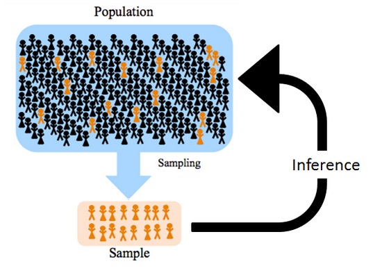

# Статистика и ее место в жизни

## Вероятности, формулировки и выводы

### Салемские ведьмы

> В январе 1692 года у дочери пастора Сэмюэла Пэрриса — 9-летней Элизабет Пэррис (род. 28 ноября 1682 года) и его племянницы 11-летней Эбигейл Уильямс (род. 12 июля 1680 года) появились симптомы неизвестной болезни: девочки кричали, издавали странные звуки, прятались под мебелью, а их тела принимали необычные позы. Когда Пэррис пытался читать проповедь, они затыкали уши. Местные жители начали выдвигать логичные, на их взгляд, предположения, все из которых сводились к тому, что девочки были прокляты ведьмой. Эти догадки вскоре подтвердил доктор Уильям Григгс, заявивший, что уже сталкивался с подобными случаями в Бостоне. Девочки указали на предполагаемую ведьму — девушку по имени Титуба, бывшую служанкой-рабыней в доме Пэррисов. Вскоре число заболевших девочек и девушек увеличилось. 1 марта 1692 года по их показаниям были арестованы 3 женщины: Титуба, Сара Гуд и Сара Осборн. Подозреваемые были допрошены и подвергнуты осмотру в поисках признаков, которые бы указывали на то, что они являются ведьмами. Главной «уликой» по делу женщин были показания девочек, к которым якобы являлись духи обвиняемых. Все три женщины были удобными целями для обвинений: Титуба имела нетитульную национальность, Сара Гуд была нищенкой, а Сара Осборн — одинокой тяжелобольной вдовой, вовлечённой к тому же в судебный спор с пуританами. Против них говорил тот факт, что женщины длительное время не посещали церковь. Эти показания суд счел адекватными и вынес сразу нескольким жительницам Салема смертный приговор. 

```{r echo= FALSE, fig.align = 'center'}
knitr::include_graphics("docs/salem.jpg")
```

### Суд на Салли Кларк

>В 1998 году, в Англии, состоялось громкое судебное разбирательство — английский адвокат Салли Кларк (Sally Clark; 1964 – 15 марта 2007) была осуждена за убийство двух своих новорожденных сыновей. Ее первый сын Кристофер умер в декабре 1996 года, через 11 недель после рождения, а второй сын Гарри умер при аналогичных обстоятельствах в январе 1998 года, спустя 8 недель после рождения. Месяц спустя Кларк была арестована. Защита утверждала, что оба ребенка умерли в результате СВДС (синдромом внезапной детской смерти), но обвинение настаивало, что их убила Кларк. Обвинение привлекло профессионального эксперта, авторитетного профессора педиатрии сэра Роя Медоу, который заявил, что поскольку вероятность внезапной смерти ребенка составляет 1/8543, то шанс двух смертей от СВДС в одной семье равен 1/8543 * 1/8543, то есть 1 : 73 000 000. В то время количество рождений в Англии, Уэльсе и Шотландии составляло 700 000 в год, поэтому вероятность случайного возникновения этого события составляла 1 каждые 100 лет. Салли Кларк признали виновной. Честерский суд приговорил ее к пожизненному заключению восемью голосами за и двумя против. В 1999 году она была заключена в тюрьму, но в январе 2003-го приговор отменили.

```{r echo= FALSE, fig.align = 'center', out.width="80%"}

```

Статистика нужна для того, чтобы делать *выводы* о происходящем в окружающем мире.

Часто выводы возможны не для абсолютного большинства случаев, а на каком-то временном интервале или для определенной группы людей. Эти может кажется нюансами, но эти ограничения очень важны, потому что, по сути, они защищают нас от вранья. 

Обратите внимание на формулировки: "большинство людей, живущих в стране...", "чаще всего люди с таким признаком...", "наиболее вероятно, что...". Они крайне полезны и помогают нам не сделать откровенно неверный вывод: чаще всего мы ничего не можем сказать об абсолбтно всех людях на планете *(но есть некоторая вероятность, что можем)*

>Цифры обманчивы, особенно когда я сам ими занимаюсь; по этому поводу справедливо высказывание, приписываемое Дизраэли: «Существует три вида лжи: ложь, наглая ложь и статистика».
> `r tufte::quote_footer('--- "Марк Твен, 5 июля 1907')`


##  Определение статистики

> Статистика — это набор математических процедур, которые необходимы для организации, обобщения и интерпретации информации.
> `r tufte::quote_footer('--- Онлайн-курс по статистике')`

> Стати́стика — отрасль знаний, наука, в которой излагаются общие вопросы сбора, измерения, мониторинга, анализа массовых статистических (количественных или качественных) данных и их сравнение; изучение количественной стороны массовых общественных явлений в числовой форме
> `r tufte::quote_footer('--- Википедия / Малая советская энциклопедия')`

> "Статистика – это раздел математики, изучающий описание наблюдаемых (на-пример в экспериментах) данных с помощью набора обобщенных параметров (таких как среднее значение) и ищущая закономерности связи между исходными данными и этими параметрами".
> `r tufte::quote_footer('--- Книга "Статистика в рисунках"')`

> Статистика – набор обобщенных вычисляемых характеристик, полученных при обработке параметров данных, которые являются объектом анализа. Слово используется также и в смысле раздела математики или отдельной науки – математической статистики.
> `r tufte::quote_footer('--- Книга "Статистика в рисунках"')`

> Статистика – или математическая статистика, раздел математики, в которой систематизированы методы определения особенностей совокупностей, которые являются объектами исследования, и включающая описательную статистику и статистический вывод.
> `r tufte::quote_footer('--- Книга "Статистика в рисунках')`

###  Применение статистики

Вопрос, в которых точно не обходится без статистики:

* Сколько человек живут у нас в стране?
* Дадут ли мне кредит?
* Сколько денег платить сотрудникам? А если сотрудник работает уже 5 лет? А 10?
* Что, прости господи, происходит с коронавирусом?
* Если я провела исследование, как понять, можно ли верить его результатам?

**Можно выделить несколько самых выжных задач статистики:**

* Описать существующую реальность
* Сделать вывод о причинах события или связях с ним
* Предсказать вероятность наступления какого-либо события

##  Виды статистики

Представим, что мы провели исследование. Как ведут себя собранные данные? Что это за данные: они непрерывные или там много отдельных значений? Каковы максимальные и миниамальные значения? А самые встречающиеся? Какова вообще встречаемость разных значений?

Такое описание данных называется **описательной статистикой (descipritve stats)**, потому что, как уже понятно из названия, описывает наши данные. Здесь мы можем получить сведения о характере данных, "пощупать" их, понять что-то -- но не делаем выводы относительного того, *влияет ли на эти данные какой-либо параметр или связано ли изменение данных с каким-либо параметром.*

Другой раздел статистики -- **статистикой вывода (inferential stats)**, где мы уже целенаправленно хотим сделать вывод относительно выдвинутых предположений, например, сравнить две групп по какому-либо параметру. Например, можем предположить, что студенты в разных городах имеют разную успеваемость по одному и тому же предмету, или что количество сна влияет на способность концентрироваться во время пары.

```{r echo = FALSE, out.width="100%"}
DiagrammeR::grViz("
digraph {
  graph []
  node [shape = plaintext, fontsize = 10]
    A [label = 'Статистика']
    B [label = 'Описательная статистика']
    C [label = 'Статистика вывода']
  edge []
    A->B
    A->C
}
")
```


## Выборка

Допустим, нас есть какое-то предположение о связи неких психологических конструктов относительно того, как работает психика у людей (теоретическая гипотеза). Мы придумываем дизайн исследования и уточняем гипотезу на языке исследования, делаем ее более конкретной. Далее проводим исследование и собираем данные на нашей выборке, часто не очень большой (обычно размер выборки варьируется от 30 до 100 человек, подробнее обсудим при рассмотрении статистической мощности). Проводим расчет статистического метода и делаем вывод по эмпирической гипотезе о связи наших конструктов, в том смысле, в котором мы их операционализировали. И когда мы делаем выводы, мы говорим не о нашей небольшой группе людей, которых мы исследовали – а о всей популяции людей, она называется **генеральной совокупностью**. Почему так можно?

```{r echo= FALSE, fig.align = 'center', out.width="100%"}

```
Собственно, за это и отвечает математика и теория вероятностей, заложенные внутрь статистических тестов. Мы оцениваем, каковы вероятности сделать неправильный вывод (ложноположительный -- в сторону наличия какого-либо эффекта, когда на самом деле его нет, или ложноотрицательный -- в сторону отсутствия какого-либо эффекта, когда он на самом деле есть), оцениваем полученные результаты статистического теста, и, учитывая, что выборка была подробрана случайным образом, делаем вывод, какова вероятность получить такие же результаты на всей генеральной совокупности.  Мы предполагаем, что люди, участвующие в нашем исследовании – рандомные представители генеральной совокупности *(ха-ха, так, конечно, почти никогда не бывает, и нам по-хорошему надо уточнить, что мы делаем вывод, например, только о русскоязычных людях или студентах психфака)*. И когда мы применяем статистический метод, мы оцениваем, какова вероятность, при условии, что мы выбрали случайных людей, получить такие результаты во всей генеральной совокупности?

Важное понятие --  **репрезентативность выборки**. Она достигается:

* **Случайным выбором людей** (берем не каких-то конкретных, которые нам больше нравятся, а случайным образом)
* **Объемом выборки** (доказано, что при большом объеме выборке прооявляется влияение факторов на случайные величины, об этом поговорим подробнее)


<!--chapter:end:index.Rmd-->


